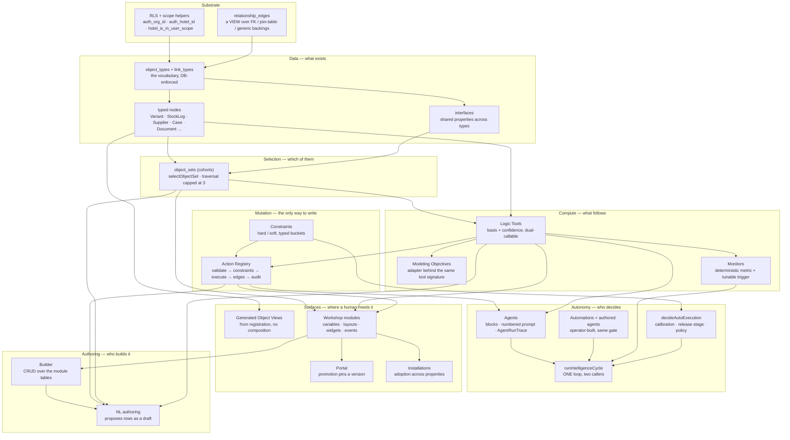

# The capability chain — what depends on what, and what is left

Two questions this answers:

1. **How does everything connect?** Not the folder layout — the *dependency*. What
   has to exist before what, and where a new capability plugs in.
2. **What is still missing, and in what order does the chain say to build it?**

The short version, because it is the load-bearing idea:

> **Every layer consumes the one below it and adds exactly one thing. Nothing
> reaches past its neighbour.** A module cannot write; it calls an action. An
> action cannot compute; it validates and dispatches. A tool cannot mutate; it
> reads and returns with a basis. That discipline is why Workshop — seven
> phases, an entire application-building product — needed **no new write path
> and no new vocabulary**: every binding it needed already existed one layer down.

---

## 1. The chain



### Reading it

- **Nothing skips a layer.** A widget that wanted to write would have to reach
  past L4, and it cannot — the button opens the Action Registry's own form.
- **L6 and L7 are pure consumers.** Workshop added tables and a renderer. It
  added no tool, no action, no edge type. That is the test of a healthy
  composition layer.
- **The cycle is the only place autonomy lives.** Two callers, one loop:
  `useRestockCycle` in the browser and the `intelligence-cycle` edge function
  under pg_cron. If you are tempted to add a second gate, extend
  `decideAutoExecution` instead.
- **`relationship_edges` is a view, not a table.** It has no unique constraints,
  so `INSERT … ON CONFLICT` throws 42P10. Writers go through
  `relationship_edges_write()`.

---

## 2. The workflow, traced once

One real need, end to end, naming the component at each hop. This is the same
path whether a human, an automation or an agent starts it.

| # | What happens | Layer | Component |
|---|---|---|---|
| 1 | "Tomatoes are running down" — a fact enters | L1 | `StockLog` node, immutable |
| 2 | It joins a population worth watching | L2 | `low_stock` object set |
| 3 | Something computes what follows | L3 | `forecast_consumption` → `156 units, auto:ewma-v1, 87%` |
| 4 | A decision is proposed, typed | L4 | `REQUEST_RESTOCK` as a `BeaconAction` |
| 5 | Rules are applied before anyone sees it | L4 | `evaluateConstraints` — hard blocks, soft escalates |
| 6 | Confidence decides who approves | L5 | `decideAutoExecution` — auto, or queued |
| 7 | It is written once, with its provenance | L4 | `dispatchAction` → RPC + `relationship_edges` |
| 8 | A human sees it in context | L6 | Object View, or a **module** somebody composed |
| 9 | The screen that showed it travels | L6 | promotion → installation at a sister property |
| 10 | The outcome teaches the next run | L5 | `Principle`, calibration, eval cases |

**Step 8 is where Workshop sits, and step 9 is why it exists.** Everything
before step 8 already worked without it; what was missing was a way for the
person who needs a screen to have one, and for that screen to travel.

### The same trace, as authoring

| # | What happens | Component |
|---|---|---|
| 1 | An operator describes a screen | `DescribeDialog` → `module-author` (API key only) |
| 2 | The answer is parsed and checked | `parseModuleSpec` → `validateModuleSpec` against the real catalog |
| 3 | It becomes rows, as a draft | `moduleSpecToRows` → `status='draft'` |
| 4 | A human reviews and corrects | the **builder** — the audit surface |
| 5 | Publishing is the approval | `modules.version` bumps |
| 6 | It is listed for others | promotion pins that version |
| 7 | Another property adopts it | installation pins its own |

**W7 depends on W6 existing, not the reverse.** An NL mistake needs somewhere to
be corrected, and without the builder that place is SQL.

---

## 3. What is left, ordered by what the chain says

Four gaps are recorded. They are **not** equally urgent, and the dependency
graph — not appetite — decides the order.

### G1 · Loop layouts and embedded modules — ✅ shipped (#474, #475)

**Correction, from the 2026-08-03 mirror.** Migration 315 says Foundry documents
neither a nesting cap nor a self-embed rule. **The self-embed half is wrong** —
`embedding-workshop-modules-overview` states it plainly:

> *"A module may not embed itself, either directly or through a chain of child
> modules. If a self-reference is configured, the module will display a warning to
> builders and render nothing to viewers."*

Our behaviour matches theirs almost exactly — warn the author, render nothing —
so what was wrong is the **attribution**, not the guard. The depth cap of 3 really
is ours: Foundry prevents infinite chains with the cycle check alone and sets no
maximum depth, so ours is the stricter of the two and would refuse a legitimate
four-level composition. Worth revisiting if anyone hits it.

The rest of the phase checked out against the source, including the 10,000-object
loop limit and the rule that the child's **published** version is always used.

---

#### The original entry, kept for the reasoning

**G1 · Loop layouts and embedded modules — *the only one that unlocks anything***

**Foundry:** `Loop` "loops over an object set or array, displaying an embedded
module for each object", and modules "can be embedded in other modules".

**Why it is first:** every other gap is presentation. This one is **composition**
— it is the difference between a screen and a *component library*. A per-property
card, a per-supplier panel, a per-case row all become one embedded module looped
over a set, instead of five near-identical modules somebody maintains by hand.
It is also the piece that makes W5's compounding argument sharper: you install a
*component*, not just a screen.

**Depends on:** module_layouts (`loop` type), module interface variables
(Foundry's `module-interface` — the parent maps a variable into the child), and
the renderer resolving a child module per row.

**Cost:** one migration (`loop` layout type + `module_variables.is_interface`),
renderer recursion with a depth cap, and a cycle guard so a module cannot embed
itself. **The depth cap is not optional** — Foundry caps traversal at 3 for the
same reason, and an uncapped recursive renderer is a browser tab that stops
responding.

**Exit:** one embedded module rendered once per object in a set, with a variable
mapped in from the parent, and a module that embeds itself refused by a test.

---

### G2 · The widget catalogue — *demand-gated, individually*

34 of Foundry's ~40 remain. **This is deliberately not a phase.** The rule that
has held all arc: a widget earns its place by being asked for, and the registry
in `builder/specs.ts` makes each one a single entry.

**The three I would expect to be asked for first, and why:**

| widget | why it earns a place |
|---|---|
| **Chart XY** | Every operational screen eventually wants a trend, and we already store the time series (276/292) |
| **Filter List** | The set is fixed at authoring time today; a filter makes one module serve five questions |
| **Object View** | Embed a generated Object View inside a composed screen — the two surfaces stop being separate worlds |

**Depends on:** nothing new for the first two. **Object View depends on G1**, since
embedding is the same machinery.

---

### G3 · Inline Action Form — *presentation, not capability*

The same Action Registry machinery rendered in the page rather than in a modal.
Worth building when somebody wants a form that is always open — a receiving desk,
a stock count — where a modal per row is friction.

**Depends on:** nothing. It is `ActionFormModal` without the `Dialog`.

---

### G4 · App thumbnails — *blocked on a decision, not on code*

Foundry requires a thumbnail to promote. Ours is nullable with the reason
recorded: no upload surface for app art. Making it `NOT NULL` is one line **the
day an upload surface exists**.

**Depends on:** a decision about where app art lives. We have document storage;
whether an application thumbnail belongs in the same bucket is a product call, not
a technical one.

---

## 4. The order, and why

```
G1  loop layouts + embedded modules      ← unlocks G2's Object View widget
G2a Chart XY, Filter List                ← independent, demand-gated
G3  Inline Action Form                   ← independent, small
G2b Object View widget                   ← needs G1
G4  thumbnails                           ← needs a product decision
```

**My recommendation: G1, then stop and wait.** G1 is the only one that changes
what the system can express. G2–G4 are things to build when a real screen wants
them, and building them before that is exactly the dead vocabulary the shape
ratchet exists to catch — the arc has now caught it twice (`nodeSet` in #418, the
`tabs` widget in 313).

---

## 5. The four invariants that hold the chain together

If a future change breaks one of these, the change is wrong.

1. **One write path.** Every mutation goes through `dispatchAction`. A surface
   that writes directly is a surface with no audit, no constraints and no edges.
2. **The database owns the vocabulary.** Widget types, effect types, layout
   types, edge types and lifecycle transitions are CHECK constraints, not
   conventions. Code that disagrees with the constraint loses.
3. **Anything unreachable is deleted.** The shape ratchet (`pnpm check:shape`)
   fails on a table or function nothing consumes. It has written the scope of
   more than one phase in this arc.
4. **Scope is proved, not assumed.** A scope-aware policy on a `NOT NULL` tenant
   column needs a matching `DEFAULT` or no browser can satisfy it — hit three
   times (310, 312, 314). And a cross-hotel rule **cannot be proved through an
   org-level user**; it belongs in `rls_contracts.sql` with synthetic claims.
