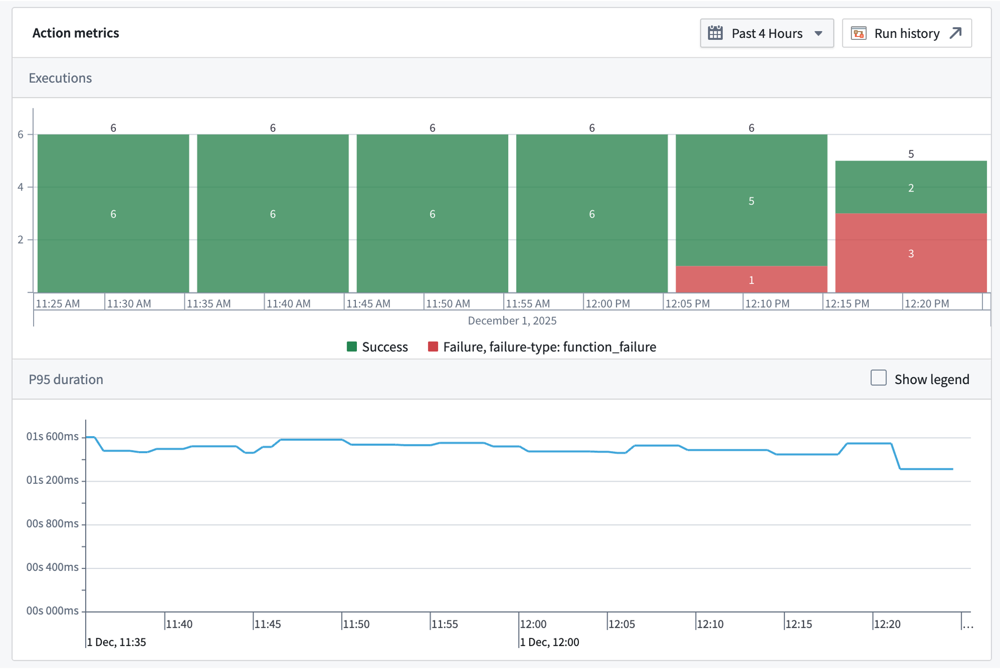

<!-- source: https://palantir.com/docs/foundry/action-types/action-metrics/ · mirrored 2026-08-18 from Palantir Foundry docs -->

# Action metrics

Action metrics display the near real-time usage of an action type over the last 30 days. You can access these metrics from the action type's overview page in [Ontology Manager](/docs/foundry/ontology-manager/overview/), or in [Workflow Lineage](/docs/foundry/workflow-lineage/overview/) by selecting the action node for a given execution. The following metrics are available:

* **Success/failure metrics:** Monitor the current status of your actions with success and failure counts. This enables rapid identification of issues and supports proactive troubleshooting, allowing you to address failures as soon as they occur.
* **P95 duration metric:** Track the 95th percentile (P95) execution duration for each action type. This metric highlights the upper range of execution times, helping you detect performance bottlenecks and optimize workflows for consistent and efficient operation.

You are also able to access [run history](/docs/foundry/aip-observability/run-history/), which provides a complete view of a given action's executions over the past seven days. Learn more about [AIP observability capabilities](/docs/foundry/aip-observability/overview/).

All metrics are updated in near real-time using the latest data from the Foundry Telemetry Service (FTS). This ensures you have access to the most current information for monitoring, debugging, and maintaining the health of your actions.

You can also embed action metrics directly inside an operational application using the [Observability Chart widget](/docs/foundry/workshop/widgets-observability-chart/) in [Workshop](/docs/foundry/workshop/overview/) to monitor resource health alongside the rest of a workflow.

## Action failure types

Action metrics do not require action logs to be displayed. Unlike action logs, action metrics track failures.

Action metrics have a variety of categories of failures that may be displayed. These categories are:

* **Invalid parameter failure:** The action was submitted with a parameter or parameters that are not valid within the context of the action.
* **Scale limit failure:** The action affected more than the permitted limit of object types (by default, usually 10,000).
* **Authentication failure:** The user did not pass the security submission criteria for the action.
* **Side effect failure:** The action failed due to a webhook or an incorrectly configured side effect.
* **Function failure:** The action failed because the underlying function failed. This failure mode is only possible for function-backed actions.
* **User-facing function failure:** The function backing the action threw an error intended to be displayed to the user. This failure mode is only possible for function-backed actions.
* **Conflict failure:** The action failed due to a conflict, such as a concurrent modification.
* **Unclassified failure:** The action failure did not fall into any of the above categories.

## Permissions

To view action metrics, you must be a `viewer` on the action.
