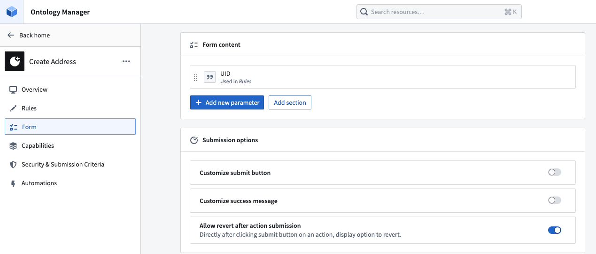
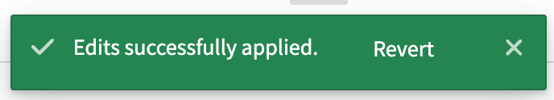
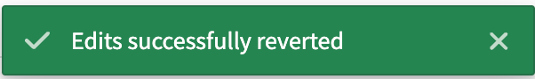

<!-- source: https://palantir.com/docs/foundry/action-types/action-reverts/ · mirrored 2026-08-18 from Palantir Foundry docs -->

# Revert or undo actions

Action reverts in [Ontology Manager](/docs/foundry/ontology-manager/overview/) allow an action to be reverted (that is, undone) immediately after the action has been applied. You can revert an action by selecting **Undo** in the success message after any successful action application.

New actions are revertible by default.

:::callout{theme="neutral"}
Action reverts are only available for Object Storage v2; meaning that only actions that modify or create an object type in [OSv2](/docs/foundry/object-backend/object-storage-v2-breaking-changes/) can be reverted. If your object types are not currently stored in Object Storage v2, you can migrate by following this [guide](/docs/foundry/object-backend/osv1-osv2-migration/#migrate-from-object-storage-v1-phonograph-to-object-storage-v2).
:::

## Configure a revertible action

Currently, actions can only be reverted by the user who applied the action.

In the **Form** tab of an action, toggle on the **Allow revert after action submission** button. Once this toggle is correctly configured and saved to the Ontology, your action can be reverted.

The **Allow revert after action submission** toggle in the **Form** tab will be enabled by default for actions created after May 2024 that only modify OSv2 object types.
If an action existed before May 2024 and modifies an object type in OSv2, action reverts will not be toggled on by default but can be manually enabled.

You will not be able to revert an action if it only modifies OSv1 object types.

## Revert an action

:::callout{theme="warn" title="Revert action"}
The toast below is your only opportunity to revert the action. This is especially important to note when performing delete actions.
:::

Once reverted successfully, users will see a similar toast to the original action success as shown below.

Edits applied:

Edits reverted:

## Caveats

An action revert may fail in some cases:

* An action on an object cannot be reverted once any subsequent edit has been made to the object, even if the edit is on a different property. In other words, an action on an object can only be reverted if the action is the most recent edit to an object.
* An action cannot be reverted if action reverts has been toggled off after action submission, even if action reverts have been toggled on again.

An action revert only reverts the edits to the object instance, but it will not revert side effects, such as notifications or webhooks, nor will it call them in the same way that the applied action would have.

### Undoing a delete action without the revert action toast

If a delete action is performed and you wish to undo the deletion, but the revert action toast is no longer available, the only remediation options available are to:

* Migrate to a new object type and copy over the desired edits using functions; or
* Drop all edits on the object type.
