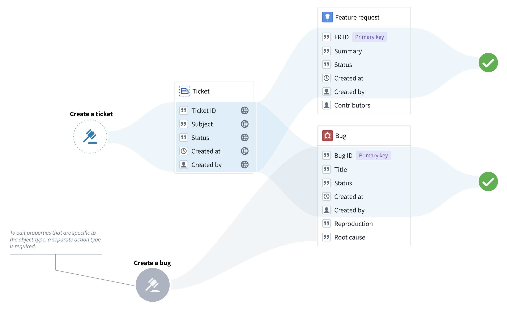
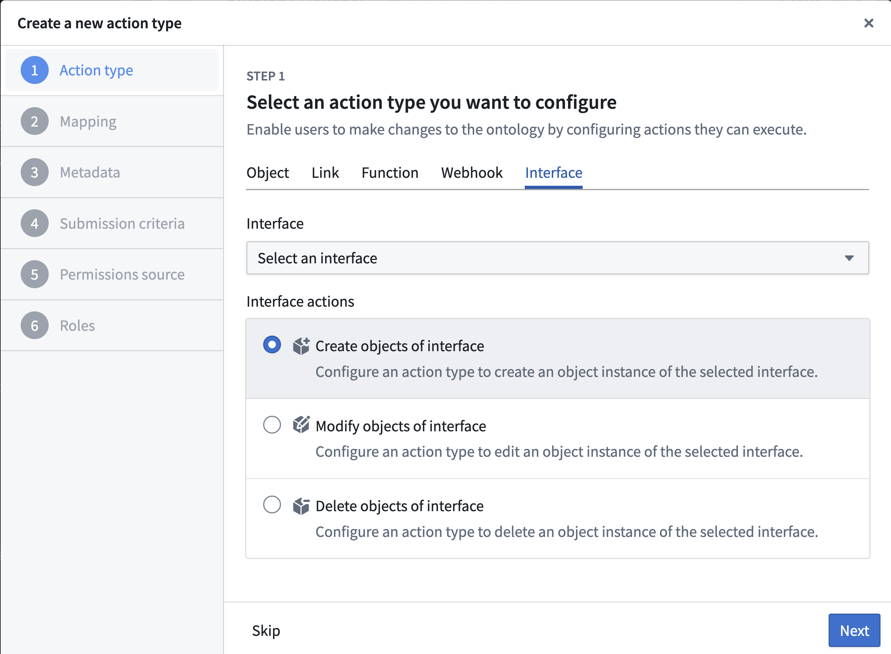
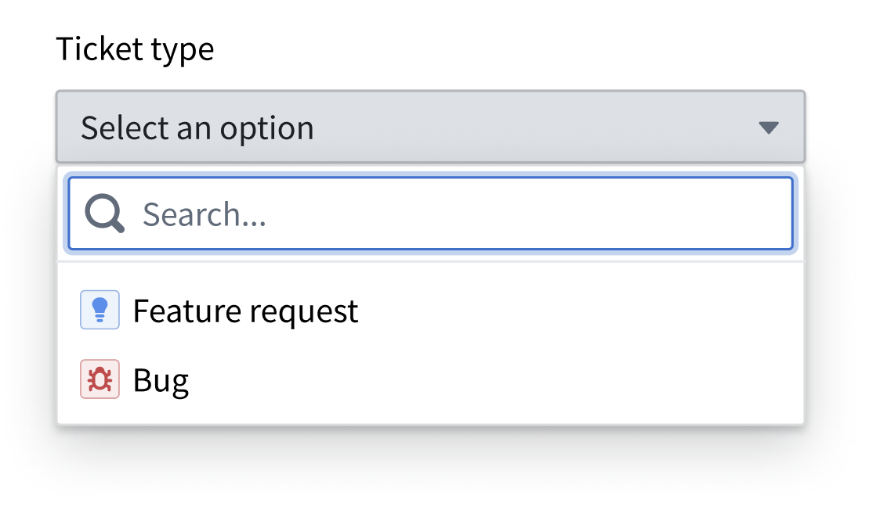
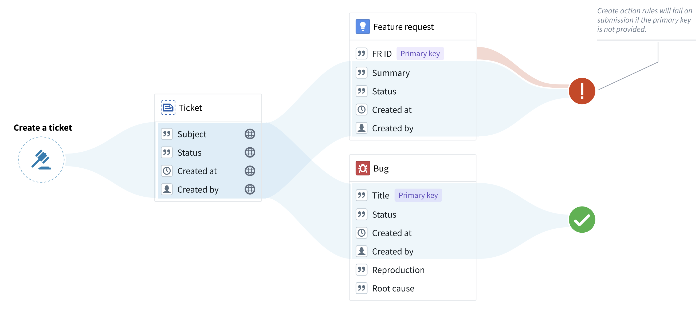
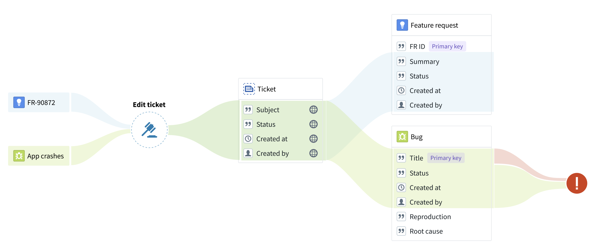

<!-- source: https://palantir.com/docs/foundry/action-types/actions-on-interfaces/ · mirrored 2026-08-18 from Palantir Foundry docs -->

# Actions on interfaces

You can create generic actions that apply to all objects of a chosen interface. There are two main ways you can use interfaces from within actions:

* **Interface action rules:** To create, modify, delete, and link objects of the configured interface.
* **Interface reference parameters:** To reference objects of the configured interface. This parameter is required by the "Modify" and "Delete" interface action rules, but can also be used by any other action rules.

Interfaces can also define [interface action type constraints](/docs/foundry/interfaces/interface-action-type-constraints/), which describe expected action capabilities that implementing object types can satisfy with concrete action types.

Action type constraints define an interface-level action contract; action rules define the edits performed when an action type is submitted.

Interface action type constraints are currently an Ontology Manager modeling and mapping feature, not an end-user application or Ontology SDK invocation surface.

:::callout{theme="warning"}
Interface action submission criteria apply uniformly to all object types that implement the interface. Before you create an interface action, carefully review which users will have permission to create, modify, or delete objects across all object types that implement the interface. [Learn more about establishing control over interface actions](#limitations-of-interface-action-rules).
:::

## Using action on interface rules

You can use interface action rules whenever the edits can apply to all the object types that implement the interface. In other words, you can use interface action rules only to modify the *interface shared properties* or to delete objects. For example, if “Feature request” and “Bug” are object types of the “Ticket” interface, you can use a “Create a ticket” action type to create bugs and feature requests, but you cannot create any property types that are specific to bugs or feature requests.

### Creating a new interface action type

To set up a new interface action type, choose **Action type** from the **New** menu in Ontology Manager.

1. Under **Interfaces**, pick the desired interface and rule type.

2. Add the shared properties that you want to include in the action (if applicable).
3. Add metadata to describe your action type. Remember that this metadata should apply to all the object types that implement the interface.
4. Under **Submission criteria**, choose the users that can execute the action (you can apply more complex criteria later on). Remember that these permissions will apply to all object types that implement the interface, as long as the user has permissions to edit them.
5. Select **Create** to finalize the action type.

### “Create” actions on interfaces

Because the action type is only associated with an interface, an “Object type” parameter will be automatically generated to indicate the object type that should be created. If using a form or a table, the user will be prompted to pick an object type from a list.

Note that **objects cannot be created without a primary key**. Therefore, any object type without a primary key assigned in the rule will fail during submission. To avoid failures of this type, make sure that both the interface and the Create rule include an interface property that can be used as the primary key in the object types that implement the interface.

### “Modify” actions on interfaces

"Modify" rules on an interface can modify any object of the configured interface. An “interface reference” parameter will be generated, constrained to the selected interface. The "interface reference" parameter is similar to the “object reference” parameter, with the exception that the "interface reference" parameter shows objects of any type that implements the interface. If using a form or a table, the user could then pick an object from a list.

Note that primary key values *cannot be modified* by any action type.  Therefore, an action will fail on submission if the action tries to modify a primary key property for a selected object type. Always ensure that the action rule does not modify properties that are likely to be used as a primary key by some of the object types that implement the interface.

In the example below, the “Title” property is incorrectly used as the primary key for the “Bug” object type. The “Edit ticket” action will fail on submission because the action attempts to change the primary key of the bug.

### "Delete" actions on interfaces

"Delete" action rules can have an "interface reference" parameter assigned to them, instead of an object reference parameter. This interface reference, constrained to a specific interface, will indicate the object to be deleted. If using a form or a table, the user could then pick an object from a list.

### "Create link" actions on interfaces

"Create interface link" rules allow you to create links using an interface link constraint defined on an interface. To configure a "Create interface link" rule:

1. Select the interface you want to create links on.
2. Select the interface link constraint defined on the interface. If the link constraint is between two interfaces, both the source and destination parameters will be automatically generated as interface reference parameters. If the link constraint is between an interface and an object type, the source will be an interface reference parameter and the destination will be an object reference parameter.

Optionally, you can also configure the source and destination objects manually if you do not want to use the parameters autogenerated by actions. These can be:

* An interface reference or object reference parameter referencing an existing object.
* An object created by a "Create object" or "Create object(s) of interface" rule within the same action type.

:::callout{theme="warning"}
If there are multiple concrete link implementations on the object type for the link constraint, the action will fail. Additionally, creating a one-to-many link modifies the foreign key on the many side of the relationship. Ensure there are no conflicts if your action type also modifies the foreign key using a "Create object" or "Modify object(s)" rule.
:::

### "Delete link" actions on interfaces

"Delete interface link" rules allow you to delete links using an interface link constraint defined on an interface. To configure a "Delete interface link" rule:

1. Select the interface you want to delete links on.
2. Select the interface link constraint defined on the interface. If the link constraint is between two interfaces, both the source and destination parameters will be automatically generated as interface reference parameters. If the link constraint is between an interface and an object type, the source will be an interface reference parameter and the destination will be an object reference parameter.

Optionally, you can also manually configure the source and destination objects instead of using the autogenerated parameters. These must be parameters referencing existing objects — either interface reference or object reference parameters.

:::callout{theme="warning"}
If there are multiple concrete link implementations on the object type for the link constraint, the action will attempt to delete all the concrete link implementations.
:::

### Executing actions on interfaces

Actions created with interface action rules can be applied to objects whose object type implements the interface, just like any object-specific action type. For a given object, all object-type-specific and interface-based actions that can be applied to that object will appear in the action dropdown.

## Permissions

Interface action rules follow the same permissions as object action types.

See the documentation on [action type permissions](/docs/foundry/action-types/permissions/) for more details.

## Level of support

As support for interface action rules and reference parameters expands, availability will vary across the Palantir platform.

### Supported applications and services

* **Ontology Manager:** Creation of interface action types and configuration of interface parameters in submission criteria and overrides.
* **Object Explorer and Object Views:** Rendering of actions defined on interfaces.

### Limitations of interface action rules

* Submission criteria apply uniformly across all object types that implement the interface, so you cannot configure different permissions per object type within a single interface action. To restrict access, disable interface actions for specific object types in [Ontology Manager](/docs/foundry/ontology-manager/overview/) by selecting its **Interfaces** tab and establishing control over actions inherited from an interface in the **Interface action control** section. The ability to apply more granular permission controls to interface actions is under active development.
* Action logs are not yet supported.
* Actions on interfaces cannot be used with functions.
