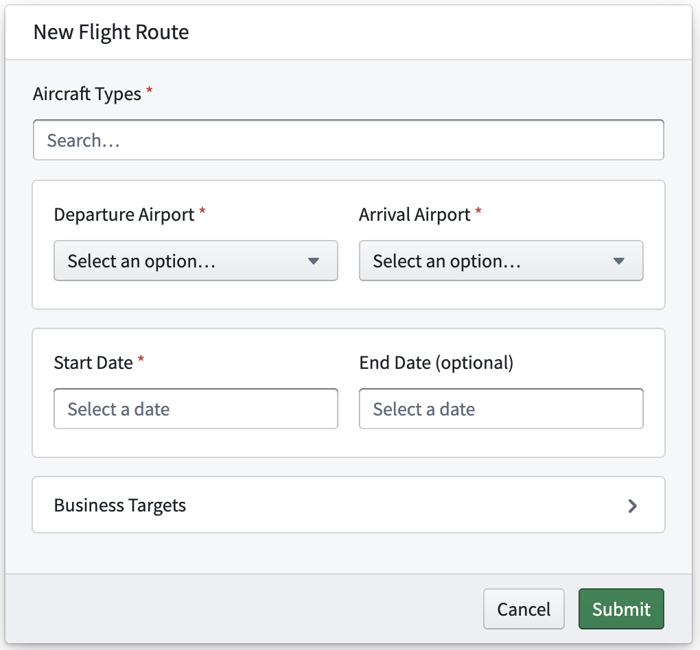
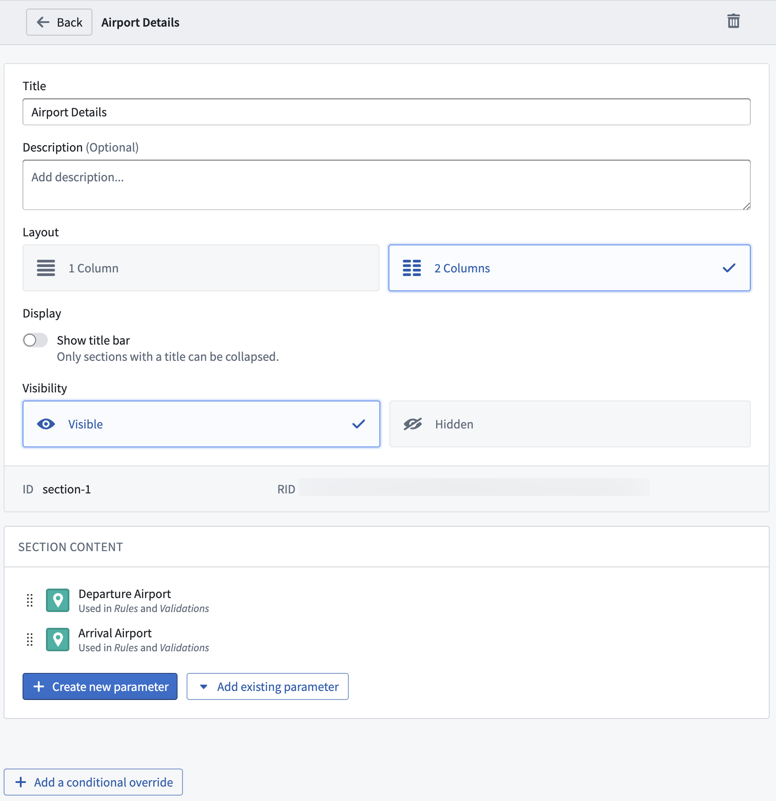

<!-- source: https://palantir.com/docs/foundry/action-types/configure-sections/ · mirrored 2026-08-22 from Palantir Foundry docs -->

# Configure sections

The action form can be customized with **sections**. These sections provide a logical grouping of parameters to organize an action form. Sections also support columns, descriptions, and conditional overrides.

## Adding a section to an action form

In the Form tab, click **Add section**. This will open a detailed section configuration modal where you can add a title, choose a column layout, and optionally write a user-facing description. The description is not stylized and, unlike parameter descriptions, will always be shown in the section itself, not in a tooltip.

You can organize parameters in columns to make better use of the space within a form or to group related parameters closer together. A section can be divided into one or two columns. Separate columns are especially useful when you use parameters that do not require a lot of space within the form.

Sections are also collapsible, can be hidden entirely, and can make use of conditional overrides, giving you more ways to customize the form behavior. All of the features will also apply to the parameters inside of the section. Using these features in combination allow for smarter forms which present required parameters under the appropriate circumstances. A section can be hidden at first and only shown based on a prior parameter.

## Adding parameters to a section

There are two ways to add a parameter to a section: from within the section configuration view, or from within the **Form** tab.

In the section configuration view, click **Add new parameter**. From here, configure the newly added parameter inside the section. Alternatively, click **Add existing parameter** to move an existing parameter into the section.

The **Form** tab lists the sections with their parameters in a single overview. Click the eight dots on the left hand side of the parameter and drag it into an existing section. Parameters and sections display in the form based on their order in this **Form Content** section.
