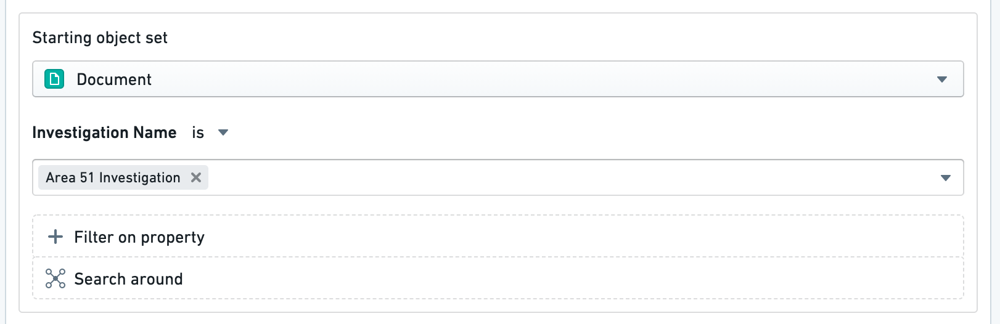
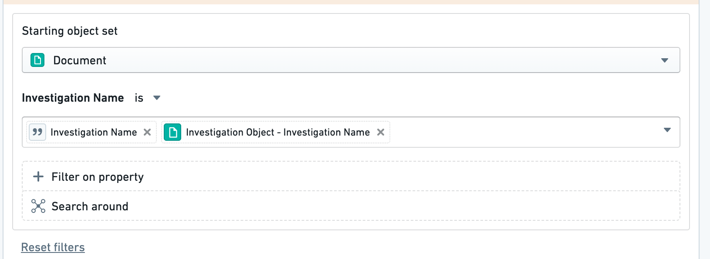

<!-- source: https://palantir.com/docs/foundry/action-types/dropdown-security/ · mirrored 2026-09-04 from Palantir Foundry docs -->

# Object dropdown security considerations

Static value filters in object dropdown validations are exposed to all users who can view the action type. Use of these filters risks exposing property value combinations to users without permissions to view the filtered objects. This risk is mitigated by relying on object properties or parameters to filter the object set. The values are not directly visible in the interface.

## Example: Data privacy issue

As an example, imagine we have a `Document` object with an `Investigation Name` property. In our action type, we add a filter on the object reference parameter to only show **Documents** where **Investigation Name** is `Area 51 Investigation`.

Here, we would potentially be revealing that `Area 51 Investigation` is a property value of some `Document` objects to users who cannot view those documents.

This only applies to **static value filters**. There is no reference to the `Area 51 Investigation` when filtering the `Investigation Name` property by a parameter or by the property of another object because:

* The `Investigation Name` parameter is user-provided. No information about the underlying data is exposed to the action type viewer.
* The `Investigation Object` parameter will respect existing restrictions on object visibility for this user.

Therefore, neither of these search queries represents a data privacy concern.

## Technical details

In most cases, the actions backend redacts sensitive information in the action type definition to avoid exposing sensitive property values. For example, action submission criteria are hidden from users who cannot edit action types. Similarly, a user will not be able to see the new object dropdown filters in the action type definition in the interface or while inspecting the response in the backend.

However, when viewing the action form, the object dropdown validation is converted into an object set. This means that users could review the network request containing this object set. In the example above, the user would receive an object set RID containing the `Investigation Name = 'Area 51 Investigation'` filter, revealing the existence of that property value even if they could not view any of its corresponding objects.

This means that these values will **not be visible in the interface** for any users. If visibility is a greater concern than security, this warning can be ignored.
