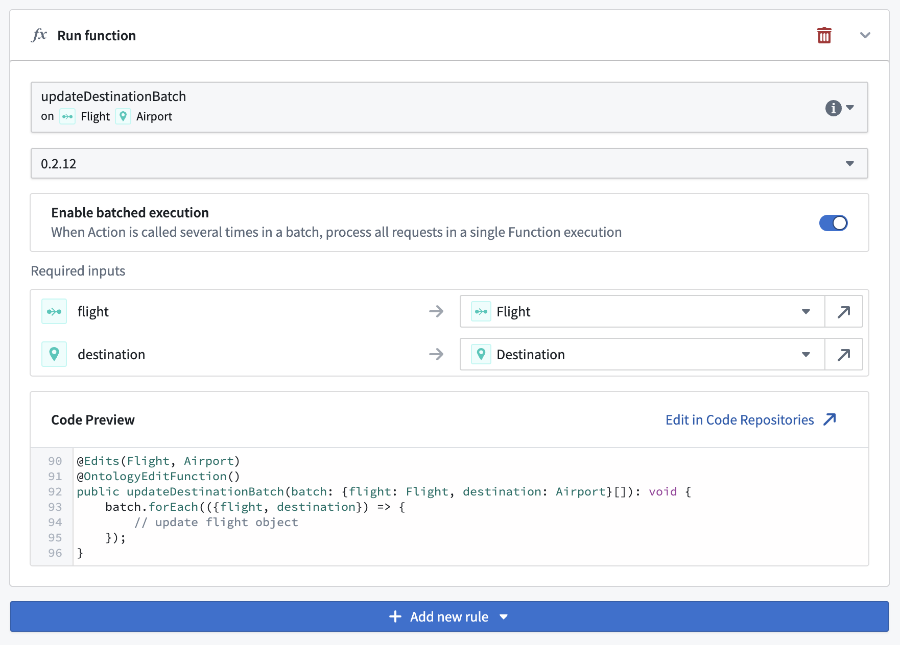

<!-- source: https://palantir.com/docs/foundry/action-types/function-actions-batched-execution/ · mirrored 2026-08-18 from Palantir Foundry docs -->

# Batched execution

When an action is triggered in batches, such as in [Workshop inline edits](/docs/foundry/workshop/widgets-object-table/#inline-edits-cell-level-writeback) or in [Automate](/docs/foundry/automate/execution-settings/), the backing function is usually called once per request in sequence, and all edits are applied atomically at the end of the action call.

Alternatively, to improve performance or resolve edit conflicts, you may wish to configure a function to receive the whole batch of action calls in a single execution.

To enable batched execution, the function must receive *a single input parameter* containing *a list of structs* (also known as a "map" or "dictionary"). You will then be able to enable batched execution and pass data into the fields of this struct in the same way you would usually pass data to a function's top-level inputs.

When using batched execution:

* A single action call will invoke a single function execution with *a single entry* in the list input parameter.
* A batched action call will invoke a single function execution with *several entries* in the list input parameter.

### Example

Instead of a function-backed action with the following signature:

```typescript
@OntologyEditFunction()
  public updateDestination(flight: Flight, destination: Airport): void {
    // update flight object
}
```

A function can instead receive a "batch" of requests and process them all in a single execution:

```typescript
@OntologyEditFunction()
public updateDestinationBatch(batch: {flight: Flight, destination: Airport}[]): void {
    batch.forEach(({flight, destination}) => {
      // update flight object
    });
}
```

You can then enable batched execution for this function when configuring the action type:


