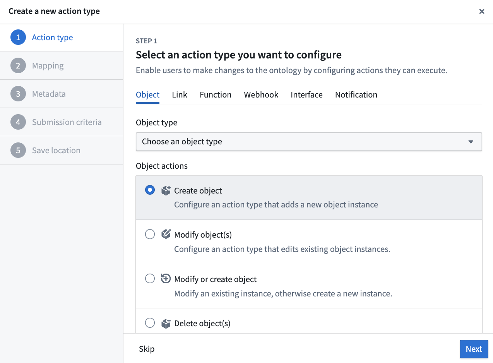
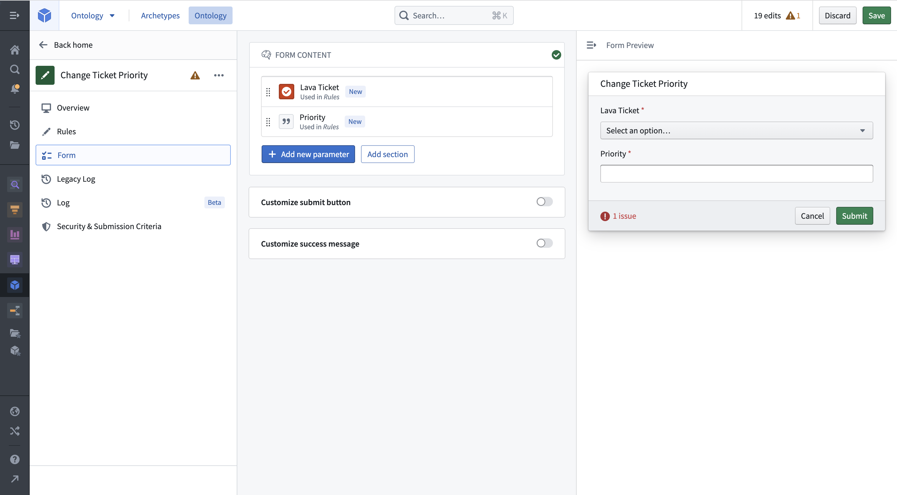
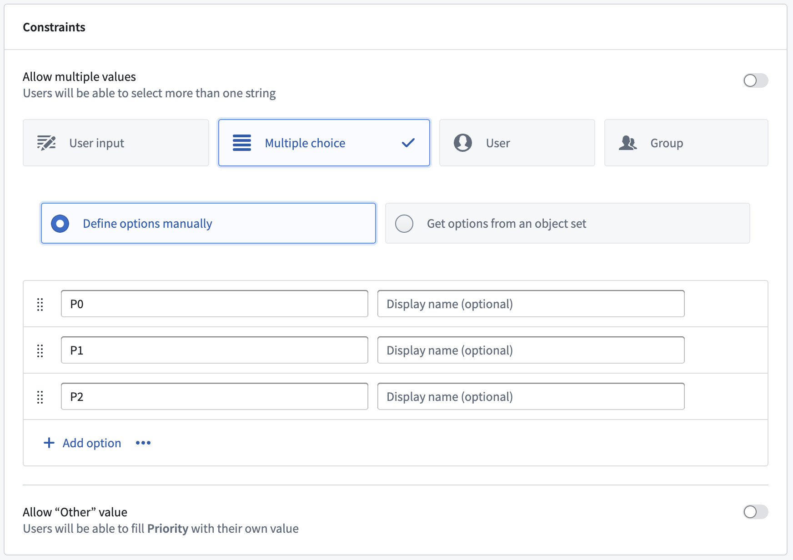
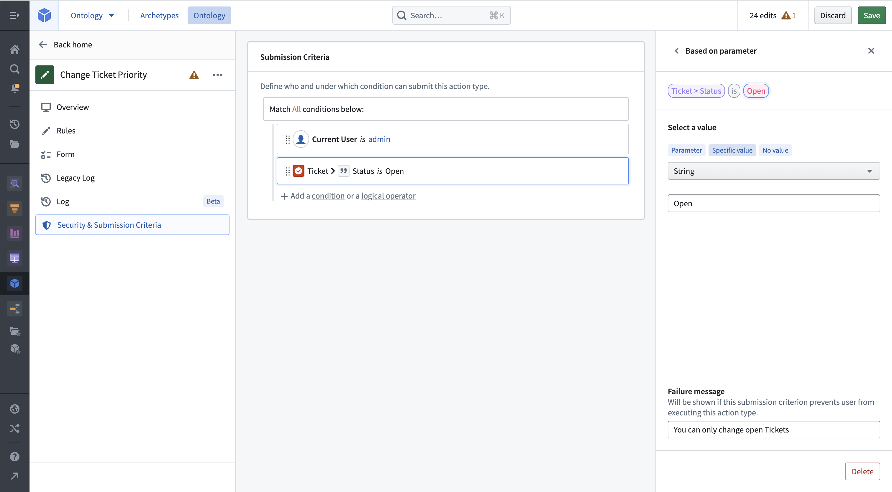
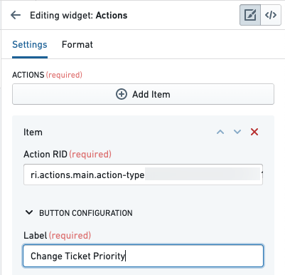
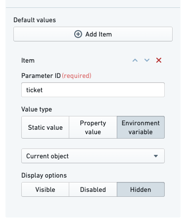
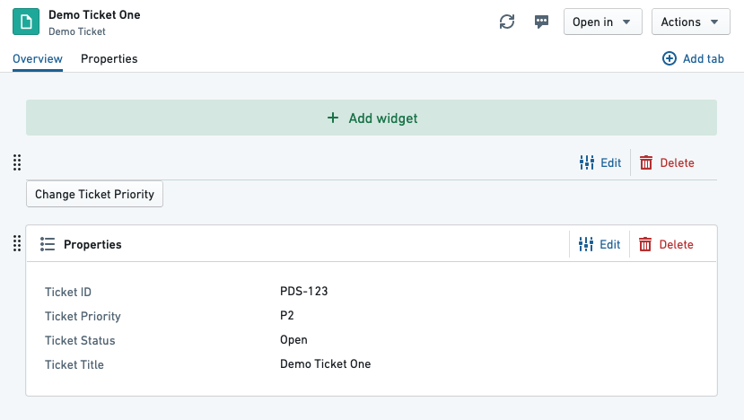
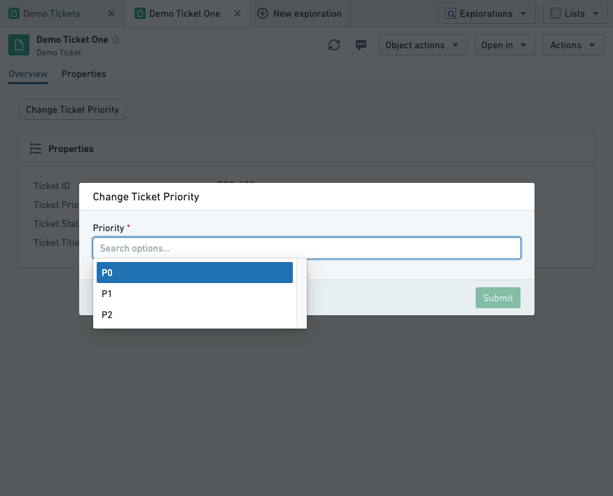
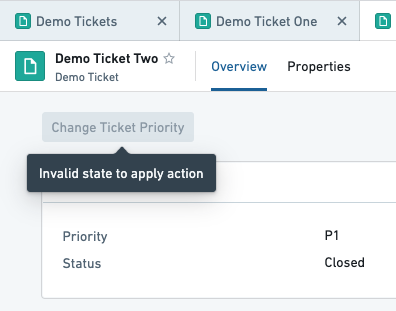

<!-- source: https://palantir.com/docs/foundry/action-types/getting-started/ · mirrored 2026-09-04 from Palantir Foundry docs -->

# Getting started

In this guide, we will create a simple action type for changing the priority on a ticket.

We will configure submission criteria to make sure that the priority is `P0`, `P1`, or `P2`, and that the ticket status is `Open`.

## Prerequisites

For this guide, we will use a `Demo Ticket` object type, which has four properties:

* `Ticket ID`
* `Title`
* `Priority`
* `Status`

We also have two demo objects available:

|Ticket ID|Title          |Status|Priority|
|---------|---------------|------|--------|
|PDS-123  |Demo Ticket One|Open  |P2      |
|PDS-124  |Demo Ticket Two|Closed|P1      |

You can recreate these in your Ontology if desired, but it is not essential.

Note that for a user to be able to take an action defined in an action type configuration, [additional configuration is required](/docs/foundry/object-link-types/allow-editing/#set-up-the-prerequisites). If running Object Storage v2, the user must enable edits with a toggle. If running Object Storage v1 (Phonograph), a writeback dataset must be created. Note that [Object Storage v1](/docs/foundry/object-databases/object-storage-v1/) is in a [planned deprecation](/docs/foundry/platform-overview/development-life-cycle/) phase of development; [migrate to Object Storage v2](/docs/foundry/object-backend/osv1-osv2-migration/).

## Create a new action type

We start by creating a new action type for changing the ticket's priority. In the Ontology Manager, select **Action types** on the left sidebar, then choose **New action type** at the top right of the view.

The creation wizard allows you to configure the most important features of an action type. On the **Action type** step, open the **Object** tab, select the `Demo Ticket` object type, then choose **Modify object(s)** under **Object actions**. On the **Mapping** step, add the `Priority` property by selecting **Add property**. On the **Metadata** step, enter an **Action type name** for your action type. Continue to the final step and select **Create**.

You can now see the full detailed view of your action type. You can make additional adjustments, like adding a **Description** in the **Overview** tab or adding additional properties to modify in the **Rules** tab.

## Edit parameters

Select the **Parameters** tab to get an overview of the parameters. The `Ticket` and `Priority` parameters have already been created based on the **Rule**.

Select the `Priority` parameter to limit the values it can take on. Change the constraints from **User input** to **Multiple choice**. This will allow you to pick what values can be chosen for this parameter. Add `P0`, `P1`, and `P2` as options. If you applied your action to an object now, you could change the priority of a ticket to `P0`, `P1`, or `P2`. You will now add submission criteria that will restrict you to only changing the priority for open tickets.

## Add submission criteria

Open the submission criteria section in the **Security & Submission Criteria** tab from the sidebar. Create a new condition by selecting **Condition** in the **Execution** section. Using the **Parameter** condition template, set a condition on the `Ticket` object parameter's `Status` property. Using the `is` operator, you can then do an exact string comparison between the ticket status and the specific value `Open`.

Add a failure message so users can see why an action has failed. Your action definition is now complete, and you can configure it to show up next to the Object View in Object Explorer.

## Add the action to an Object View

Go to **Demo Ticket One** and edit its Object View. Add a new widget to the top, and choose the **Actions** widget. In the sidebar, select **Add Item**. Copy the action RID from the Ontology Manager and paste it into the Action RID field. Name the label "Change Ticket Priority".

By default, the action form will show every parameter as a field in the action form, including the `Ticket` parameter. Additionally, an action does not know that it should fill the current object in for the `Ticket` parameter. We will configure the action form to hide the ticket field (so the user cannot change the status of a different ticket), and set its value to the current object.
Under **Default value**, select **Add Item**. Type the parameter ID for the `Ticket` parameter—in this tutorial, we set it to `ticket`. Change the value type to **Environment variable** and select **Current object**. Finally, change the display option to **Hidden**.

You will now see the action button on the preview page:

You can now save and publish the Object View.

:::callout{theme="neutral"}
Before you apply an action, you can validate its submission criteria, rules, and resulting edits with a [test run](/docs/foundry/action-types/test-run/) in Ontology Manager.
:::

## Apply the action

Visit an open ticket and select the **Change Ticket Priority** button we configured. You should see the action form appear over the view. Clicking into the **Priority** field will show the single selected submission criterion we configured on the parameter:

Pick a priority and select **Submit**. The form will disappear and the object view will update with the new priority. Our submission criteria said that it should not be possible to run this action on a closed ticket. If we open Demo Ticket Two, which is closed, we see the following:

## Resolve conflicting user edits (actions) and datasource updates

Object instances in the Foundry Ontology can be created and modified by both input datasources and user edits/actions. When a single object instance (that is, a row or object with a specific primary key value) receives data from both the input datasource and user edits, these received values must be transparently resolved with a conflict resolution strategy.

There are two strategies for resolving conflicts:

* Strategy 1: Apply user edits (default)
* Strategy 2: Apply most recent value (may not be available on your enrollment)

[Learn more about how to resolve conflicting user edits and datasource updates.](/docs/foundry/object-edits/how-edits-applied/#resolve-conflicting-user-edits-and-datasource-updates)

## Next steps

* [Explore the other action types you can build, including link, function, webhook, and scenario actions.](/docs/foundry/action-types/explore-action-types/)
* [Learn more about action permissions.](/docs/foundry/action-types/permissions/)
* [Create a function-backed action.](/docs/foundry/action-types/function-actions-getting-started/)
* [Use an action elsewhere in the platform.](/docs/foundry/action-types/use-actions/)
* [Resolve conflicting user edits (actions) and datasource updates](/docs/foundry/object-edits/how-edits-applied/#resolve-conflicting-user-edits-and-datasource-updates)
