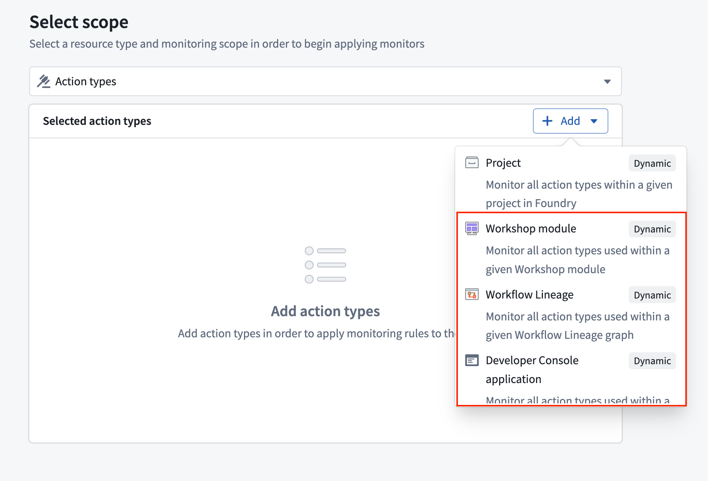

<!-- source: https://palantir.com/docs/foundry/action-types/monitoring/ · mirrored 2026-08-11 from Palantir Foundry docs -->

# Action monitoring

Actions in Foundry can be monitored to track performance and reliability. This page explains the available monitoring capabilities for actions.

## Available monitoring rules

Action monitoring in Foundry supports two key rule types:

1. **Action duration p95:** Alerts when the 95th percentile execution time exceeds thresholds.
2. **Number of action failures in window:** Alerts when failure count exceeds thresholds within a timeframe.

For detailed configuration options and parameters, review our [monitoring rules reference documentation.](/docs/foundry/monitoring-views/rules-reference/#action-rules).

## Set up action monitoring

To set up monitoring for your actions, follow the standard process for creating monitoring views and rules:

1. Create a monitoring view as described in the [monitoring views overview documentation](/docs/foundry/monitoring-views/overview/#create-a-new-monitoring-view).
2. Add a monitoring rule for an action or action type as described in the section on [adding a monitoring rule](/docs/foundry/monitoring-views/overview/#add-a-monitoring-rule).
3. Configure appropriate thresholds and severity levels.
4. Set up alert notifications following the [alert subscription guide](/docs/foundry/monitoring-views/overview/#subscribe-to-alerts).

### Dynamic scopes

Action monitors support **Workflow Lineage**, **Workshop**, and **OSDK application** as dynamic scopes. When you select one of these scopes, the monitor automatically tracks all actions the scoped resource uses and adjusts as actions are added or removed without further intervention.

## Related documentation

* [Monitoring rules reference](/docs/foundry/monitoring-views/rules-reference/#action-rules)
* [Monitoring views overview](/docs/foundry/monitoring-views/overview/)
