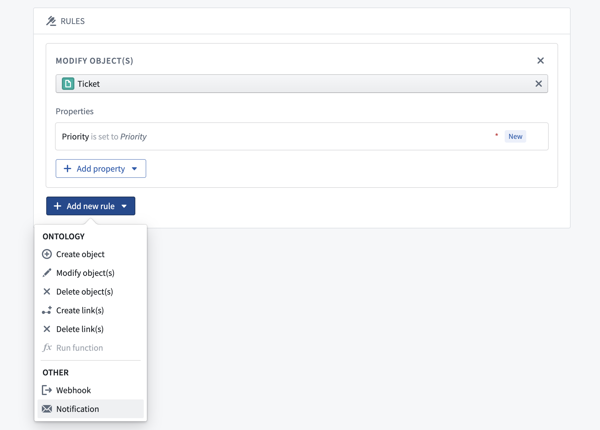
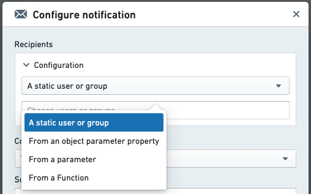
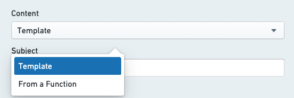
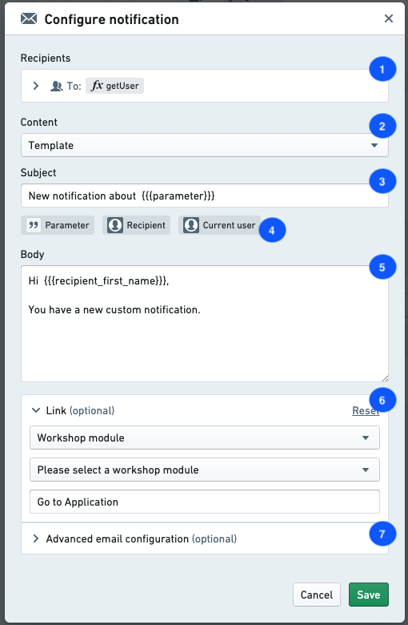
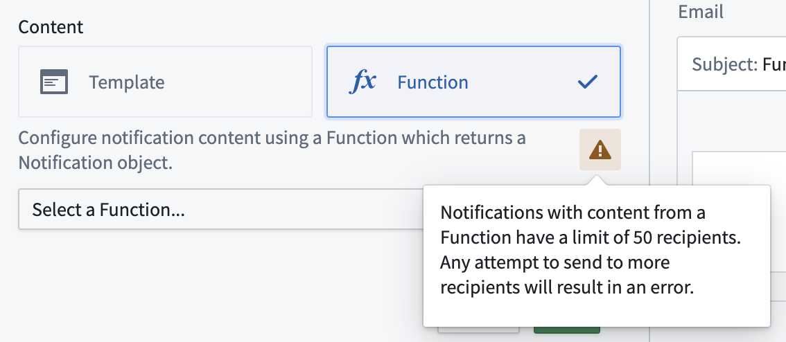
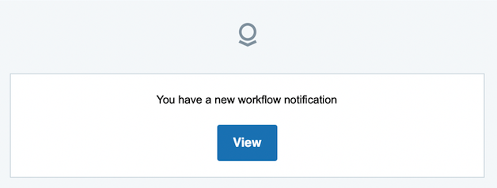
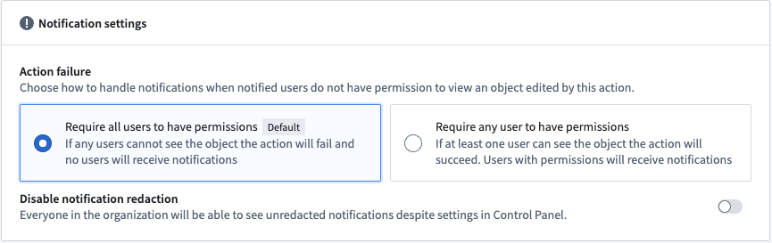

<!-- source: https://palantir.com/docs/foundry/action-types/notifications/ · mirrored 2026-08-18 from Palantir Foundry docs -->

# Notifications

Notifications can be added to an action through the **Add new rule** dropdown menu. [Learn more about how to add a notification.](/docs/foundry/action-types/set-up-notification/)

Configuring a notification requires specification of [recipients](#recipients) and [content](#content). The following sections provide more detail on these options.

## Recipients

Configuring the **Recipients** option of a notification allows you to specify the set of Foundry users who will receive a notification when the action runs. Notifications will be sent to each recipient individually. Adding users as CC (carbon copy) recipients to email notifications is not supported.

There are several supported ways of specifying recipients:

* **Static:** In the configuration, you may select a set of users or groups who will always be notified when the action runs.
* **From a parameter:** If you have a parameter to the action that is a Foundry user or group ID, you may specify this as your recipient for a notification.
  * This can be used to allow the sender to select one or more recipients in the user interface of an application or module that uses this action, or to automatically detect and send a notification to the user running the action.
* **From an attribute of an object parameter:** If you have an object parameter to the action, and one of the properties of that object contains a Foundry user or group ID, you may specify that property of a parameter as the recipient. This is also possible for lists of Foundry user and group IDs.
* **From a function:** If your use case is not covered by the above options, you may write a custom function which takes in action parameters and will return the list of users or groups who should be notified. [Learn more about how to write a function that returns a list of users or groups.](/docs/foundry/functions/types-reference/#users-groups-and-principals)

  Examples of use cases for recipients based on a function include:

  * Combining the other options for recipients; for example, notifying the `assignee` specified from an attribute of an object parameter and also always notifying a static set of additional recipients.
  * Recipient selection based on other parameters or property values of parameters; for example, whenever there is a new task in EMEA, notify one set of users; whenever there is a new task in North America, notify a different set of users.
  * Any other custom logic which does not fit into the structured options.

:::callout{theme="neutral"}
Recipients may change their preferences for how notifications are delivered to them. For example, one user may choose to only have notifications delivered in their web browser, while another user may choose to receive both in-platform toasts and emails. If a user has action notifications turned off in their personal preferences, they will not be notified. However, they may still view their notifications when logged into Foundry by going to "Notifications" and then "See All" in the Workspace.
:::

## Content

There are a number of options for customizing the content of notifications. Content may be configured via *Template* or provided via a custom *function*. Selecting template content will allow you to configure the full content directly in the configuration dialog. Function content will require you to have a published function, which returns the appropriate notification type.

### Content components

1. **Subject:** Usually, content will include a subject line. By default, this will be the same for all delivery mechanisms.

2. **Body:** The body of the notification. For in-platform notifications, this will display inside the notification toast. For email, this will be rendered inside the body of the email.

3. **Link:** You may specify a link. This will appear as a button just below the body content of the notification. The text of the button can be customized.
   * The following options are available for configuring a link:
     * Link to an existing object parameter
     * Link to a Workshop app
     * Link to a Carbon workspace
     * Link to a newly created object

4. **Advanced Email Configuration:** When configuring a notification, you may specify a custom content body to use when delivering a notification via email. This option allows you use HTML for more advanced formatting which is not supported for in-platform notifications. The preview will show you how your notification will look, excluding any parameter references. Recipients will only receive this content if they set their preference to receive notifications via email.

:::callout
Triple handlebars may be used to reference parameters and user attributes in the Subject, Body, and Link mentioned above. When editing a section, clicking on one of the available parameters will auto-generate the correct handlebar reference for that parameter or user attribute.
:::

5. **From a Function:** When selecting "From a Function", you do not configure the sections listed above. Instead, you must provide a Function that returns a `Notification` object with the appropriate properties specifying each section of your custom content. You may need to use a Function if any of the following applies:
   * The notification content is completely different depending on the recipient or input parameters to the Action.
   * You want to have a different subject line for email and in-platform notifications.
   * You want to use full link URLs, including links to external systems or applications that live outside of Foundry.
   * You want to perform Search Arounds, aggregations, or query data beyond what is provided via parameters when rendering the content.
   * You have any other custom requirements that are not possible via the template content options.

More information on the Notification return type can be found in the [Functions documentation](/docs/foundry/functions/configure-notifications/).

:::callout{theme="neutral"}
Any Ontology data used for generating notification content will reflect the state of the Ontology before edits of the current Action are applied. To give notification recipients access to the latest state of specific objects, it is possible to embed links to objects referenced via object parameters, or links to newly created objects (if those objects are created via a "create object" rule and not via a function) in the notification.
:::

***

## Example configuration

This is an example configuration for a notification.

1. **Recipients** configuration
2. **Content** configuration
   * Choose from template (configure directly in the Ontology app dialog) or Function (specify a Function that returns a fully-formed `Notification` object).
3. **Subject** line for template notification.
4. Available **parameters** based on the available parameters to the Action. Click on a parameter to generate the `{{{}}}` syntax to reference that parameter.
5. **Body** content for template notification.
6. **Link** configuration for template notification (optional).
7. **Custom HTML content for email** with template notification (optional).

***

## Other key information

### Maximum recipient limits

* There is a maximum of 50 recipients when using the "From a Function" option to render the notification content. There will be a warning in the configuration panel when selecting "From a Function" under the content configuration options, and the number of recipients will be checked each time the Action is run. If the number of recipients is over the limit, a red error toast will be displayed and the Action will fail to run.
* There is a maximum of 500 recipients for a single Action notification when the content is configured directly in the configuration dialog using the "Template" option.

### Content length limits

* The maximum subject length is 250 characters.
* The maximum body length is 1,000 characters. When rendering custom HTML content for email, the maximum length is 51,200 characters.

Keep in mind that these maximum content lengths are validated and truncated when notifications are rendered. This means that if the rendered content is dynamic (for example, if the notification content includes object data), any content longer than the allowed maximum lengths will be truncated and indicated by trailing `...`.

### Strict redaction

If "Strict Redaction" or "Group Redaction" on outbound email notifications is enabled for your Foundry instance, custom notification content will not be rendered. Instead, users will receive the generic message shown below. Selecting "View" will direct them into Foundry where they can view the full notification content. [Learn more about email content redaction in Foundry.](/docs/foundry/email/email-content-redaction/)

### Recipient user accounts

* Groups will be resolved to individual users in order to check permissions on the data before sending the notifications.
* Foundry user and group IDs can be found via Settings under Account. The configuration interface for notifications provides selectors for users and groups when choosing a static set of recipients. This will only display users and groups for which the person configuring the Action has adequate permissions.
* If recipient(s) are configured via reference to an object property, make sure the property stores the Foundry user or group ID as a string. You can use conditional formatting to display the associated user or group display name (for more detail, see the [value formatting documentation](/docs/foundry/object-link-types/value-formatting/)).
* Sending directly to email addresses is not supported.

### Links to newly-created objects

You must reference the primary key of a new object when linking it, since an object RID is not generated by time the notification is rendered.

**Example:** You have an Action that creates a new `task` object, and will be generating a unique ID when creating the task. Inside your Action notification you render a link to the newly created object using the [parameter options provided by Object Explorer](/docs/foundry/object-explorer/generate-urls/).

* There are two supported ways of specifying URL links when using Function generated content:
  * Full link example: `https://<your-foundry-instance>.com/workspace/module/view/latest/<module-rid>`
  * Relative link example: `/module/view/latest/<module-rid>`

### Required data access for recipients

* Users may only receive notifications containing data which they are allowed to view.
* In cases where there are multiple recipients, all recipients must have access to the object data rendered in the notification content.
* When configuring your Action, two methods of handling notification failures are available at the bottom of the **Security & Submission Criteria** tab in the sidebar:
  * **Require all users to have permissions (default):** If any recipients do not have the required access, an error will be shown when attempting to apply the Action. If this happens, no data will be edited and no notifications will be sent.
  * **Require any user to have permissions:** If at least one user can see the object, the Action will succeed. Only users with permissions will receive notifications.

### Override and disable email content redaction

[If the organization settings allow](/docs/foundry/email/email-content-redaction/#disable-email-redaction-in-action-types), you can bypass other strict redaction settings set at the organization level for particular action types and have an action type that sends non-redacted content.

To override redaction for email notifications, navigate to the **Security & Submission** tab, then **Notification settings > Disable notification redaction**.

To learn how to enable this for the organization, refer to [the email redaction documentation page](/docs/foundry/email/email-content-redaction/#disable-email-redaction-in-action-types).
