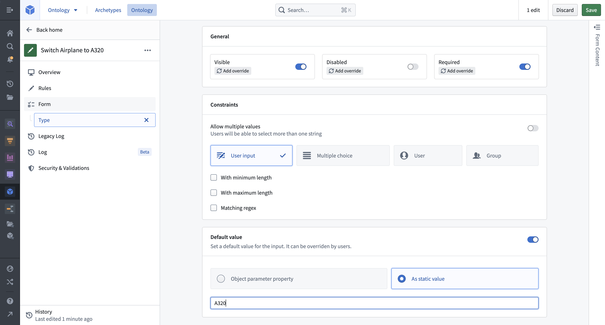
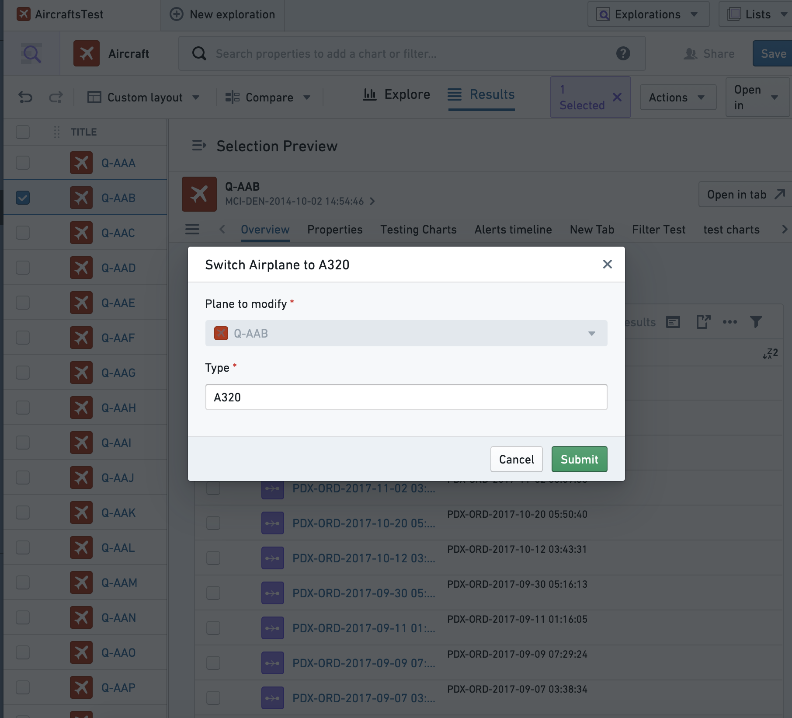
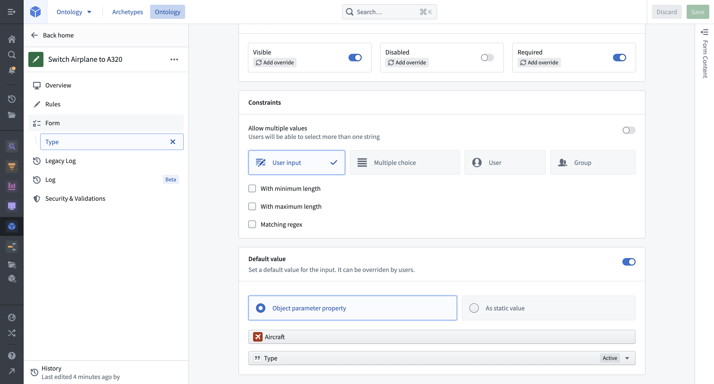
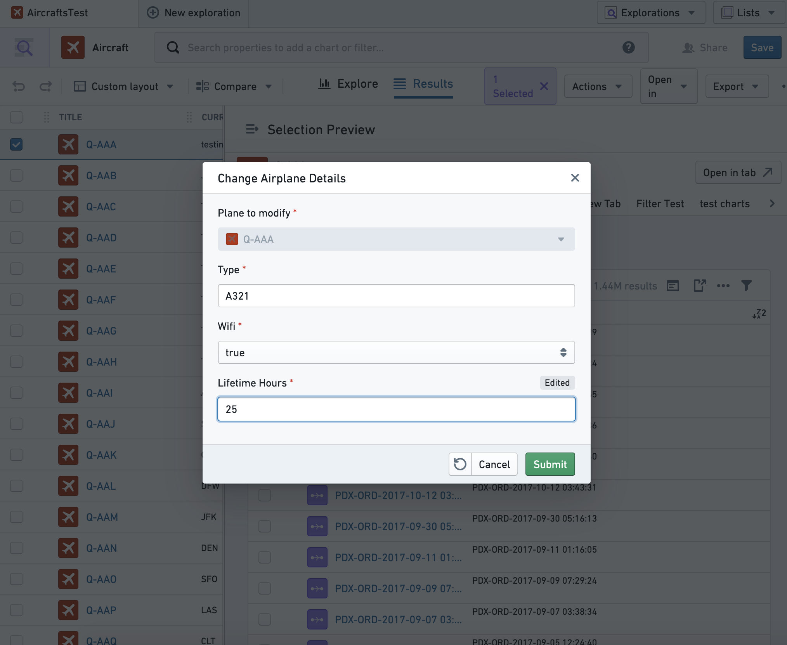
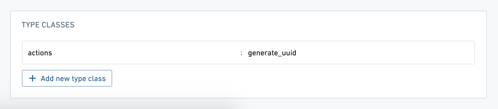

<!-- source: https://palantir.com/docs/foundry/action-types/parameters-default-value/ · mirrored 2026-09-04 from Palantir Foundry docs -->

# Set parameter default value

Default values for action type parameters are used to prefill parameters in the action form. Default values are configured at the parameter level and are supported in Workshop, Object Explorer, Object Views, Quiver, and Slate. They can be deployed to standardize action logic across multiple consuming applications, eliminating the need to add default values in each application individually.

Parameters can be set to default values to display either a fixed value or a property of the selected object.

## Default value interaction with local variables

Local default values (for example, Workshop variables) always take precedence over global default values. When passing any Workshop variable to an action with a default value, the action form will prefill with the values from the Workshop variables. The same pattern applies with environment variables from Object Views and defaults from Slate. Defaults provided in each instance of an action take precedence. Any migration to default values will therefore require removing local overrides.

## Configuring default values

Selecting any parameter opens the parameter configuration view for that parameter. Select whether the parameter should default to a fixed value or with a value from the property of an object parameter.

### Static default value

Imagine an example action type that modifies the `Type` property of a selected `Aircraft` object to become `A320`. To configure, click into the `Type` parameter and add a static default value.

To achieve a similar user experience without default values, input values would need to be configured in each application that uses the parameter. Updating this behavior (for instance, to `A380`) would require manually modifying the behavior, possibly across multiple applications.

### Object property default values

To set an object property as the default value for a parameter, begin by selecting an object parameter to configure. Consider a more generic action type called `Change Airplane Details` where, for example, users need to know the current value of a property before making edits. This can be achieved by configuring the value of each parameter to be prefilled from the currently selected object (in this case, the `Plane` object to modify). Only object reference parameters that are placed above the parameter in the input list are available to be used as a default value.

In Object Explorer, the `Change Airplane Details` action will be prefilled with current values. In this case, users could choose to modify just one property and keep the rest the same. This same default logic will be present anywhere the action is submitted. Note that the `Lifetime Hours` value shows as edited once this default value is updated by the action user.

### Type class prefills

Action parameters can be prefilled with special values (such as automatically-generated UUIDs or the current user's ID) by annotating them with type classes. The Ontology documentation has [a complete list of the available type classes](/docs/foundry/object-link-types/metadata-typeclasses/).

In most cases, you should set the parameter visibility to `hidden`, so that users do not manually change these special prefilled values.
