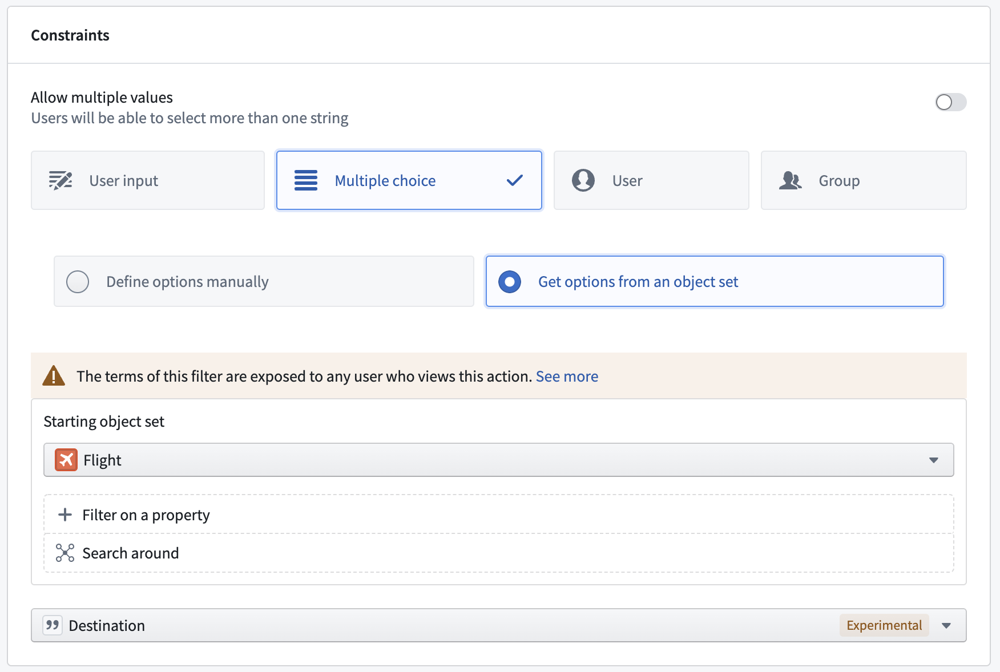
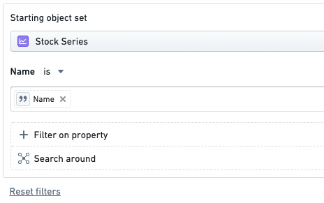
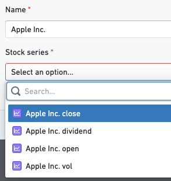
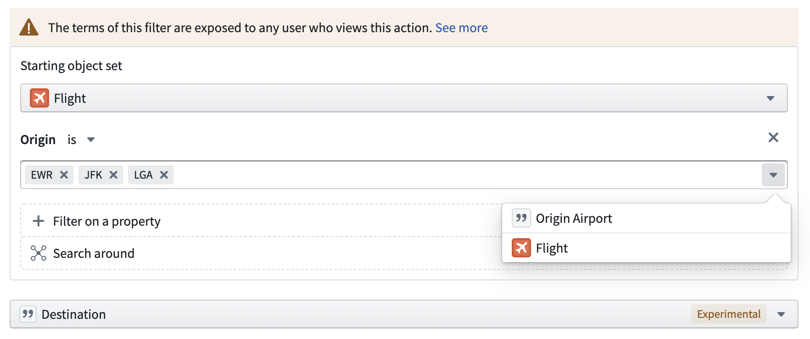
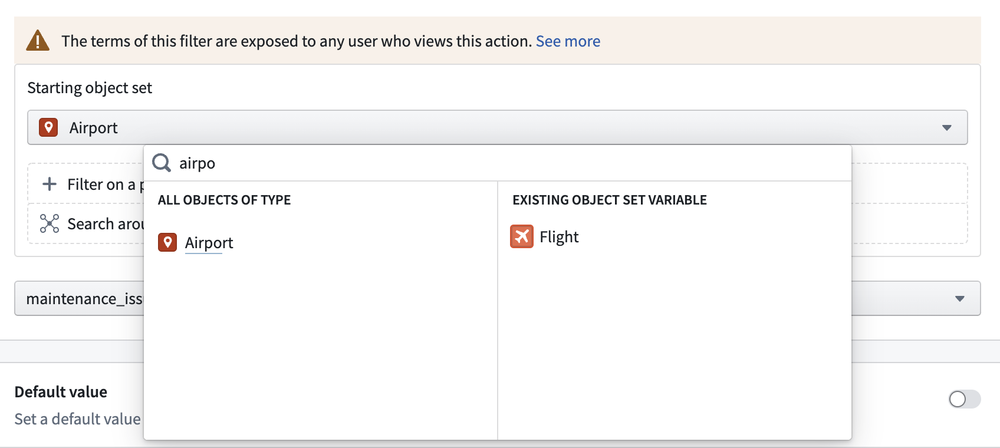

<!-- source: https://palantir.com/docs/foundry/action-types/parameters-filter/ · mirrored 2026-09-04 from Palantir Foundry docs -->

# Filter results of a parameter dropdown menu

Adding filters to non-object reference multiple choice or single object reference parameters will determine the allowed values that are selectable in the parameter's dropdown menu.

## Multiple choice parameter dropdown menus

When configuring multiple choice parameter dropdown menus, action editors can reduce allowed values to just those that are properties of an object set. This can be leveraged to display or prefill values based on properties of a linked object. To accomplish this, ensure the parameter is set to display multiple choices, select **Get options from an object set**, configure the desired object set, and select the property that includes all allowed values for the parameter dropdown menu. If only one linked object is available in the resulting object set and the parameter is required, the parameter dropdown menu will automatically prefill with the corresponding property value. The resulting multiple choice options will be derived from the set of objects that the user has permission to view. In other words, when deriving multiple choice options from an object set, users will not see properties of objects to which they do not have access.

## Object dropdown menus

Within the parameter configuration view, action editors can specify filters and Search Arounds to limit the objects that show up in the dropdown menu across all action interfaces. After configuring the filters, the action form will render a dropdown menu with only objects that match the filter. The value selected is also validated before the action is executed.

For example, an object dropdown menu configured to only show **Stock Series** where the **Name** is equal to the value in the `Name` parameter.

The image below shows the possible values for the `Name` parameter:

### Properties displayed in dropdown menu options

Dropdown menu options display the title of each object along with the object type's [prominent properties](/docs/foundry/object-link-types/property-metadata/#metadata-reference). Properties matching the search term are displayed first with the matching text highlighted, followed by the remaining prominent properties. A prominent property with no value is displayed as `No value`.

Which properties are displayed depends on the visibility configured on the object type in Ontology Manager rather than on the action type. Users only see objects they have permission to view, and property values a user cannot view are not displayed.

### Data privacy implications

When using the new validation on an object parameter, it is possible for data to be viewed by everyone who can view the action type. If there are sensitive static values in the parameter filters, users will be able to view those values even if they cannot view the underlying objects that are being filtered. [Learn more about the data privacy implications.](/docs/foundry/action-types/dropdown-security/)

## Supported operations

### Filtering on a property

The object dropdown menu only shows objects where the specified property matches any of the provided values.

The value can be statically defined by the user, inferred from another parameter, or a property of an `Object Reference` parameter. If more than one value is provided to compare against, the result will be an **OR** operation.

### Changing the starting object set

The **starting set** for the query is set to all objects of the object type by default, but this can be changed to any other type. The starting set could also be set to an `ObjectReference` list parameter.

### Search Arounds

A Search Around would create a new set by traversing a link on every object in the current set. For example, `Github Issue of Current Employee` would take the `Employees` in the current set and create a resulting set of `Github Issues` linked to those `Employees`.

