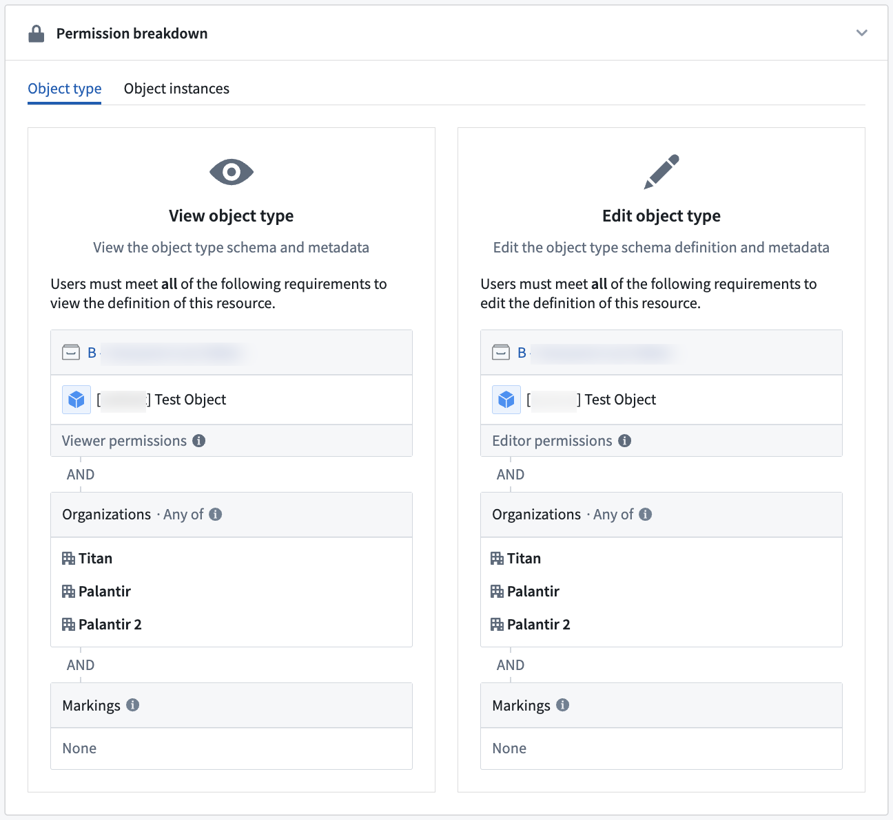

<!-- source: https://palantir.com/docs/foundry/action-types/permissions/ · mirrored 2026-08-18 from Palantir Foundry docs -->

# Permissions

Permissions apply to action types in the following ways:

* Who can view a given action type?
* Who can edit a given action type?
* Who can apply an action type with a given set of parameters?

## Apply action

The ability to apply an action type depends on the configuration of the object types and link types it is editing. In all cases, the user submitting the action must be able to view the edited object types and link types and their datasources, and pass the [submission criteria](/docs/foundry/action-types/submission-criteria/). If the object type only allows edits via actions, users can make edits for all the objects they can view. For object types and link types allowing edits beyond actions, the user also needs edit permissions on the writeback dataset if the object type or link type is backed by a dataset. If the object type or link type is backed by a [Restricted View](/docs/foundry/security/restricted-views/), the user needs to pass the edit policy.

:::callout{theme="neutral"}
Use the **Check access** panel in the sidebar to check a user's access to a Workshop module, including access to dependent action types and their submission criteria. For more information, review the [check access panel documentation](/docs/foundry/security/checking-permissions/).
:::

### Submission criteria

Action submission criteria allow for fine-grained control over who can run an action. Simple submission criteria can require a specific user ID or group ID and can be combined with information from parameters. For more information see the [submission criteria documentation](/docs/foundry/action-types/submission-criteria/).

### Read and write authorizations

Read and write authorizations limit which marked data an action can read directly or receive as input from other logic and enforce minimum security for data it creates or modifies. For more information see the [read and write authorizations documentation](/docs/foundry/action-types/read-write-authorizations/).

### Object edits permissions

Object edits can either be locked down so that edits are only allowed via actions, or reopened so that edits are allowed via actions, Foundry Forms, direct Object Explorer edits, and API calls. To enforce a consistent security paradigm across many workflows, by default, new object types only allow edits via actions. Other forms of edits are not recommended for new usage.

For object types that only allow edits via actions, the user submitting the action will only need `Read` access on the objects that are being edited. This means that it is possible for users to create objects that they cannot view.

By contrast, when an object type backed by a dataset can be edited by actions, Foundry Forms, direct Object Explorer edits, and API calls, the user submitting the action must have `Edit` permissions on the writeback datasets of all objects being edited. A user with `Edit` permissions will be able to view all data in a writeback dataset.

Therefore, setting an object type to be edited by actions, Foundry Forms, direct Object Explorer edits, and API calls is discouraged since granting `Edit` permissions simply for object editing may expose more data to a user than is required to complete the Ontology editing workflow.

With either writeback setting, an action type's configuration does not display permission settings on affected underlying object types; the person configuring the action type must ensure that these permissions are correct.

Updating edit permissions on an object type to "Only allow edits via actions" will not remove historical, non-action edits, but they will prevent further edits from Foundry Forms, direct Object Explorer edits, and API calls.

[Learn more about writeback permissions.](/docs/foundry/object-permissioning/configuring-rv-access-controls/)

## Side effect permissions

Any user who can set up an action may configure side effects.

* Webhook side effects are not enabled by default. Additional permissions are required to configure a webhook plugin in the Data Connection app before it can be used in the actions setup page. Contact your Palantir representative with any questions about using webhooks on your Foundry instance.

Submission criteria must pass as normal; if the action submission criteria fail, then side effects will not be triggered.

Recipients must have access to any object data included in the notifications.

* If a user does not have access to all data included in the notification content, the notification will not be sent to them.
* If there are multiple recipients and some are missing the correct permissions data included in the notification, only the users with sufficient permissions will be notified.
* If notifications fail to send for whatever reason, edits may still succeed.

The user executing the Action must be able to view the users and/or groups that will be receiving a notification.
