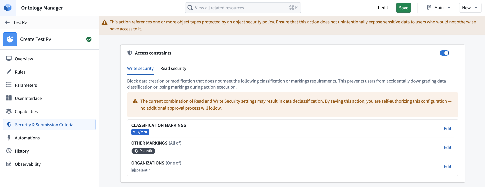
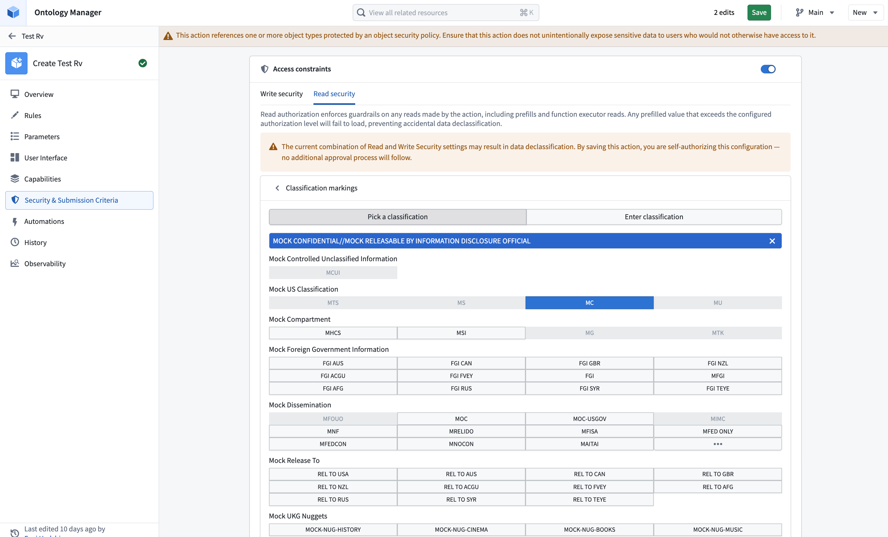
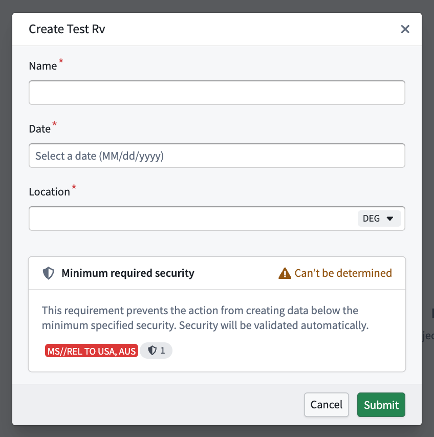
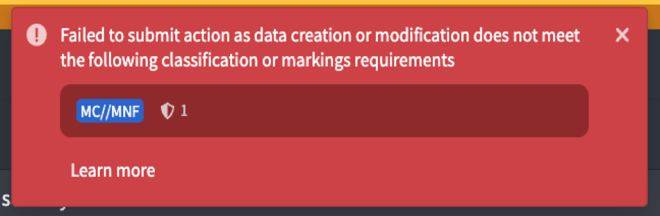

<!-- source: https://palantir.com/docs/foundry/action-types/read-write-authorizations/ · mirrored 2026-08-18 from Palantir Foundry docs -->

# Read and write authorizations

:::callout{theme="neutral" title="Beta"}
Read and write authorizations are in the [beta](/docs/foundry/platform-overview/development-life-cycle/) phase of development and may not be available on your enrollment. Functionality and platform support may change during active development.
:::

Read and write authorizations add security boundaries to an action type. [Read authorization](#read-authorization) limits the marked data that an action can read directly or receive as input when invoked by another piece of logic. [Write authorization](#write-authorization) sets minimum security requirements for data created or modified by an action. These authorizations supplement the user's existing permissions and the action type's [submission criteria](/docs/foundry/action-types/submission-criteria/). They do not grant access or replace existing permissions or submission criteria.

## Read authorization

Read authorization provides an additional upper bound on the data an action can read during execution or receive as input. Read authorization applies when Foundry loads values into parameters, including when another piece of logic invokes the action, and when function-backed actions perform reads. If data exceeds the configured read authorization, the action cannot load that data even if the user could otherwise access it.

The user applying the action must still have permission to access the data. If no markings are configured for read authorization, the action has no additional read boundary beyond the user's existing access.

## Write authorization

Write authorization defines the minimum security that data created or modified by an action must meet. Foundry validates the resulting data security and blocks the action if the result is below the configured minimum.

Write authorization does not grant a user access to markings, automatically add any configured markings, or make an otherwise invalid edit permissible. The user must have the required permissions, provide valid marking values where applicable, and pass the action type's submission criteria. If no markings are configured for write authorization, this feature does not enforce additional minimum output security.

A configured write authorization is not enforced for writes managed by the platform, including [action logs](/docs/foundry/action-types/action-log/) and [edit history](/docs/foundry/object-edits/user-edit-history/) objects. This means that security applied to action logs and edit history may be below the write authorization.

## Mandatory marking guarantees

[Mandatory markings](/docs/foundry/security/markings/#data-dependency) are intended to propagate along data dependencies so derived data retains the protections of its inputs. For actions, the action's logic sets the security applied to output data. An action can therefore produce output at the same, higher, or lower security than the data it receives or reads. Read and write authorizations set upper and lower bounds on what an action can do. Together, they guarantee the permitted security differences between the action's inputs and outputs.

Configuring write authorization to be less restrictive than read authorization allows the action to write data below the security boundary of data that the action can read. This intentionally severs mandatory marking propagation and may result in data declassification. The action type editor displays a warning whenever the read and write settings differ.

When read and write authorizations differ, Foundry checks the permissions of the user saving or publishing the action type. The user must have permission to declassify every mandatory marking severed between the read and write boundaries. If the check succeeds, the action type may perform the approved declassification; Foundry does not repeat this permission check at runtime.

:::callout{theme="danger"}
Read and write authorizations are currently optional. If read authorization is not configured, Foundry does not perform declassification permission checks when the action type is saved or published. The action can therefore read data above its write boundary and write less restrictive data, which can cause a data spill. Configure read authorization whenever an action may read marked data.
:::

## Authorization rules by marking category

Foundry combines configured markings according to their category:

| Marking category | Read authorization | Write authorization |
| --- | --- | --- |
| Classification markings | Follows the environment's configured hierarchy and conjunctive or disjunctive category rules. | Follows the environment's configured hierarchy and conjunctive or disjunctive category rules. |
| Other mandatory markings | All configured markings are required. | All configured markings are required. |
| Organizations | All configured Organizations are required. | At least one configured Organization is required. |

Classification behavior can vary between environments. Review [Classification-based Access Controls](/docs/foundry/security/classification-based-access-controls/#conjunctive-and-disjunctive-classification-marking-categories) for details about classification hierarchies and conjunctive or disjunctive categories.

## Configure read and write authorizations

In the action type editor, enable **Access constraints** to configure authorizations. Enabling access constraints initializes both authorizations with no markings. Disabling access constraints clears both authorizations.

Use the **Write security** and **Read security** tabs to configure each authorization separately. The editor displays a warning when the settings differ. If an authorization contains values that you cannot view, those values appear as redacted and cannot be edited.

Before submitting an action, the action form can display **Minimum required security** based on write authorization. The status can be:

<!-- vale Palantir.Contractions = NO -->

* **Security passed:** The destination security is expected to meet the configured minimum.
* **Security not passed:** The destination security is below the configured minimum.
* **Can’t be determined:** Foundry cannot determine the destination security before submission.
* **Not set:** No write authorization markings are configured.
* **Redacted:** The user cannot view the configured authorization.

<!-- vale Palantir.Contractions = YES -->

The form status provides early feedback. Foundry performs the authoritative validation when the action is submitted and fails the action if the resulting data does not meet write authorization.

