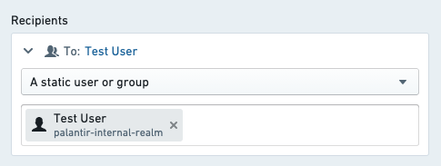
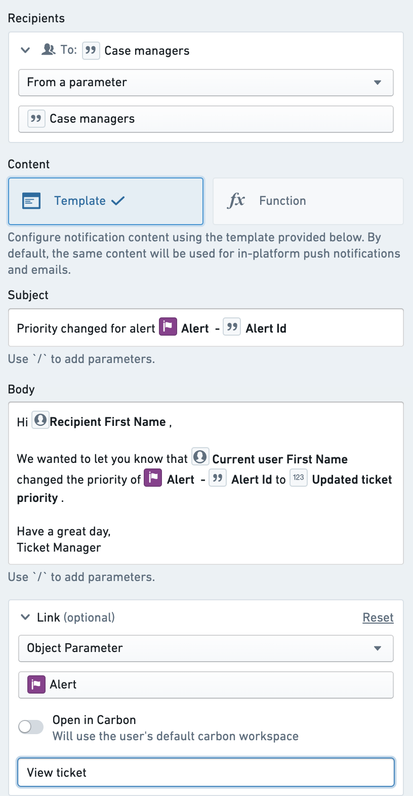

<!-- source: https://palantir.com/docs/foundry/action-types/set-up-notification/ · mirrored 2026-08-18 from Palantir Foundry docs -->

# Set up a notification

This tutorial demonstrates how to set up an action with a notification.

We will be using an action which updates the `Priority` property of an `Alert` object, and also notifies the `Assignee` (a Foundry user) which is stored as a property on that Alert object. If you want to follow along, you'll need to have the following already set up:

* An object with the correct properties and configured to be editable via actions
* An action which takes in one of your objects as well as a parameter containing the new priority and updates the priority property on the specified object. If you previously followed [the tutorial on getting started with actions](/docs/foundry/action-types/getting-started/), you should already have this set up.

If you are new to managing objects, you can read about [how to set up an object type](/docs/foundry/object-link-types/create-object-type/).

## Prerequisites

### Complete the Getting Started tutorial

This tutorial assumes you already completed the [Getting Started](/docs/foundry/action-types/getting-started/) tutorial for actions.

### Add the assignee property to your object type

For this tutorial, you will need to have a property on the `Alert` object that is called `Case Managers` and contains the Foundry user ID for the currently assigned user. Typically, if you are using actions to construct your workflow, you will be able to capture and store user IDs with the user selector components in your application. These will show up as full usernames wherever they are displayed in Foundry.

## Add a notification

First, navigate to your action that updates the ticket priority. Under the **Rules** section select **Add new rule**, followed by **Notification**. This will open the configuration dialog for adding a notification.

## Configure recipients

For this example, you will send the notification to the assignee, which is stored as a property of the `Alert` object being edited. To do this, use the option "Recipient(s) from property of object parameter" in the **Recipients** dropdown. Select the `Alert` object that is available as a parameter to the action, then select the `Case managers` property when prompted.

You should see the selected object parameter and property displayed in the **Recipients** section of the configuration. Keep in mind that the recipient must always be a Foundry user ID. If this property contains something else such as string email addresses, no notifications will be sent.

:::callout{theme="neutral"}
For testing, you may initially want to configure the action with hardcoded recipient(s) that can be used to validate the logic and notification content is configured as expected.
:::

[Learn more about other recipient configuration options.](/docs/foundry/action-types/notifications/#recipients)

## Configure notification content

Next, you will configure the content of the notification by customizing the notification to address the recipient by name and including the old and new priority of the `Alert` object in the content. An example notification configuration is available below.

First, select "Template" from the content options. This is the most straightforward way to configure the content and does not require writing any code.

For the subject line, enter your desired message. To add a parameter reference, add a forward slash `/` and select the desired parameter from the dropdown list.  If your selection is an object parameter, you will be asked to select which property you want to reference.

For the body, enter text that addresses the recipient by name, identifies the user who made a change, and reports the previous and updated status.

As with the object reference in the subject, you can select the "Recipient", "Current User", and any parameter options from the dropdown list in order to generate the correct reference to those user attributes.

[Learn how to generate notification content with more complex requirements.](/docs/foundry/action-types/notifications/#content)

## Configure a link

Finally, you will add a link to the Object View of the specified `Alert` in Object Explorer. Select "Object View" and then select your ticket object parameter from the dropdown. Then, add a label for the link button that reads `View Ticket`.

Now you are ready to save your entire notification configuration:

[Learn more about other types of links that can be configured.](/docs/foundry/action-types/notifications/#content)

## Send a test notification

To verify, create a test alert with yourself as the assignee. In order to run the action, you will then need to expose the action in Object Explorer or via a button in a Workshop module as described in the [actions documentation](/docs/foundry/workshop/actions-overview/).

Once you've made a test change, you should receive both an in-platform push notification and an email notification to the email account specified on your Foundry user profile. Previews for both in-platform and email notifications are displayed within the notification configuration view.

If you did not receive an email, it may be because you have email and/or in-platform notifications disabled. You can verify this in **Notifications** under **User Settings**.

## Next steps

* Explore other optional features, such as [custom content](/docs/foundry/action-types/notifications/#content-components) for when the recipient chooses to receive notifications via email.
* Configure complex logic for recipients or content using [functions](/docs/foundry/functions/configure-notifications/).
