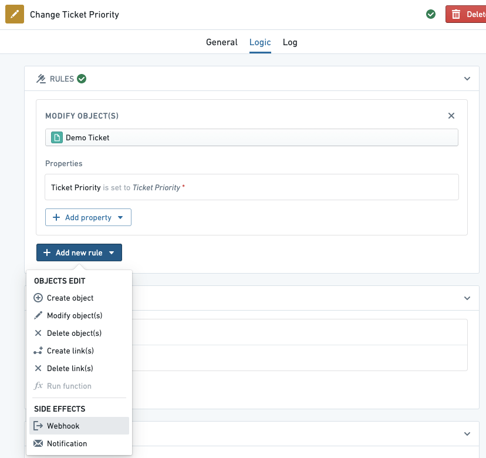
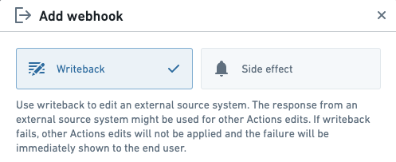
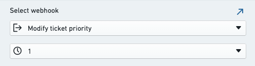
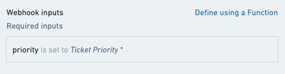
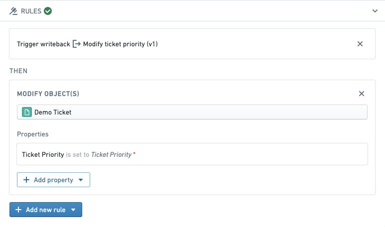
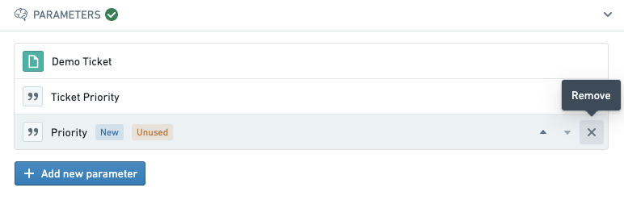

<!-- source: https://palantir.com/docs/foundry/action-types/set-up-webhook/ · mirrored 2026-09-04 from Palantir Foundry docs -->

# Set up a webhook

## Prerequisites

1. Complete the [getting started](/docs/foundry/action-types/getting-started/) tutorial to learn about how to set up a basic action.
2. Set up a [webhook](/docs/foundry/data-connection/webhooks-setup/) to create a connection to an external system. You may need to work with a system administrator who has permissions to connect to source systems before creating a webhook.

## Steps

In the below example, suppose that we have a webhook called **Modify ticket priority** which accepts a `priority` string value and sends it to an external system.

Navigate to your action, select the **Logic** tab, select **Add new rule**, then select **Webhook**.

By default, the newly added webhook is configured as a **side effect**; this makes the webhook run *after* objects are edited in Foundry. Alternatively, select **Writeback** to have the webhook run *before* object edits.

In the menu below, select the webhook you want to execute. In this example, we select the **Modify ticket priority** webhook. If you wish, you can select a different version of the webhook.

Next, configure webhook input parameters based on action parameters. By default, a new action parameter is generated for each webhook input unless an existing action parameter with the same name already exists, in which case the existing parameter is automatically configured. In this example, we map the webhook input called `priority` to an existing action parameter called `Ticket Priority`.

Select **Add webhook** to complete adding the webhook rule to your action. Note that after the webhook is added, the Rules section shows that the writeback will occur before objects are modified.

You may want to remove any autogenerated parameters created when you added the webhook which are now unused.

Select **Save** in the top-right to save your changes to the action. Now, when the action is applied, the request to the external system will be made before any changes are applied to objects in Foundry.

## Next steps

This tutorial demonstrated how to add a webhook to an action. To learn more, try these resources:

* View the [webhooks](/docs/foundry/action-types/webhooks/) section to learn about all the options available for webhooks in actions.
* Learn how to configure webhook input parameters using [functions](/docs/foundry/action-types/webhooks/#input-parameters).
* Learn more about the [webhooks concept](/docs/foundry/data-connection/webhooks-overview/) in Data Connection.
