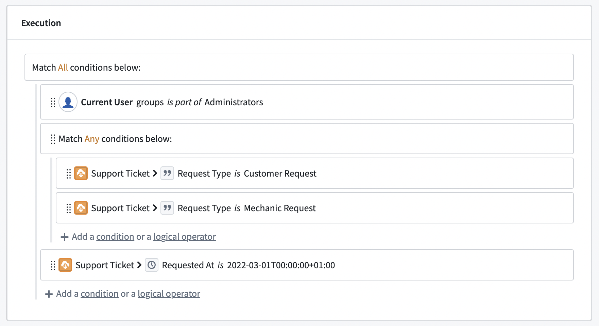
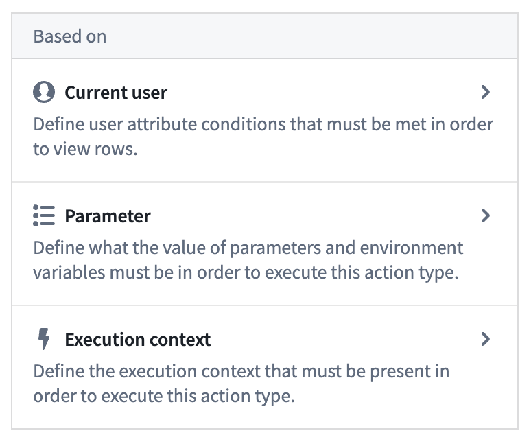
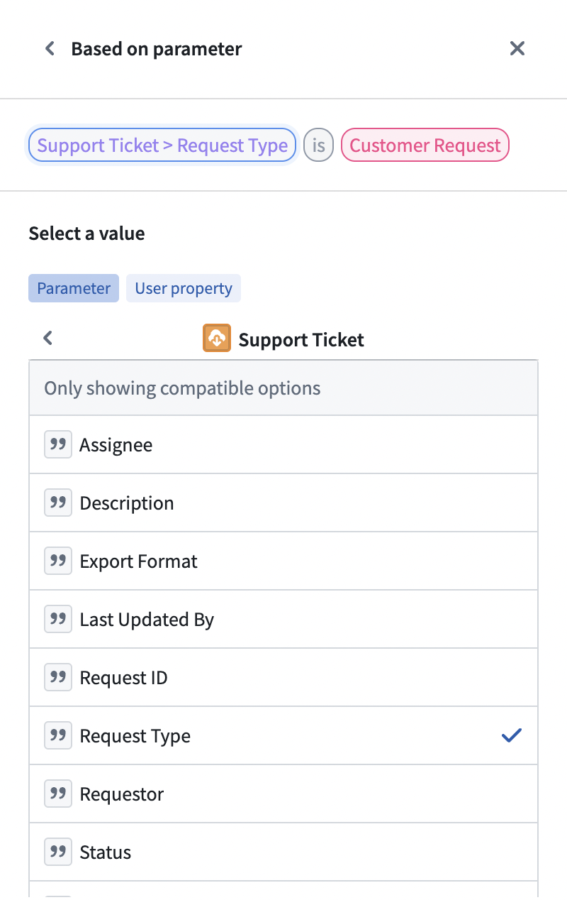
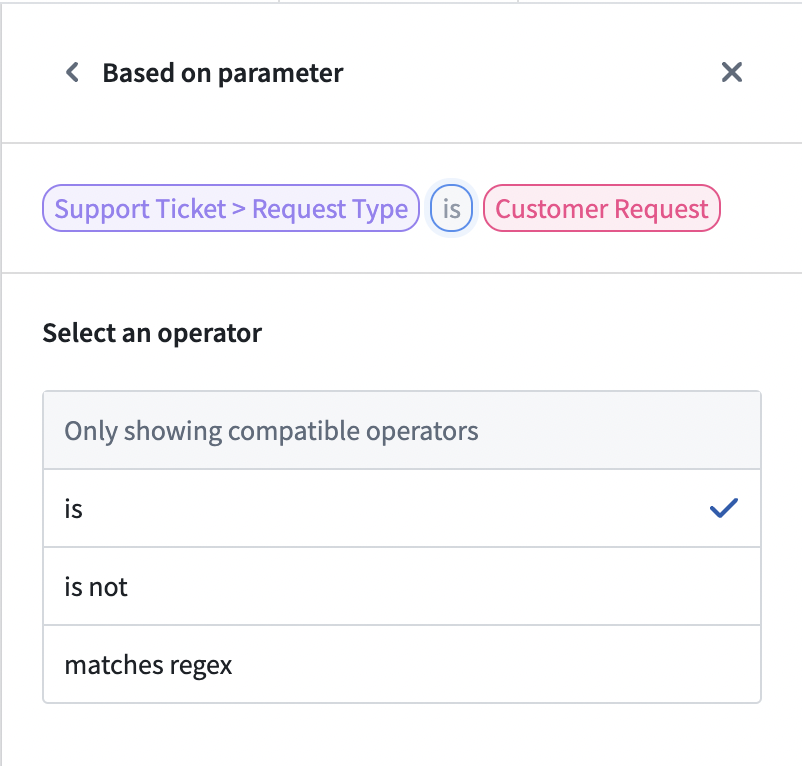
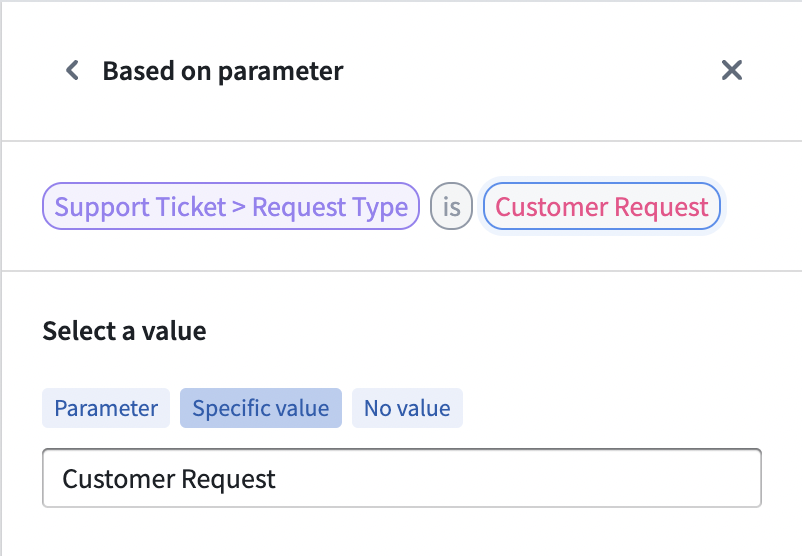

<!-- source: https://palantir.com/docs/foundry/action-types/submission-criteria/ · mirrored 2026-08-22 from Palantir Foundry docs -->

# Submission criteria

**Submission criteria** (formerly known as validations) are the conditions that determine whether an action can be submitted. Submission criteria support encoding business logic into data editing permissions, ensuring Ontology data quality and editing governance.

Submission criteria are created by combining conditions based on the context (like a user or a parameter) and static information to create a logical statement. Submission criteria can incorporate object, relation, and even user information into a logical statement to determine whether an action can be submitted.

:::callout{title="Example"}
For example, an airline might want to change the airplanes listed for a specific flight. The configured action allows users to change the `Aircraft` object linked to a `Flight` object. However, the airline only wants selected users (like a flight controller) to be able to use this action, in order to ensure that only aircraft which are still in operation are used. Using submission criteria, builders can ensure that an action which changes the airplane on a flight can only be submitted when the criteria are met by combining the user's membership to a group with the airplane's status at the moment that the action is submitted.
:::

Submission criteria consist of conditions and operators. Conditions are single statements governing the values of parameters or user properties. Operators are used to combine and nest different conditions.

Using the different types of operators, we can create more sophisticated statements, mirroring their business processes and requirements. Actions can only be submitted if all the submission criteria are met. This is independent from the permissions that govern whether a user can edit the action type itself. While an object type can have several action types adding, modifying, and removing objects, each action type has independent submission criteria.

## Conditions

A condition is a single comparison check between two values. Each condition either passes or fails based on its parameter or user inputs. A condition can be configured using one of three condition templates: “Current user”, “Parameter”, or "Execution context". These templates provide a framework for the rest of the condition. Every condition is a simple comparison between two values using an operator in the middle.

:::callout{title="Example"}
Continuing with our example, the flight controller requirement can be set using the `Current User` template, as it requires the context of the person submitting the action. To know whether an aircraft is still in operation, the `Aircraft` object needs to be used via the `Parameter` template.
:::

### Current user

The `Current User` template defines permissions based on the user submitting the action. The `Current User` input can be used to check a user's ID, group memberships via group IDs, or any other multipass attribute available (such as the user's Organization). Foundry evaluates user IDs as strings, which can be compared against either a statically defined list of user IDs or any string parameter that stores a user ID.

The group IDs option allows you to create conditions using the groups for which the action's user is a member (whether direct or inherited membership). The groups can be compared against a static selection of groups or the group ID provided by other parameters.

Multipass attributes are treated as string lists and can only be compared against other strings or string lists. A user will have a list of proposed multipass attributes that the user has access to. Using the `Other user attribute` field, conditions can be configured against attributes the user does not have access to. If a user does not have access to an attribute, they will fail the condition.

:::callout{theme="warning"}
Avoid using `NOT` conditions with group, marking, or organization memberships. Using a `NOT` condition in these circumstances is a misconfiguration. The platform supports scoped tokens, which carry only a subset of a user's permissions. These tokens may lack the attribute the `NOT` condition checks against, causing the condition to pass and grant more access than intended.
:::

### Parameter

Submission criteria can also use parameters defined in the parameter section. Parameters are passed into an action type from other apps or users themselves. Using conditions on parameters allows builders to embed business logic into the action type and prevent users from submitting actions on data that do not conform with business requirements.

:::callout{title="Example"}
In our example, the operating status is given via the `Aircraft` object and can change with every aircraft. The condition needs to be built on top of the `Aircraft` object type parameter.
:::

### Execution context

Submission criteria can also be based on the execution context in which an action submission is evaluated, namely if the action was submitted within an [Ontology Scenario](/docs/foundry/ontology/overview-ontology-scenario/). The Scenario execution context indicates that the action is being evaluated within an Ontology Scenario. It does not identify a particular Scenario.

:::callout{title="Example"}
Continuing the example, only a flight controller should be able to change the `Aircraft` object. However, within an Ontology Scenario, planners who are not flight controllers may need to test alternative aircraft assignments.

The submission criteria can allow the action when either:

* The action is executed in a Scenario and the current user is a member of the planning group; or
* The standard criteria flight controller requirement is met.

Separately, the flight controller can be permitted to [merge the scenario](/docs/foundry/ontology/merge-scenario/#configure-the-merge-action) via submission criteria of the merge scenario action.
:::

Submission criteria do not support attachment and object set parameters. These parameter types are removed from the selection panel.

### Select a value

After selecting the condition template, choose what value to compare. Some parameters (like lists or object parameters) require a more granular selection of what value should be used in the comparison. We can also choose to compare the length of a list instead of its content.

:::callout{title="Example"}
In the aircraft example, the operating status of an aircraft is stored in the property on the `Aircraft` object.
:::

### Operators

Operators define the comparison between the two values. To simplify the configuration workflow, operators are pre-filtered to only show a selection of operators valid for the parameter. When a parameter is changed, all conditions using this parameter need to be reconfigured.

There are multiple operators available depending on the selected parameters. For single value parameters, the following operators are available:

|Operator	|Example	|Data Example	|Description	|
|---	|---	|---	|---	|
|is	|name *is* John Doe	|"John Doe" is "John Doe" = TRUE	|The left value exactly matches the right value.	|
|is not	|**Current User** *is not* John Doe	|“John Doe" is not "Maria Smith" = TRUE	|The left value and right value do not match.	|
|matches	|name *matches* ^\[A|E|I|O|U]\*	|"John Doe" matches	|The left value matches the Regular Expression.	|
|is less than	|Aircraft > Engine Count *is less than* 2	|4 is less than 2 = TRUE	|The left value is smaller than the right value.	|
|is greater than or equals	|Aircraft > Engine Count *is greater than or equals* 2	|4 is greater than or equals 2 = TRUE	|The left value is greater than the right value.	|

For parameters with multiple values, the following operators are available. Object reference lists are turned into a list of values (either the object value or the value of the defined property):
|Operator	|Example	|Data Example	|Description	|
|---	|---	|---	|---	|
|includes	|Aircrafts > Pilot Name *includes* "John Doe"	|\[ "John Doe", "Maria Smith" ] includes "John Doe" = TRUE	|At least one of the left values exactly matches the right value.	|
|includes any	|List of names *includes any* Aircrafts > Pilot Name	|\["King Louis", "John Doe"] is included in \[ "John Doe", "Maria Smith" ] = TRUE	|At least one of the left values exactly matches at least one of the right values.	|
|is included in	|name *is included in* \[ "John Doe", "Maria Smith" ]	|  "John Doe" is included in \[ "John Doe", "Maria Smith" ] = TRUE	|The left value exactly matches at least one of the right values.	|
|each is	|Aircrafts > Pilot Name *each is* "John Doe"	|\[ "John Doe", "Maria Smith" ] each is "John Doe" = FALSE	|All left values exactly match the right value.	|
|each is not	|Aircrafts > Pilot Name *each is not* "John Doe"	|\[ "John Doe", "Maria Smith" ] each is not "King Louis" = TRUE	|All left values do not exactly match the right value.	|

:::callout{title="Example"}
Since a user in our example is a member of many groups but the comparison is to a single group, we need to select the `includes` operator to check for an overlap. However, the operating status needs to exactly match an expected status, so the `is` operator must be set.
:::

### Value

The value represents the other side of the comparison. The value can either be based on an existing parameter, a static value, or no value. No value checks whether the first value is empty (or null). Like the operator, the available options depend on the first value type.

:::callout{title="Example"}
We can now finalize the two conditions needed in the aircraft example. For flight controllers, the correct group needs to be selected as a static parameter. This is because the group should not change, but should stay the same every time an Action is submitted, regardless of the context. Hence the `specific value` is used and the desired group is selected via the dropdown. An aircraft is considered operational when the operating status property is `Yes`, which can be set using the specific value option again.
:::

## Logical operators

A logical operator can be used to combine different conditions. Logical operators can also be nested to create even more complex logic and can require either all, any, or no conditions underneath it to be met to pass.

## Failure message

Failure messages support defining what error should be displayed whenever the Action cannot be submitted. Every condition and logical operator on the root level has its own failure message. If conditions of lower levels are not met, the failure message of the corresponding root level (parent) is displayed. The failure message will be displayed to the end user across Foundry (Object Explorer, Workshop, or Quiver) whenever a condition is not met. The failure message informs the user about why they are blocked from submitting an Action.

You can verify how your submission criteria evaluate for a given set of parameter values with a [test run](/docs/foundry/action-types/test-run/) in Ontology Manager.
