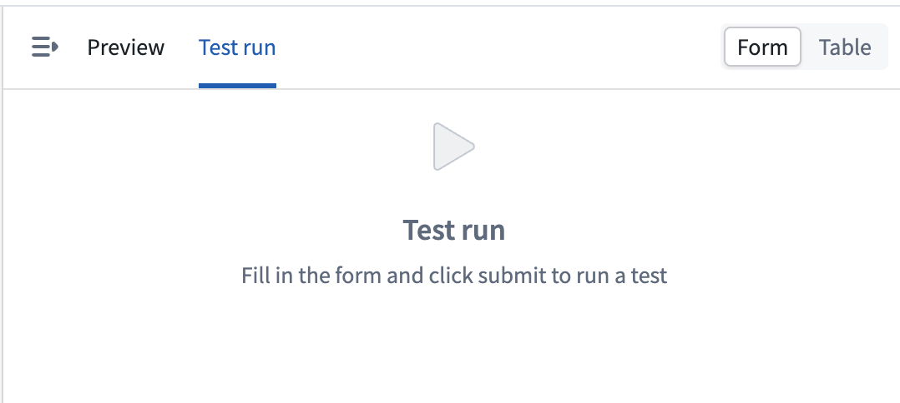
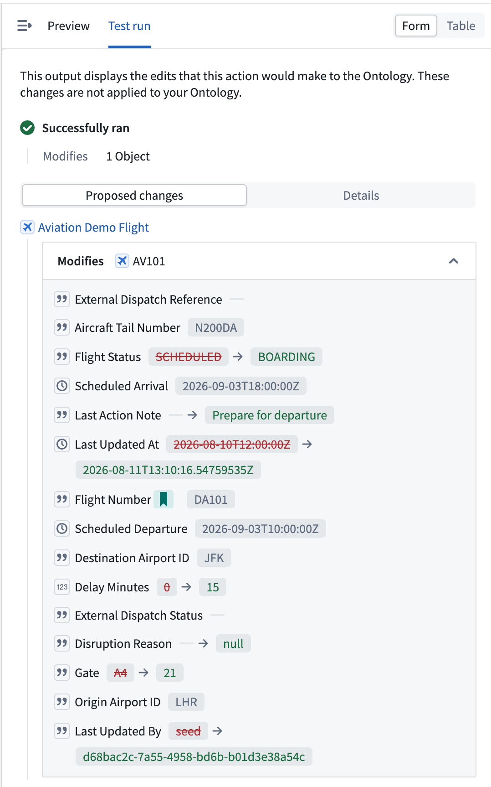
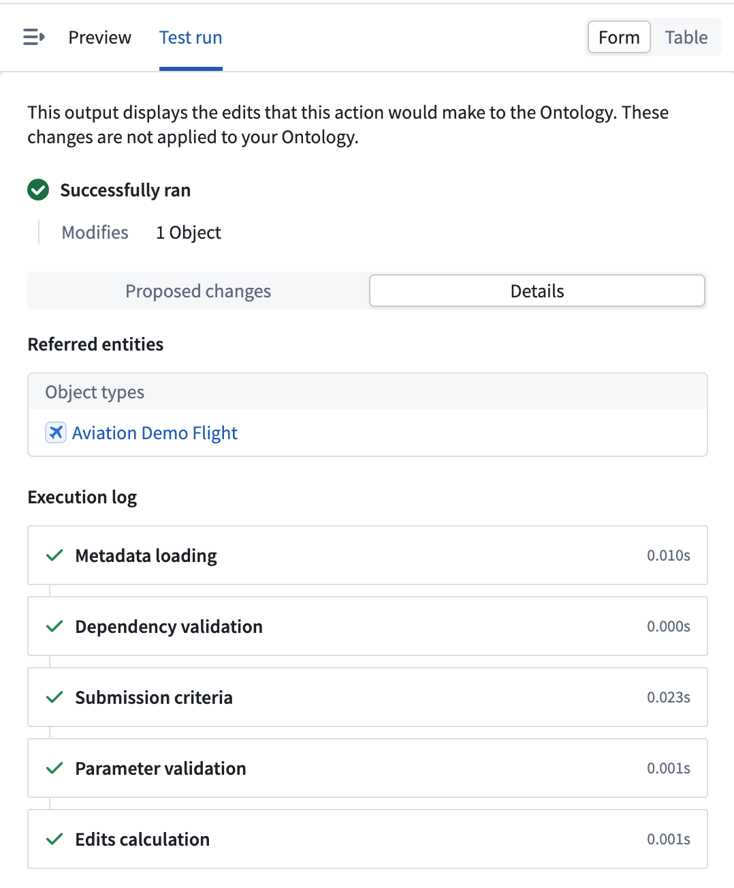
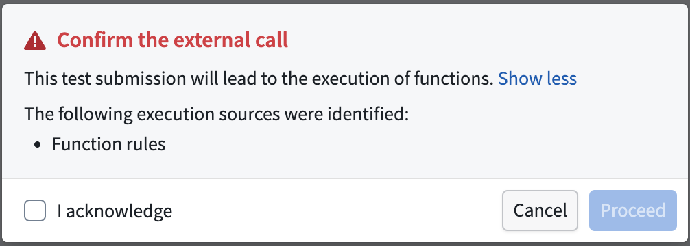

<!-- source: https://palantir.com/docs/foundry/action-types/test-run/ · mirrored 2026-08-18 from Palantir Foundry docs -->

# Test run

A **test run** lets you simulate an action type in Ontology Manager before end users can apply it. When you submit a test run, Foundry evaluates the action against the parameter values you provide and returns the edits the action *would* make, along with a detailed execution breakdown.

:::callout{theme="neutral"}
The edits produced by a test run are **not** applied to your Ontology. A test run is a safe way to view the edits an action would make and how it would execute, without changing any data.
:::

Test runs are available from the **Test run** tab of the action form preview in the action type editor.

## Run a test

1. Open an action type in Ontology Manager and open the action form preview.
2. Confirm the preview is set to the form layout. Test runs are available in the form layout and are not available in the table layout.
3. Select the **Test run** tab in the action form preview.
4. Fill in the form with the parameter values you want to test.
5. Select **Submit** to run the test.

The results of the test run appear in the action form preview once the run completes.

A test run evaluates the action type on your current Ontology branch and executes with your permissions, enforcing the same object security and submission criteria as a regular action submission. You can run a test if you are able to view the action type configuration in Ontology Manager.

:::callout{theme="neutral"}
Test runs are unavailable while an action type has unsaved edits. Save your changes before running a test so that the test evaluates the saved configuration.
:::

## Interpret the results

A completed test run presents its results across two tabs.

### Proposed changes

The **Proposed changes** tab lists the edits the action would make to the Ontology, including created, modified, and deleted objects and links. Property changes are shown as a comparison between the current and proposed values. If the action would not produce any edits, the tab displays **No proposed changes**.

### Details

The **Details** tab explains how the action was evaluated and what would happen beyond the direct edits:

* **Execution log:** A step-by-step breakdown of the run, covering metadata loading, dependency validation, submission criteria, parameter validation, and edits calculation. Use this log to understand why an action succeeded or where it failed.
* **Side effects:** A preview of the [side effects](/docs/foundry/action-types/side-effects-overview/) the action would trigger, such as [notifications](/docs/foundry/action-types/notifications/). You can open a notification preview to review the content and recipients that would be generated.
* **Referred entities:** The object types, link types, interface types, and [functions](/docs/foundry/action-types/function-actions-overview/) that the action referenced during the run.

If the action fails, the **Details** tab separates errors into two categories:

* **Admin-facing errors:** Technical details for debugging.
* **End-user-facing errors:** The message shown to users who trigger the action.

## What is skipped during a test run

A test run only performs the work needed to determine the action's result. Side effects that would take effect after the action is applied are skipped. When your action type contains any of the following, the action form preview notifies you that they will be skipped:

* [Side effect webhooks](/docs/foundry/action-types/webhooks/#side-effect-webhooks) are not called.
* [Notifications](/docs/foundry/action-types/notifications/) are not sent. A breakdown of the notifications that would have been triggered is displayed in the test run results.
* [Schedule builds](/docs/foundry/action-types/trigger-schedule-build/) are not triggered.

## External calls

To produce an accurate result, a test run executes the functions and calls that the action needs to reach its outcome. This includes functions used in the action's [rules](/docs/foundry/action-types/rules/), functions that generate a notification's body or recipients, functions that generate a webhook payload, [writeback webhooks](/docs/foundry/action-types/webhooks/#writeback-webhooks), and functions that access external resources. Only the calls required to determine the action's result are made.

:::callout{theme="warning"}
Because external calls are executed, they can affect external systems. When your action type includes any of them, Foundry lists the execution sources and prompts you to **Confirm the external call** before the test run proceeds. The calls execute only after you acknowledge them.
:::

## Limitations

* Test runs are available in the form layout only; they are not available in the table layout.
* Test runs are unavailable while an action type has unsaved edits. Save your changes before running a test.
* Side effects that take effect after the action is applied are skipped, as described in [What is skipped during a test run](#what-is-skipped-during-a-test-run). Certain function-backed calls still execute; see [External calls](#external-calls).
