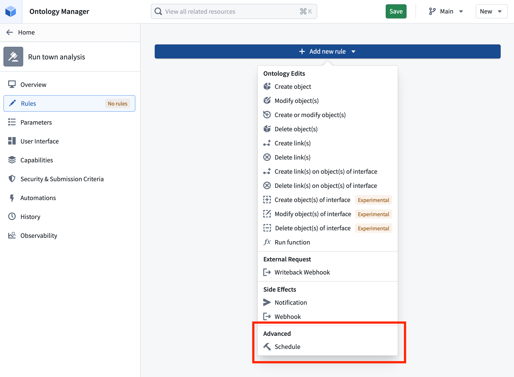
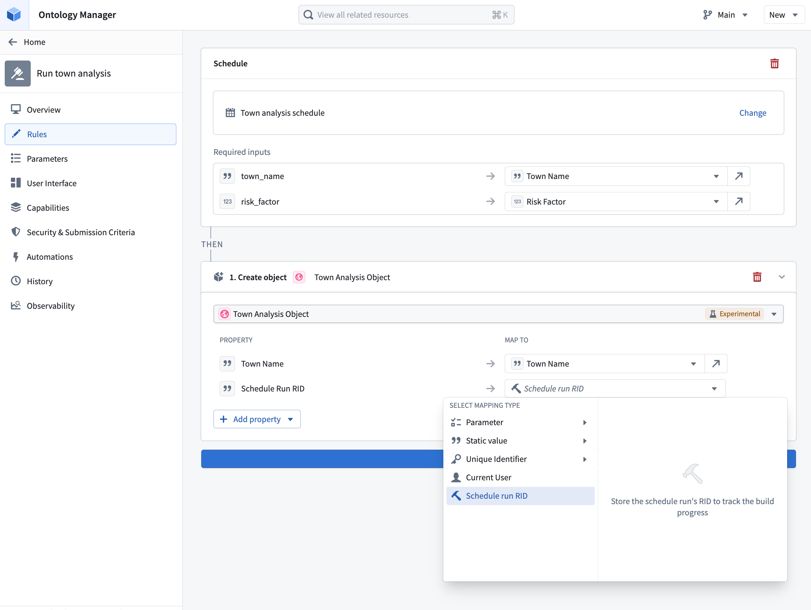

<!-- source: https://palantir.com/docs/foundry/action-types/trigger-schedule-build/ · mirrored 2026-08-11 from Palantir Foundry docs -->

# Trigger schedule build

A [schedule](/docs/foundry/data-integration/schedules/) defines a set of resources Foundry recomputes as part of a [build](/docs/foundry/data-integration/builds/). By configuring a **schedule rule** on an action type, you can trigger a build of that schedule whenever the action is applied. This enables end-user workflows in the Ontology to recompute datasets without users having to navigate to [Data Lineage](/docs/foundry/data-lineage/overview/) or the [Builds application](/docs/foundry/data-integration/application-reference/#builds).

When an action type contains a schedule rule, the action's Ontology edits are applied *after* the build begins. Edits do not wait for the build to finish. Instead, the action triggers the build, captures the schedule run RID, and immediately applies the rest of the rules, including the Ontology edits.

## Configure a schedule rule

Add a schedule rule to an action type and select a schedule. The schedule must be in [project-scoped mode](/docs/foundry/data-integration/schedules/#project-scope).

If the selected schedule is [parameterized](/docs/foundry/building-pipelines/parameterization/), you must provide a value for each schedule parameter. When the action is applied, the resolved parameter values are passed to the schedule and forwarded to the underlying parameterized transforms inside the build.

Schedule rules are particularly useful when paired with [parallelized parameterized schedules](/docs/foundry/building-pipelines/parameterization/#parallelized-mode-advanced). Review the [parameterization documentation](/docs/foundry/building-pipelines/parameterization/#use-action-types-for-parallelized-schedules) to learn more about using actions in the Ontology for parallelized schedules.

## Permissions

The action's [submission criteria](/docs/foundry/action-types/submission-criteria/) manage the permissions needed to trigger a schedule through the action. If users satisfy the action submission criteria, they can run the schedule without any direct permissions on the schedule.

:::callout{theme="neutral"}
Foundry checks whether a user has permission to run the schedule the first time it is referenced and whenever the schedule rule is edited. Referencing a schedule from an action type delegates control over running it from the schedule to the action type. Anyone who can manage actions on the action type then controls who can trigger the schedule.
:::

## Track build progress

When a schedule rule is triggered, the resulting schedule run is identified by a **schedule run RID**. This RID is exposed as a value that can be referenced from the action type's Ontology edit rules, allowing you to write it into a string property of an edited object. This is useful when you want to keep a record on the object of the build that was triggered by the action.

To capture the schedule run RID, configure a **Modify object** or **Create object** rule on the same action type and map a string property of the target object to the schedule run RID value provided by the schedule rule.

To render the stored RID as a live build status indicator, apply [resource RID formatting](/docs/foundry/object-link-types/value-formatting/#supported-value-formatting) to the property. With formatting enabled, Foundry displays the RID value as a link with an icon and text that reflects the current status of the build: `Running`, `Ignored`, `Failed`, or `Succeeded`.
