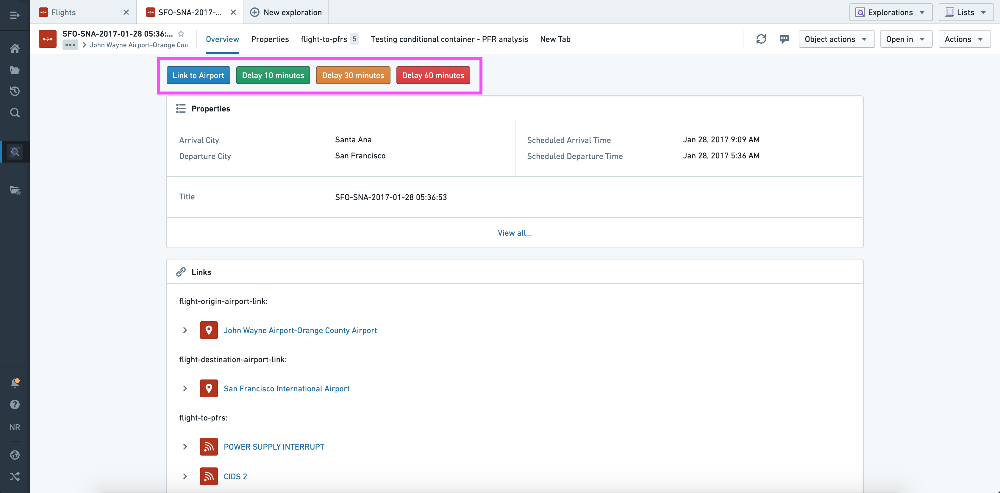
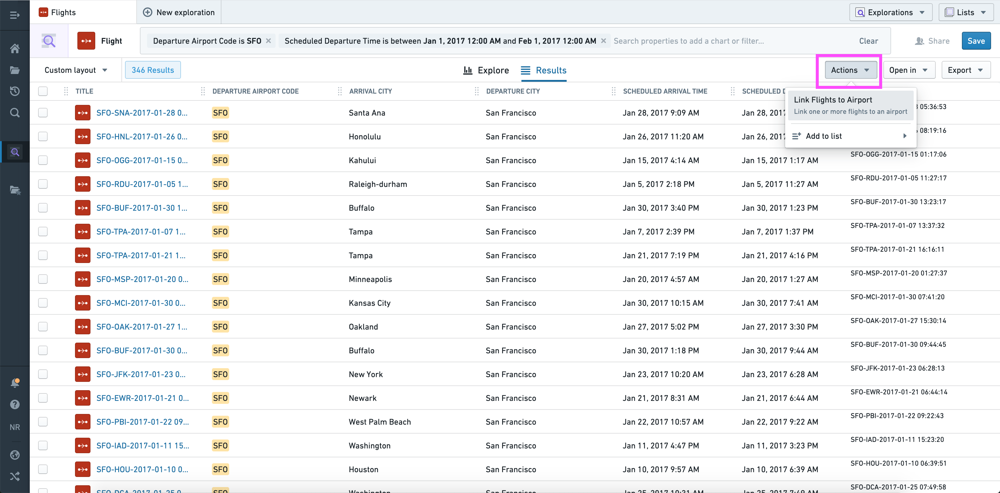
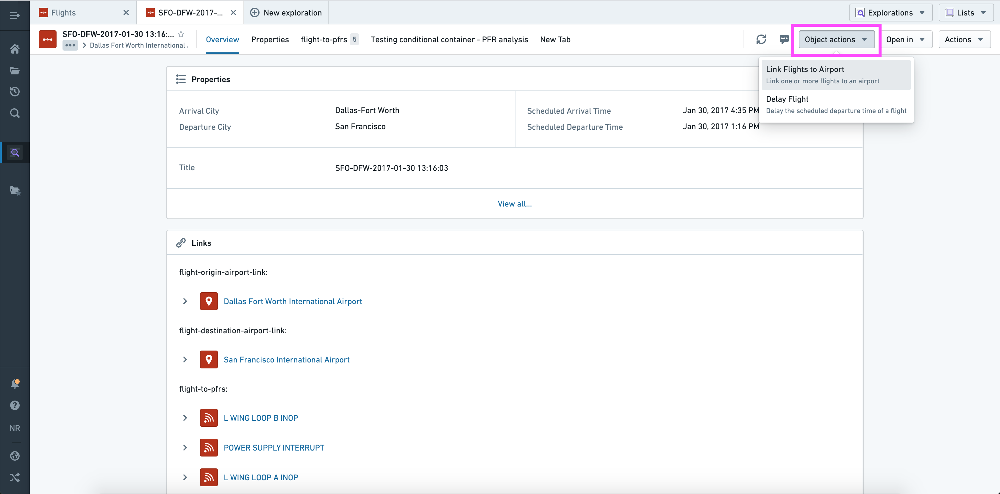
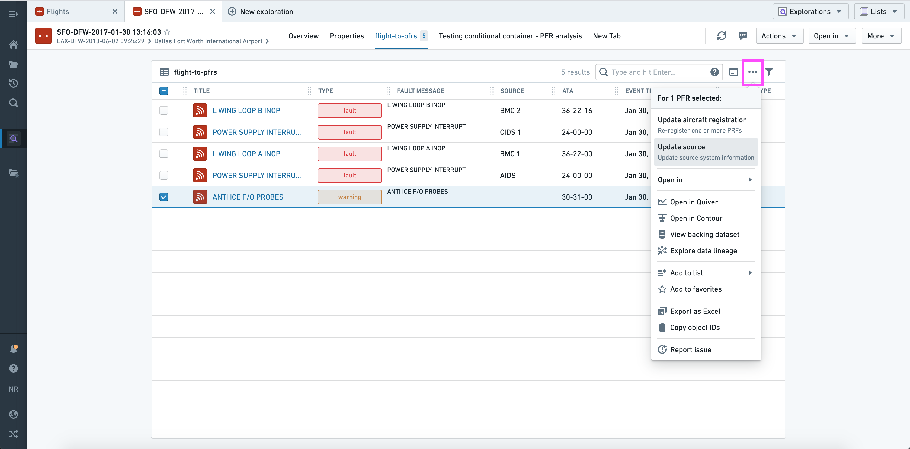
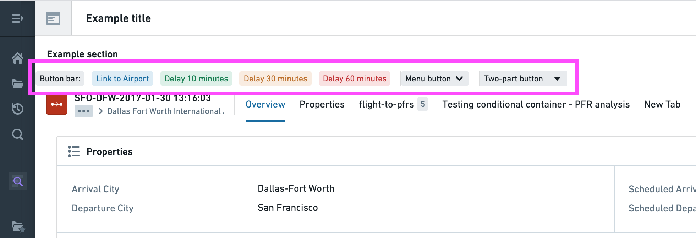

<!-- source: https://palantir.com/docs/foundry/action-types/use-actions/ · mirrored 2026-09-04 from Palantir Foundry docs -->

# Use actions in the platform

Action types can be seamlessly integrated across applications in Foundry. Read on to learn how to configure and apply an action from [Object Explorer](/docs/foundry/object-explorer/overview/) and [Workshop](/docs/foundry/workshop/overview/).

In the examples below, we use the term **single action type** to refer to an action type using an object reference parameter, and **bulk action type** to refer to an action using an object reference list parameter.

## Object views

Actions can be added to an [Object View](/docs/foundry/object-views/overview/) using the **Actions section**.

When configuring the **Actions section** you have the option to:

* Add any action as a button in the section.
* Give each button its own label and color.
* Change the default on-click behavior from opening the form to applying the action immediately using the default values (if valid).
* Specify whether the button should be hidden or disabled if a non-visible parameter is invalid (the idea being that visible parameters could be corrected upon opening the form).
* Provide a default value for each parameter; this can be a property value of the current object or a "local" value (current user, current timestamp, current object, or a manually entered value).
* Override the visibility of each parameter.

As shown above, you can therefore use this section to offer multiple structured versions of the same generic action ("Delay 10 minutes", "Delay 30 minutes", etc.).

## Object Explorer

Actions will automatically be shown in three places across [Object Explorer](/docs/foundry/object-explorer/overview/):

1. From the **Actions** dropdown in the Exploration View (top right).

Using the current set of objects, this dropdown is automatically populated with applicable bulk actions.

2. From the **Object Actions** dropdown menu in the Object View (top right).

Using the current object, this dropdown menu is automatically populated with applicable single and bulk action types.

3. From the **Linked objects view section** in the Object View (top).

Using the selected object(s), this dropdown is automatically populated with applicable single and/or bulk action types.

:::callout
In "bulk" contexts (where multiple objects are shown in a list view), only actions that accept object list parameters of the correct type will be shown.
:::

## Workshop

In [Workshop](/docs/foundry/workshop/overview/), Actions can be configured and applied using the [**Button group** widget](/docs/foundry/workshop/widgets-button-group/).

This widget has the same configuration options as the [Actions section](#object-views) in an Object View, with a few notable extensions:

* There are three possible layouts, all of which are shown above.
* The buttons have additional display options, including left/right icons, minimal styles, and tag styles.
* In addition to an Action, an individual button can trigger a Workshop event, URL, or object set export.

And one difference:

* A default value can be a [variable](/docs/foundry/workshop/concepts-variables/), the current user, or the current timestamp

Read more about [Actions in Workshop](/docs/foundry/workshop/actions-overview/), or read the full reference for the [Button Group widget](/docs/foundry/workshop/widgets-button-group/) to learn about all available configuration options.
