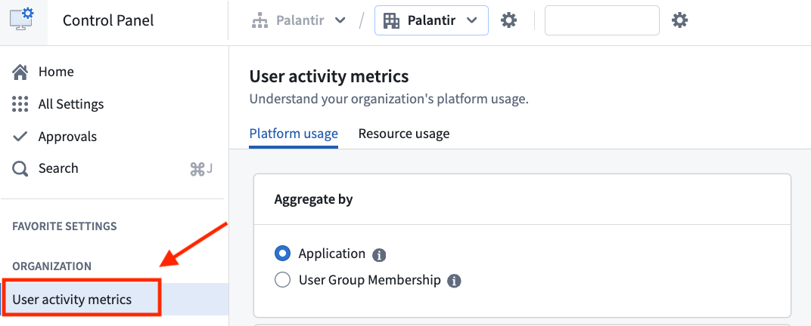
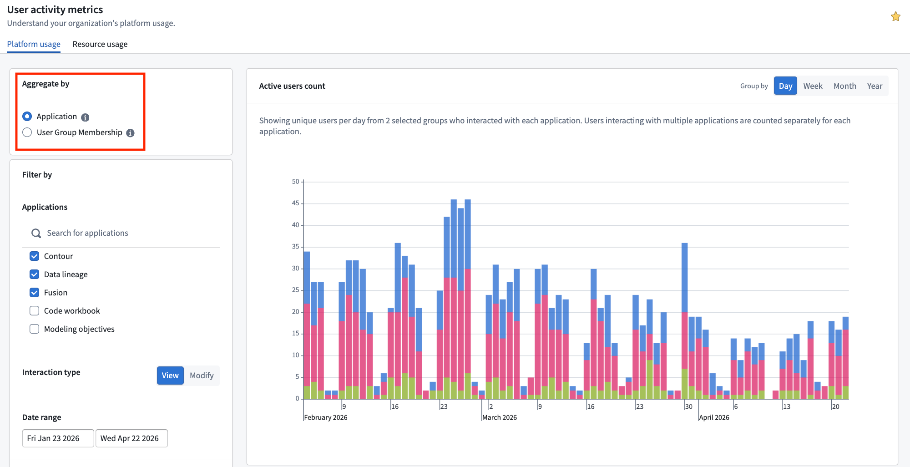
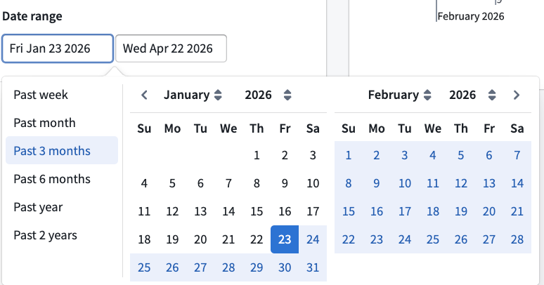
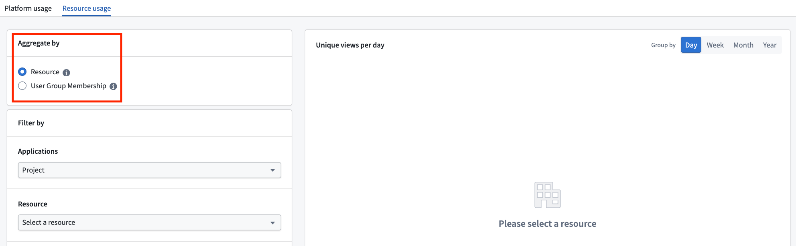

<!-- source: https://palantir.com/docs/foundry/administration/analyze-user-activity-metrics/ · mirrored 2026-08-22 from Palantir Foundry docs -->

# Analyze user activity metrics

Understanding how your content is being used can help you demonstrate impact and prioritize your efforts. For example, usage metrics may reveal that a report is accessed daily across the organization, which could indicate high value, or the metrics could show that a dashboard is rarely viewed and could benefit from revision or removal.

These insights can help you allocate your time and resources more effectively by focusing on the content that matters most. They can also help you identify areas where additional training or communication may be needed to increase engagement with certain resources.

The Palantir platform provides organization-level metrics on platform-wide and resource-specific usage, enabling administrators to track adoption over time across defined usage cohorts. For more information on group management, refer to [Authentication](/docs/foundry/authentication/overview/).

## Permission and navigation

There are two views of usage metrics, with different access paths:

* **Platform usage** tab (organization-wide aggregated metrics): available to any user holding the **View usage metrics** workflow on the organization. By default, this workflow is assigned to the `Organization Administrator` and `Organization Settings Viewer` roles.
* **Resource usage** tab (per-resource metrics): a user sees metrics for a given resource only if **both** of the following are true:
  * They hold the **View usage metrics** workflow on the organization of the users who viewed the resource, and
  * They have permission to view usage metrics on that specific resource. By default, only the `Owner` role on the resource grants this permission.

To grant a user access to both views without making them an administrator, an `Organization Administrator` can assign the **View usage metrics** workflow to an existing or [newly created role](../platform-security-management/manage-roles.md/#creating-a-custom-role), and then add the user to that role. For general information on access, refer to the [Enrollments and organizations permissions documentation](/docs/foundry/administration/enrollments-and-organizations-permissions/).

The User activity metrics dashboard can be found on **Control Panel** under **Organization**.

## Platform usage

:::callout{theme="warning"}
The dashboard provides only aggregated usage metrics by default. To get access to individual usage metrics, refer to [**Exporting User Activity Metrics**](#exporting-user-activity-metrics) below.
:::

By default, this view provides a high-level usage count across the organization. The usage count indicates the number of unique users per day who have visited your organization's platform for any amount of time.

### Grouping usage metrics

Usage metrics can be grouped by:

* **Applications/Resources:** When user counts are grouped by `Applications/Resources`, the bars in the bar chart will be color-coded by application.
* **User group membership:** When user counts are grouped by `User group membership`, the bars in the bar chart will be color-coded by both the application's usage and user groups (for example, all users of a given group leveraging `Contour` will have a dedicated color).

:::callout{theme="warning"}
When a user group does not meet the minimum of 10 interactions for the selected date range, the information will be suppressed and will not be represented in the resulting bar chart.
:::

### Filtering usage metrics

Usage metrics can be filtered by:

* **Applications/Resources:** `Workspace` is checked by default, but you can select any other application installed on your instance, such as `Workshop`, `Slate`, or `Contour`.
* **Interaction type:** View and Modify
  * **View:** Corresponds to the number of times an application has been opened. Every user that has made a `Modify` interaction is automatically counted in the `View` count.
  * `Modify` corresponds to the number of times an application has been edited. Note that `Edit` events do not exist for all application types (for example, Data Lineage).
* **Date Range:** You may choose any time frame of your choosing or select any of the predefined options located on the left-hand side of the panel.

* **Limit to user groups:** By default, `Only my groups` will be checked. However, any user with the correct [permissions](#permission-and-navigation) will be able to query and select any other group within your own organization, as well as organizations for which you are a guest. However, these two conditions need to be met:
  * The user group must have at least 10 members; otherwise, the dashboard will not display user activity metrics.
  * There must be at least 10 interactions in which the resource was viewed within the selected date range.

### Examples of using the platform user activity dashboard view

* **Comparing adoption rates:** Use the dashboard to compare application adoption rates between two user groups, which may represent different manufacturing plants, departments, or teams.
* **Identifying Development Trends:** Track development trends as new tools are introduced to the platform. For instance, you might expect the number of users with a "Modify" interaction type to decrease over time as workflows reach a steady state.

## Resource usage

The Resource Usage view allows users to monitor the usage over time of specific resources (for example, Workshop applications) to which they have [access](#permission-and-navigation). This view shares all the grouping and filtering features mentioned in the [platform usage view](#platform-usage), but includes an additional filter: **Resource**.

To use this filter, users will need to:

1. Select an *Application* from the dropdown menu.
2. Choose the corresponding *Resource* from the organization's directory.

:::callout{theme="warning"}
Under *Application*, the *Project* option allows Administrators to track user interactions with a specific project. Organizations often use projects as proxies for different teams or workflows. As a result, this option enables users to monitor the total amount of Palantir platform activity across various initiatives.
:::

## Exporting user activity metrics

Some organizations may be interested in analyzing raw user activity metrics in greater depth. Internal datasets are sensitive and should only be accessed by authorized personnel in accordance with all applicable laws. Palantir recommends that any exported dataset be appropriately permissioned — for instance, by applying a [marking](/docs/foundry/security/markings/) to the project. Processing of exported data is subject to [Palantir's Acceptable Use Policy ↗](https://palantir.pactsafe.io/legal-3791.html#ucr-985315). Refer to [Internal dataset exports](/docs/foundry/administration/internal-dataset-export/) in the documentation to learn more.
