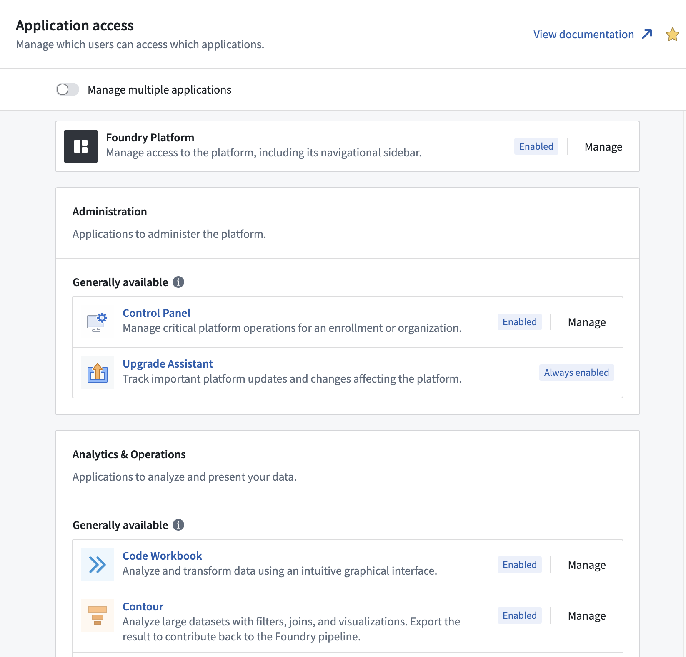
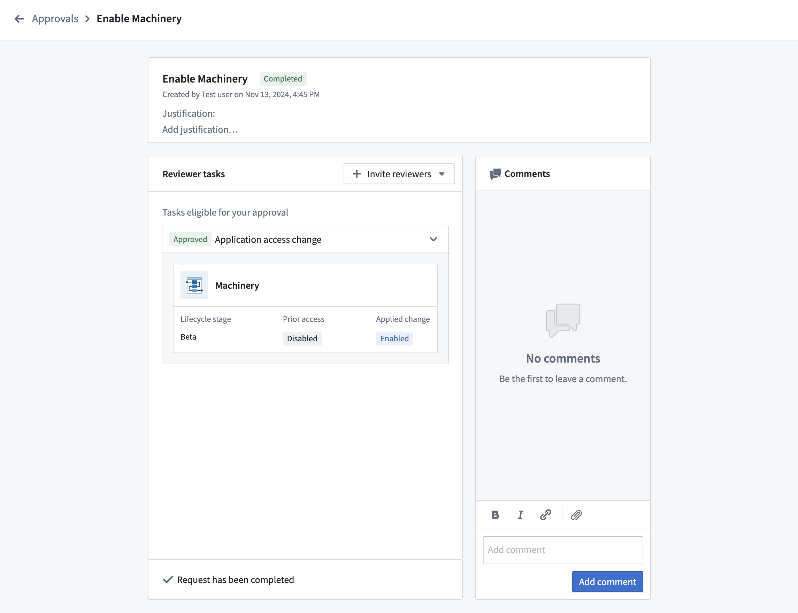
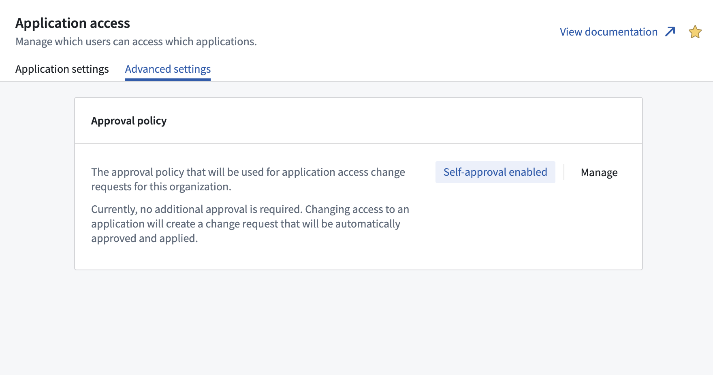
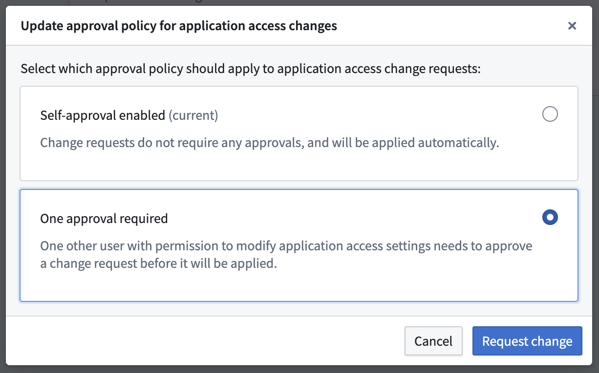
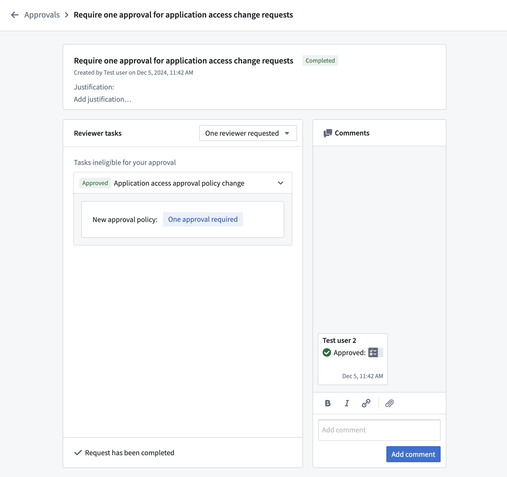
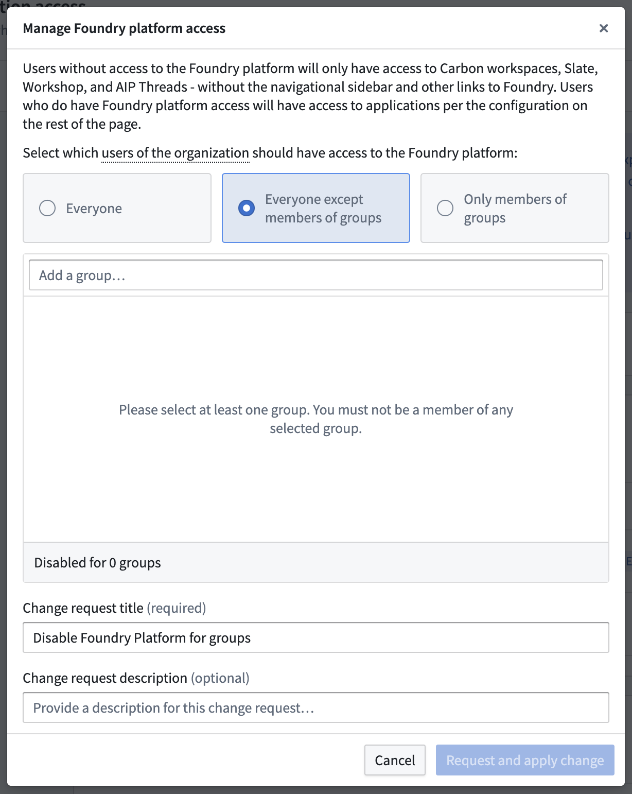
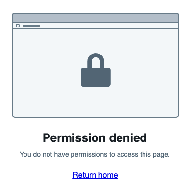
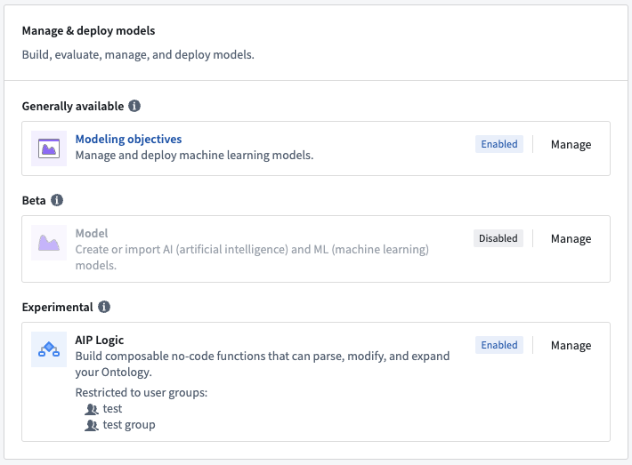
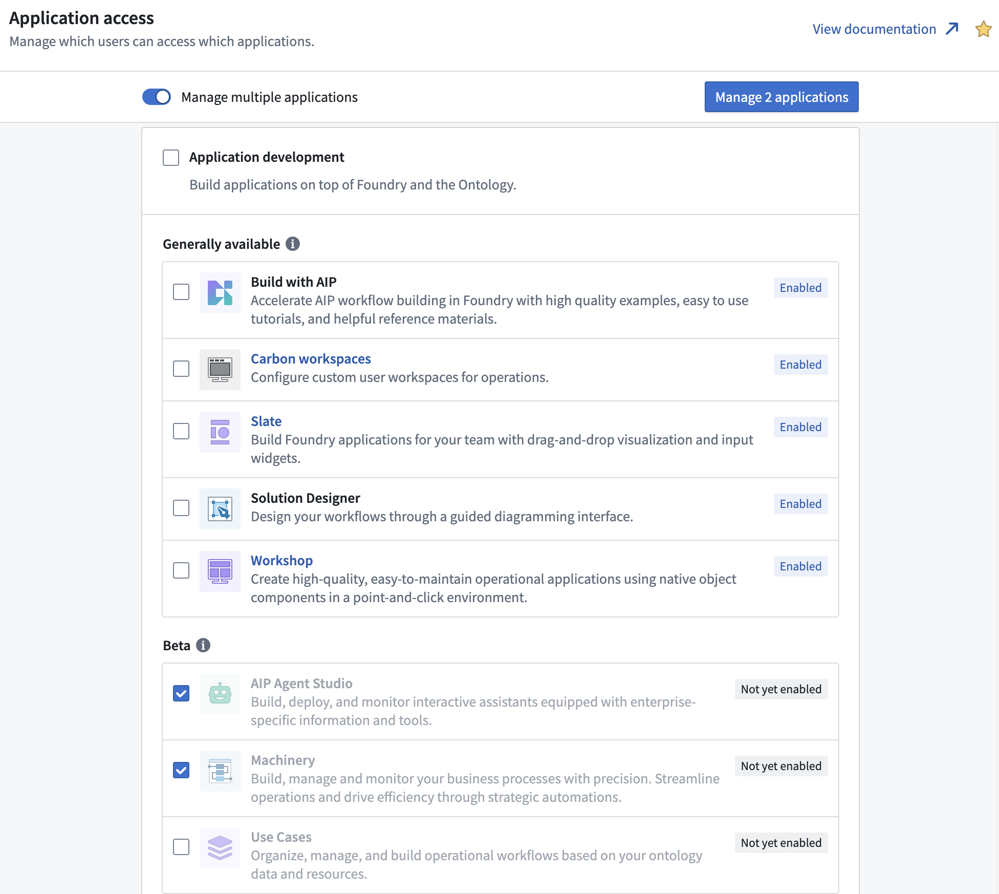
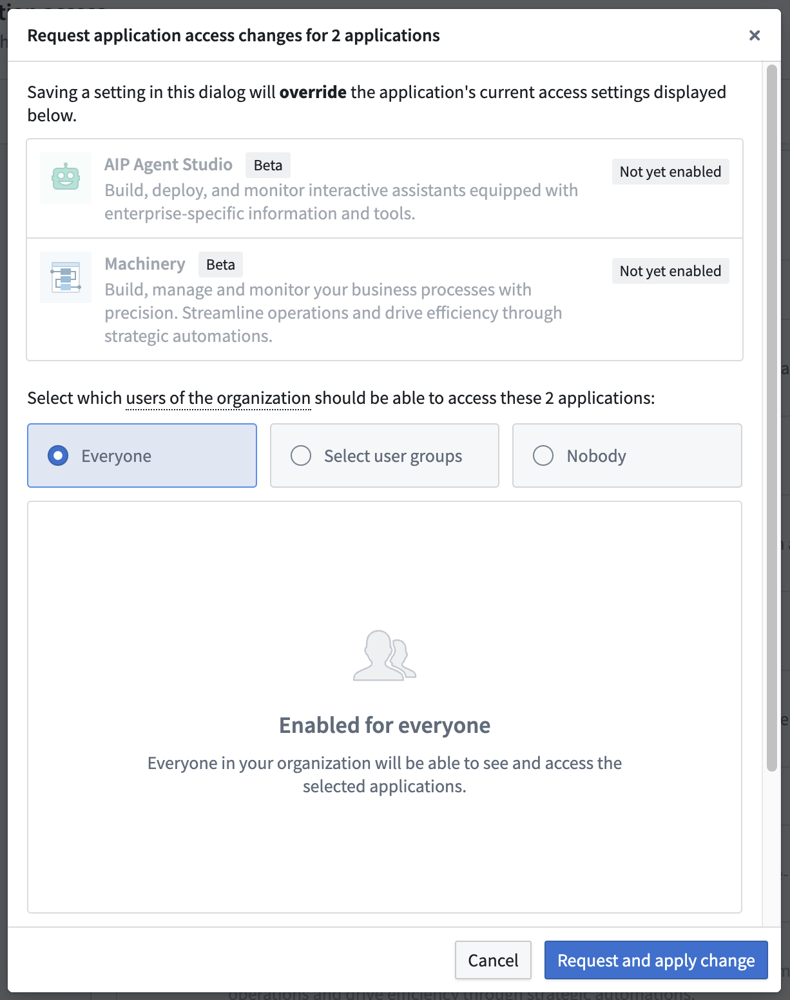

<!-- source: https://palantir.com/docs/foundry/administration/configure-application-access/ · mirrored 2026-08-22 from Palantir Foundry docs -->

# Configure application access

The **Application access** section of Control Panel allows appropriate administrators to control the scope of access for users and groups to specific tools within Foundry.

A common usage pattern for limiting application access is to prevent distraction or confusion for users within Foundry that operate within either custom applications or with a narrow set of curated analyses and other resources. Limiting the scope of applications available to this group of users can streamline their Foundry experience.

Another common pattern is to use application access to give a platform administration team or a group of advanced users early access to [beta](/docs/foundry/platform-overview/development-life-cycle/#beta) applications while restricting their availability to the broader user base.

This can even go as far as removing access to almost all Foundry applications. In this case a user will only have access to consumer-facing applications, such as Slate and Workshop.

:::callout{theme="warning"}
Application access is not a security feature; it only simplifies the frontend user experience for users that do not need to view certain applications. Refer to the [Security documentation](/docs/foundry/security/overview/) for guidance on how to properly permission off functionality.
:::

To view and configure the Application access section in Control Panel, a user needs the **Manage application access** workflow, which is granted by the **User experience administrator** role. Roles are administered in the **[Organization permissions](/docs/foundry/administration/enrollments-and-organizations-permissions/#roles)** tab in Control Panel.

## Change requests

Changing an application access configuration will generate a change request in [Approvals](/docs/foundry/approvals/overview/). These can be viewed in the [Approvals inbox in Control Panel](/docs/foundry/administration/control-panel-approvals/) with the request type **Application access change requests**. A historical record of all changes made will be kept.

## Configure approval policy

By default, application access change requests will be automatically self-approved and applied. This can be configured in the **Advanced settings** tab.

Select **Manage** to request a change to the approval policy. This will bring up a dialog where you can select the new policy that should apply to application access requests.

Choose the new desired approval policy and select **Request change**. This will generate a change request in Approvals. Changes to the approval policy require approval from a user with the **Manage application access** workflow other than the change request author.

Once approved, the updated approval policy will immediately start being applied to application access change requests.

## Restrict platform access

By default, Foundry users have access to most parts of the Foundry platform. With Application access it is possible to flexibly tailor the Foundry experience for different groups.

The most restrictive configuration is to remove Foundry platform access entirely. There are two options for restricting access to the Foundry Platform: an allowlist or a blocklist. **Everyone except members of groups** restricts access for users who are in at least one of the groups specified. **Only members of groups** restricts access for users who are *not* in any of the groups specified. Users with restricted access to the Foundry platform will only have access to consumer-facing applications built in Slate or Workshop to which they have explicitly been granted resource-level access. For these users the Foundry sidebar will be hidden and they will be prevented from navigating to any other parts of Foundry. Note that application access operates at the application level; these controls do not differentiate between read and write access.

To limit which users are able to access the Foundry platform as a whole:

1. Select **Manage** next to **Foundry Platform** to bring up a dialog for configuring access to the Foundry platform.
2. Choose **Everyone except members of groups** or **Only members of groups**.
3. Search for user groups which, depending on the previous selection, should or should not have access to the platform.
4. Select **Request and apply change** to create a change request and immediately apply it.

Note that a user account with the **User experience administrator** role must remain in at least one group that retains Foundry platform access because otherwise it will lose access to Control Panel and no longer be able to administer these settings.

## Customize application access

The scope of the Foundry platform can be restricted on a per-application basis. Users without access to an application will not be able to discover it from the sidebar or [Application Portal](../getting-started/orientation-and-nav.md/#applications-portal). Additionally, they will see a 403 "Permission denied" error message when attempting to access an application through a URL to which they do not have access.

All applications are grouped by category and [lifecycle stage](/docs/foundry/platform-overview/development-life-cycle/), and sorted alphabetically.

Select **Manage** to bring up a dialog for configuring access to one single application. To configure the same access setting for multiple applications, toggle **Manage multiple applications** at the top of the page and make a selection of applications to update.

In this case, the manage dialog shows all selected applications with their current lifecycle stage and access setting.

Note that Control Panel cannot be disabled completely. At least one group that you are a member of needs to have access because otherwise you would no longer be able to administer these settings.

## Lifecycle stage updates

Applications follow the [development lifecycle](/docs/foundry/platform-overview/development-life-cycle/). When an application transitions from one lifecycle stage to the next, the same set of users maintain access, with the following exceptions:

* When an application becomes generally available, all users will get access to it automatically, unless the application has been explicitly disabled during the experimental or beta stage. Beta applications that will be automatically enabled are shown as "Not yet enabled" rather than "Disabled" in **Application access** to indicate this state.
* When an application is deprecated, all users will lose access to it.

To highlight significant lifecycle stage updates, some applications are displayed at the top of the page until their settings are confirmed or updated:

* **Generally available applications that were previously disabled:** Applications that were explicitly disabled or restricted to certain user groups during the experimental or beta stage remain restricted when those applications reach general availability. Quick actions are available to either keep the restriction or enable the application for all users in its new lifecycle stage.
* **Recently sunsetted applications that are enabled:** When an application enters the sunset stage, those users who had access before will maintain access. At this point, usage of the application is discouraged, but support for critical bug fixes is still provided. If a deprecation timeline (typically 12 months) has been set, the deprecation date will be announced and displayed alongside the application on the application access page. Work with users to decrease usage of the application ahead of the deprecation date, then disable it.
* **Deprecated applications that are enabled:** It is expected that all users have migrated to different workflows while the application was in the sunset stage with a deprecation date. Deprecated applications can disappear from your Foundry installation at any point and should no longer be used.

Note that all application lifecycle stages will be announced two weeks in advance in the [Announcements](/docs/foundry/announcements/) section of the documentation. Addresses configured in the **Platform administration** [contact information](/docs/foundry/administration/platform-communications/#configure-contact-information) will also be emailed about these changes.
