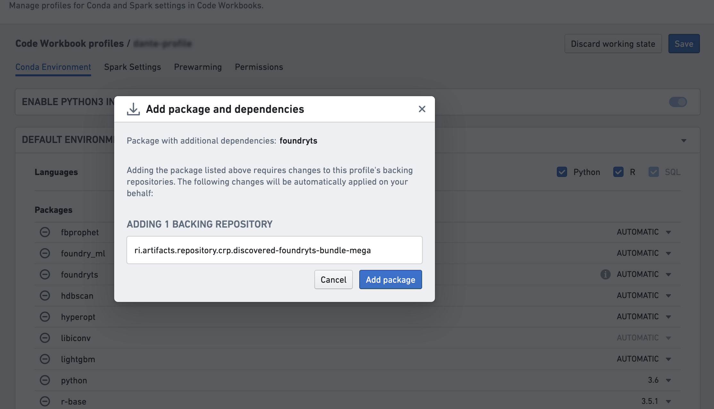
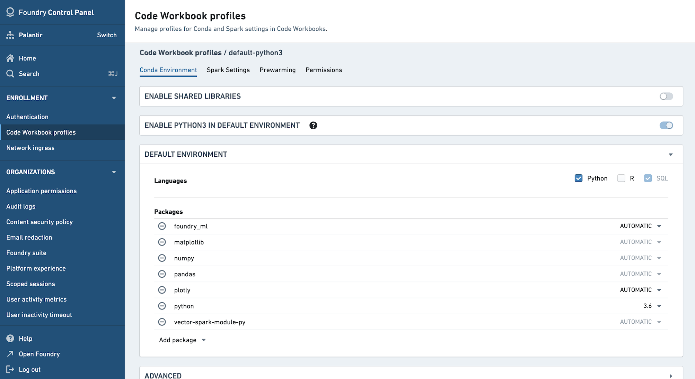
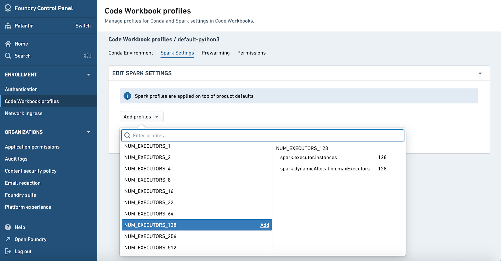
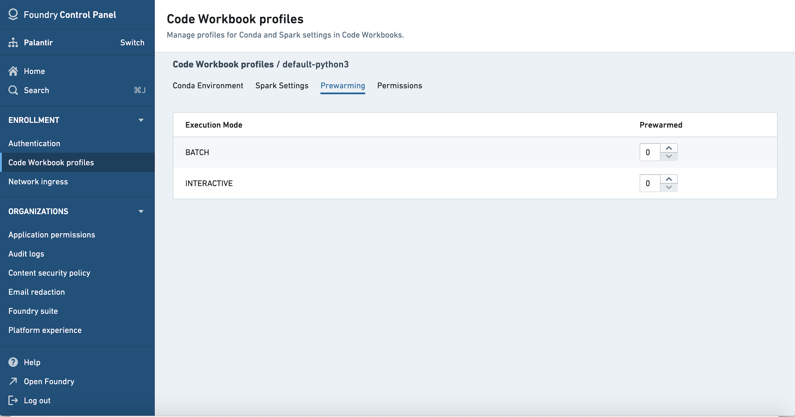
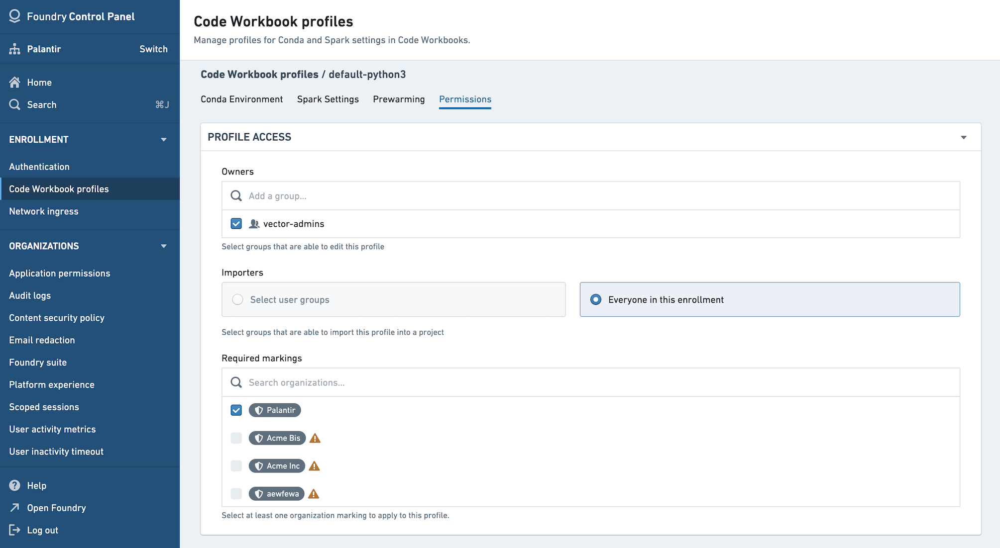

<!-- source: https://palantir.com/docs/foundry/administration/configure-code-workbook-profiles/ · mirrored 2026-08-22 from Palantir Foundry docs -->

# Configure Code Workbook profiles

:::callout{theme="warning" title="Availability"}
Code Workbook profiles are only configurable in Control Panel in some environments. Contact your Palantir representative with any questions.
:::

Code Workbook profiles can be seen as a useful default of Conda packages and Spark settings for a particular use case or user group. Code Workbook profiles will appear in the [Environment Configuration dialog](/docs/foundry/code-workbook/environment-overview/) in Code Workbook for users to select. Optionally, you can specify prewarmed modules for a given profile to reduce startup time.

:::callout{theme="neutral"}
New Code Workbook profiles created in Control Panel are backed by Artifacts. See below for details about Artifacts profiles.
:::

## Artifacts profiles

All new profiles created in Control Panel are backed by Artifacts. The configuration of Artifacts profiles is largely the same as the configuration of existing legacy profiles, with Artifacts profiles enabling the use of libraries published securely through Artifacts, including Python libraries created in Foundry that are not published to the `shared` channel.

In an Artifacts profile, the Conda environment contains both a list of packages and a list of backing repositories. To use a profile in Code Workbook, all backing repositories listed on the profile must be imported into the workbook's project.

When editing the Conda environment for a profile, the UI automatically finds the needed list of backing repositories and informs the user they will be added to the profile.

## Configuring Code Workbook profiles

### Conda environment

In the Conda environment tab, specify the default packages when using this profile. Users will be able to customize their Conda environments in their workbook as desired.

In order to execute Python and R transforms, Code Workbook requires the packages `vector-spark-module-py` and `vector-spark-module-r` respectively to be present in the profile's environment. To add those, you can either toggle the Python and R checkboxes in the Conda environment tab, or manually add them in the **Add package** dropdown menu. SQL does not require any additional packages and is therefore always available on any given profile.

Before changing the Conda environment for a profile, make sure that the proposed environment resolves by customizing the environment in a workbook. You will be asked to acknowledge you have done so when saving changes to the Conda environment.

:::callout
Code Workbook automatically adds default versions of `pandas`, `matplotlib`, and `numpy` if python is enabled, and a default version of `r-base` if R is enabled. If you need different versions, manually add these packages either in the Conda environment tab of Control Panel or directly in Code Workbook via **Environment > Configure environment > Customize Profile** and choose a version from the dropdown menu for each package to satisfy your version requirements.

Additionally, R is not yet available for self-service by default. Contact Palantir support for enablement.
:::

### Spark settings

Upon initially migrating to Control Panel-backed Code Workbook profiles, your legacy Spark settings will be preserved. However, if you choose to make any changes to your Spark settings, you will need to recreate these overrides using Spark Configuration Service profiles.

You must have import permissions on a Spark profile to add it to a Code Workbook profile. [Learn more about available Spark profiles.](/docs/foundry/optimizing-pipelines/spark-profiles-reference/)

### Prewarming

For each profile, you can choose to prewarm a number of modules so they are ready to be used. If no prewarmed modules are defined, users selecting the profile will need to wait for their environment to initialize.

In the Prewarming tab, you will see options to prewarm Interactive and Batch modules. Interactive modules are used for workbook sessions. Batch modules are used for builds, including scheduled builds. [Learn more about the difference between batch builds and interactive builds.](/docs/foundry/code-workbook/environment-batch-interactive/)

### Permissions

Owners of a profile are able to edit the profile, while Importers are able to import the profile into a project. Owners are automatically included in the Importers group. You can choose to allow all users in the enrollment to import the profile by selecting **Everyone in this enrollment**.

Once an Importer has imported a profile into a project, anyone in the project will be able to use that profile. You can add markings to a profile to limit the profile to a particular Organization.

## FAQ

### Who can configure Code Workbook profiles?

The set of users who are allowed to create Code Workbook profiles for an enrollment is configurable in Control Panel's Enrollment Permissions tab.

* To create a profile, a user must have the `Manage Code Workbook profiles` workflow, which is part of the `Analytical applications administrator` role (or be an enrollment administrator).
* To edit an existing profile configuration (such as a Spark or Conda environment configuration), a user must have the Owner role on the profile resource.

### Who can configure warm module queues?

To configure warm module queues, a user must have the "manage" permission on a profile (`Manage Code Workbook profiles` workflow plus being the Owner of the profile) as well as the `Manage Code Workbook warm module queues` workflow, which is part of the `Resource management administrator` role.

### Which profile is used by default for all users?

The profile named `default` is the default environment for users in Organizations in the enrollment.

### What profiles can I see in Control Panel?

All of the profiles for which you have Owner access will be listed in the Code Workbook tab of Control Panel. There may be additional profiles for which you have Importer access but not Owner access; you would be able to use these profiles in Code Workbook but unable to view them in Control Panel.
