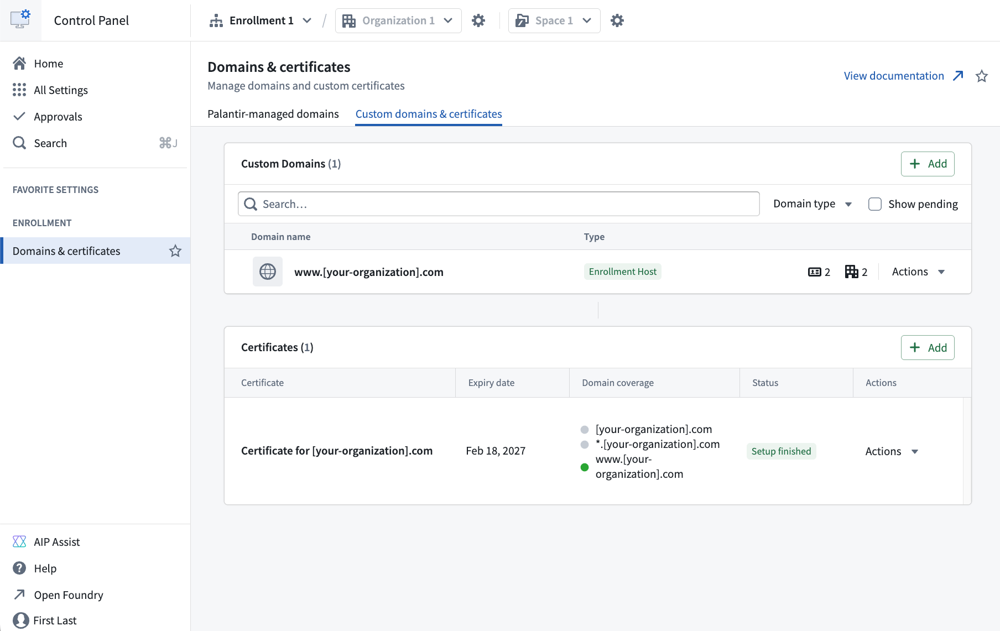
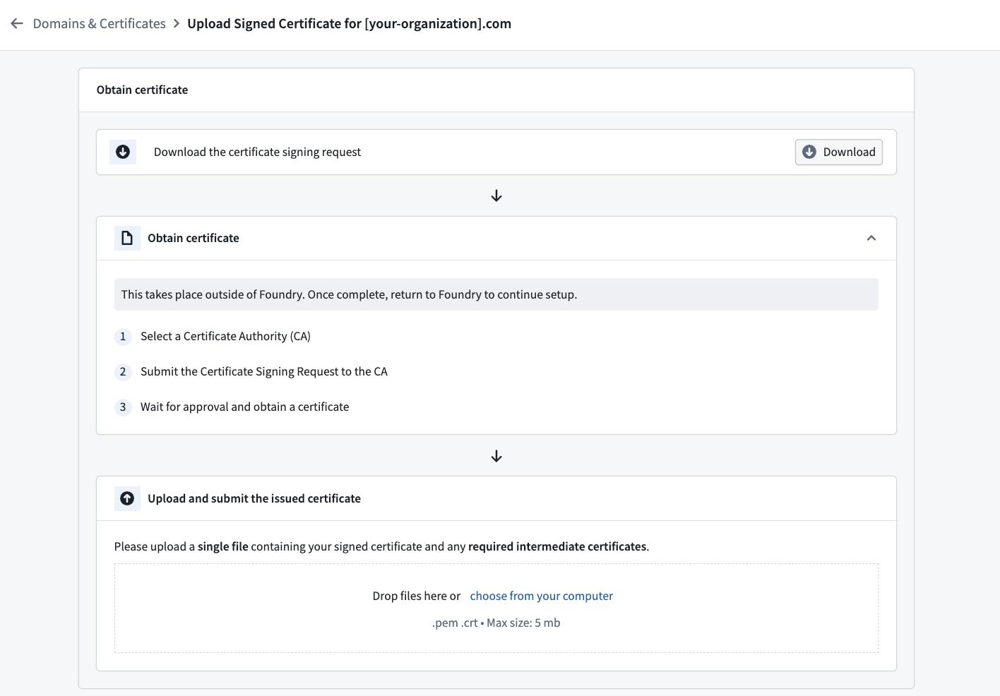
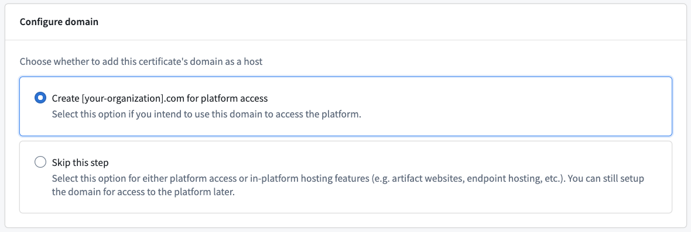
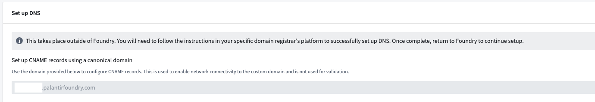
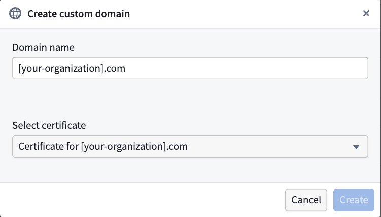
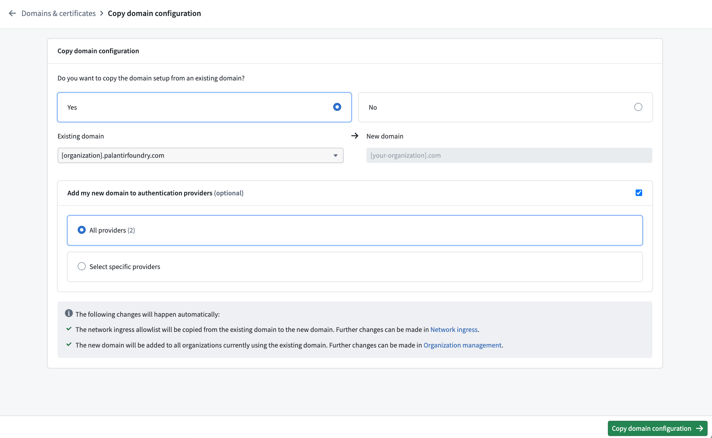
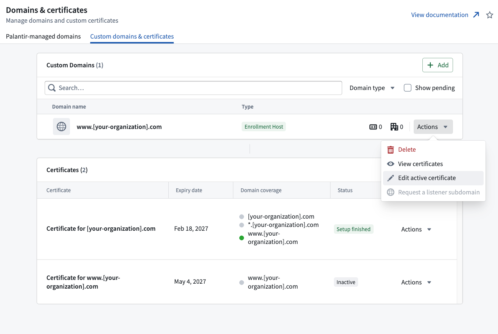
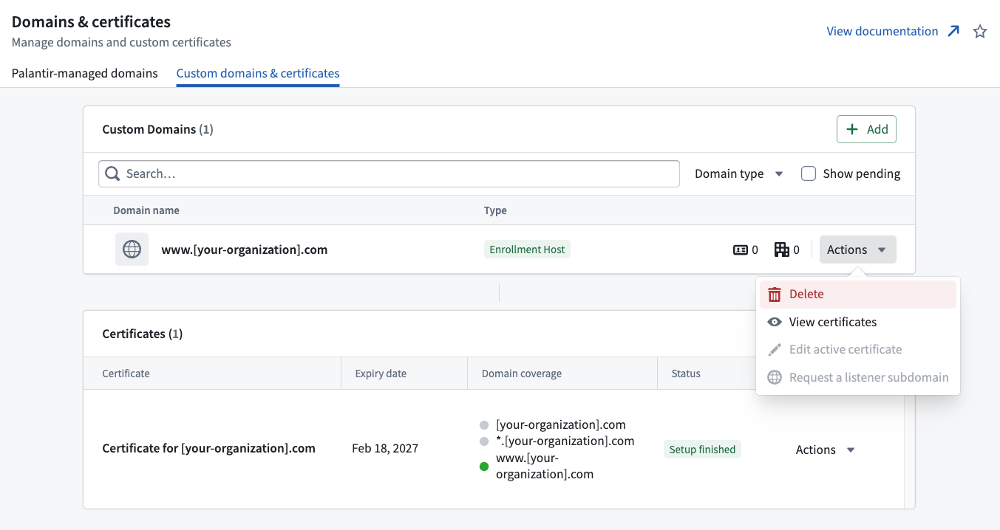

<!-- source: https://palantir.com/docs/foundry/administration/configure-domains-and-certificates/ · mirrored 2026-08-22 from Palantir Foundry docs -->

# Configure domains and certificates

:::callout{theme="warning"}
As of February 2026, this feature is only available for new customer managed domains. Any existing domains previously configured with support from Palantir may continue to require Palantir support.
:::

Users with permissions to edit custom domains and certificates can access the **Domains & certificates** tab under **Enrollment settings** in [Control Panel](/docs/foundry/administration/overview/) to create, edit, and delete custom domains and renew certificates. `Enrollment administrators` and `Information Security Officers` are given these permissions by default.

:::callout{theme="neutral"}
Custom domain and certificate configuration in Control Panel is a new feature and, due to compliance reasons and ongoing migrations, may not be available on some enrollments. If the feature is not yet available in your enrollment, contact your Palantir representative for assistance.
:::



## Create a new custom domain

Follow the steps below to create a custom domain. The first step is creating a new certificate.

### 1. Generate a certificate signing request (CSR)

* Select the **+ Add** button in the certificates table.
  * *Optional:* select the **Populate fields from existing certificate** checkbox to copy details from an existing certificate.
* Provide the common name (CN). Additionally, you may include subject alternative names (SANs), which can be regular domains or wildcard domains. You can also specify other details such as country (C), state (ST), locality (L), organization (O), and organizational unit (OU).
* Once the CSR is generated, download the `.pem` CSR file. This CSR is used in the next step to obtain a signed certificate from a certificate authority (CA).

### 2. Sign the certificate

Signing the certificate should be completed outside of the platform. This can be done by many domain providers or through a registered CA. To ensure compatibility and security, the signed certificate must meet the following criteria:

* The certificate must not expire within 30 days. If it does, renew the certificate before proceeding.
* The certificate must be encoded in PEM format. PEM is a Base64 encoded format that is widely used and compatible with most systems.
* The `CN` and `SAN` fields must exactly match those in the generated CSR.
* The certificate must use the SHA256withRSA signing algorithm.
* The certificate must be publicly trusted by major browsers. If you wish to use a certificate signed by a custom CA, contact Palantir Support for guidance.

:::callout{theme="neutral"}
If your CA returned the leaf certificate and any required intermediate certificates as separate files, upload each `.pem` file to Control Panel in any order. You can also upload a single `.pem` file containing the complete certificate chain with the leaf certificate first, followed by intermediate certificates. Certificates uploaded to Control Panel must be signed by a root CA approved by the Palantir security team in order to be accepted.
:::

This process may vary based on the domain and method you choose to sign the certificate.



### 3. Upload the signed certificate

* If the criteria in step 2 are met, upload the signed certificate to the form.
* The form will run validation checks on the signed certificate. If there are any issues, an error message will appear. Refer to [common errors](#common-errors) for guidance.
* Upon successful validation, the CA and the expiry date of the signed certificate will be displayed as confirmation.

### 4. Configure a domain

* After uploading the signed certificate, select whether you would like to create the domain for platform access. Choosing this option will configure this domain to enable platform access immediately.
* Choose **Skip this step** if you want to enable platform access through this domain later (See step 6), or if you do not intend to configure this domain for platform access, for example if you want to host an artifact website on this domain.



### 5. Update the domain name server (DNS)

* To enable network connectivity to the custom domain, the DNS settings need to be updated in the domain registrar’s platform.
* This takes place outside of the Palantir platform and the process will depend on the domain provider.
* Control Panel will display the domain that is required to create a CNAME record using a canonical domain.



### 6. Create the domain using the new certificate

* Select **+ Add** in the custom domains table.
* Enter the custom domain you wish to provision.
* Choose the certificate that you just created from the **Select certificate** dropdown menu.
* Select **Create**.



### Common errors

* `NotAllowedByPalantirSecurity`: The certificate authority is not allowed by Palantir security. Common root causes for this error include:
  * Uploading a self-signed certificate or a certificate signed by a CA that is not recognized by major browsers. Contact Palantir Support for assistance if you need to use a custom CA.
  * Uploading only the leaf certificate when it was signed by an intermediate CA. Upload the entire certificate chain, including all required intermediate certificates, as separate `.pem` files in any order, or include the complete certificate chain in a single `.pem` file.
* `UntrustedAlgorithm`: The certificate was signed using an untrusted algorithm.
* `InvalidSignedCertificate`: The signed certificate is invalid, or it does not match the CSR.
* `ShortExpiryForCertificate`: The duration until certificate expiration is too short.

## Copy an existing domain configuration

When setting up a new domain, you can choose to copy settings from an existing domain to the new domain for convenience. The following automatic changes occur if you go forward with this option:

* The network ingress allowlist will be copied from the existing domain to the new one. You can make further modifications in the **Network Ingress** extension.
* The new domain will be added to all organizations currently using the existing domain. Further adjustments can be made in the **Organization management** section.
* \[Optional] Your new domain can be added to authentication providers. You can either add it to all auth providers or select specific ones.
* The previous domain will continue to function after the new domain is set up until it is manually removed.



Follow the steps below to migrate from an existing domain:

1. Follow the steps to [Create a new domain](#create-a-new-custom-domain).
2. Select **Yes** on the migration screen.
3. Select the existing domain from which you would like to copy settings.
4. Decide if authentication providers using the old domain should be updated, and if yes, select the authentication providers you would like to update.
5. Select **Migrate**.
6. Follow the instructions to update your authentication providers. Your identity provider will have to be updated at the source and the process will depend on the type of identity provider (SAML or OIDC),
   * **SAML:** Download the metadata (in XML) for each provider.
   * **OIDC:** Copy the redirect URLs for each provider.
7. Once the identity providers have been updated, select **Finish setup** to mark the domain’s migration status as complete. You will be redirected to the domains list where you can see your new domain.

## Renew expiring certificates

If a certificate is set to expire within 30 days, a banner will appear at the top of Control Panel to notify you. In addition, an email will be sent to users with the `Enrollment administrator` role.

To renew expiring certificates, follow these steps:

1. Navigate to the certificate list.
2. Select **Actions > Renew** to initiate the certificate creation workflow, with the CSR form pre-populated with existing certificate details for convenience.
3. Complete the steps from [create a new custom domain](#create-a-new-custom-domain) to generate a certificate signing request and upload the signed certificate.
4. After the upload is complete, you will be directed to a renewal page where you can replace an existing certificate. Select the desired certificate and **Renew**.
5. You will be redirected back to the domains and certificates list where your renewed certificate will be visible.

## Create a new custom certificate

The process for creating a new custom certificate mirrors that of [creating a new custom domain](#create-a-new-custom-domain). If no custom domain corresponding to the new certificate’s common name exists, a new one will be created, and the flow will automatically switch to the creation of a new custom domain.

## Edit the active certificate

To edit the active certificate of a domain:

1. Navigate to the domains list.
2. Go to **Actions > Edit active certificate** to switch certificates.
3. Select an eligible certificate to set as the active certificate for the custom domain.



## Delete a domain

To delete a domain, navigate to **Actions > Delete**.

A domain cannot be deleted if any of the following are true:

* It is being used by one or more organizations
* It is being used as a supported host by one or more authentication providers
* It has active subdomains or open subdomain registration requests



## Glossary

* `CSR` = Certificate Signing Request
* `CA` = Certificate Authority
* `SAML` = Security Assertion Markup Language
* `OIDC` = OpenID Connect
* `DNS` = Domain Name Server

## Frequently asked questions

The following section serves to answer frequently asked questions.

### Can I change my Palantir-owned domain?

No. The Palantir-owned domain provided with your enrollment is not modifiable in self-service. If you have an enterprise account and need to change your domain to another Palantir-owned domain, contact your Palantir representative.

### Can I only have my certificate signed by an intermediate CA rather than the root CA?

No. Upload the leaf certificate and all required intermediate certificates as separate `.pem` files in any order. You can also upload a single `.pem` file containing the complete certificate chain. In either case, the certificate must chain to a root CA approved by the Palantir security team. If you choose to concatenate the certificate chain into one `.pem` file, it should be in the following order:

```
-----BEGIN CERTIFICATE-----
[leaf certificate content]
-----END CERTIFICATE-----
-----BEGIN CERTIFICATE-----
[intermediate certificate content]
-----END CERTIFICATE-----
```

### Can I host Foundry on a subdomain?

Yes, you can host Foundry on a subdomain (such as  `client.example.com`), but with the following constraints:

* Foundry cannot be hosted on a main domain and a subdomain of that domain at the same time. For example, hosting Foundry on `example.com` and on `client.example.com` simultaneously is not supported. To generate a valid CSR for `client.example.com`, ensure that `example.com` is not currently configured as an enrollment host.
* To provision `client.example.com` as an enrollment host, you must purchase a certificate with the common name (CN) `client.example.com`. You can purchase a wildcard certificate (`*.client.example.com`) so that you can host artifact websites (such as your Ontology SDK applications) on domains like `app1.client.example.com`. However, a wildcard certificate for your main domain (`*.example.com`) cannot be used to provision the subdomain `client.example.com` as an enrollment host.
