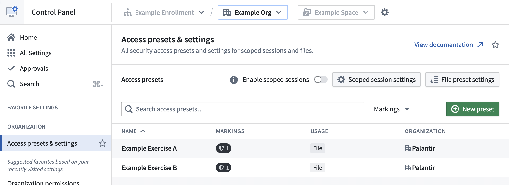
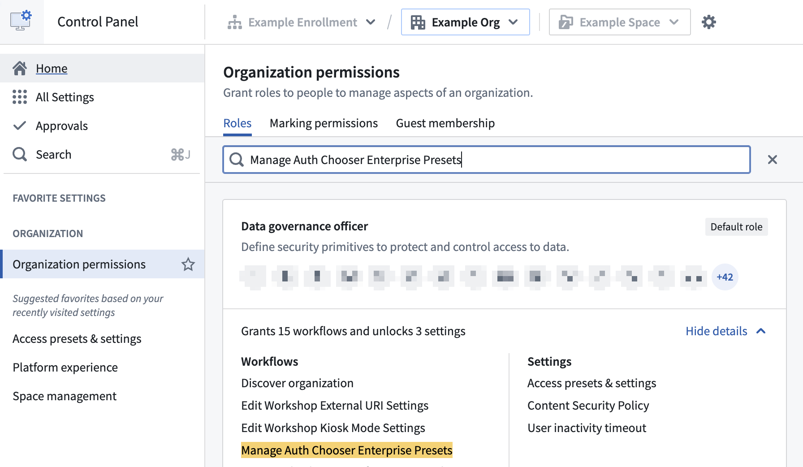
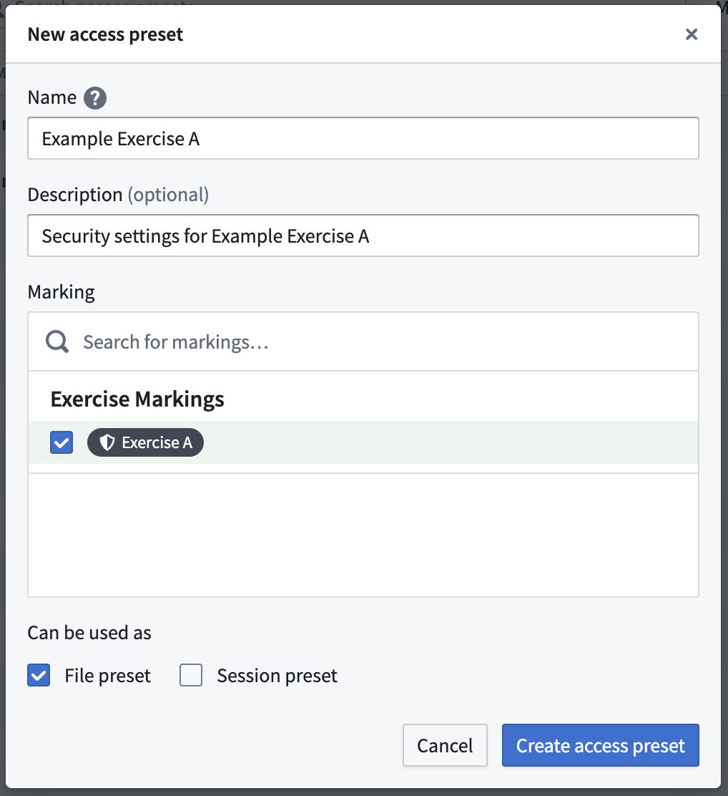
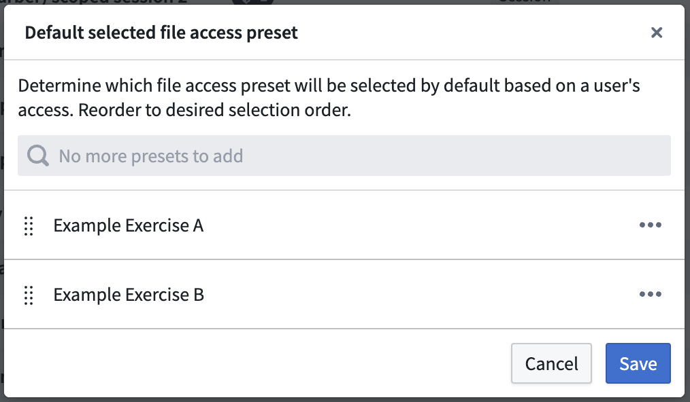
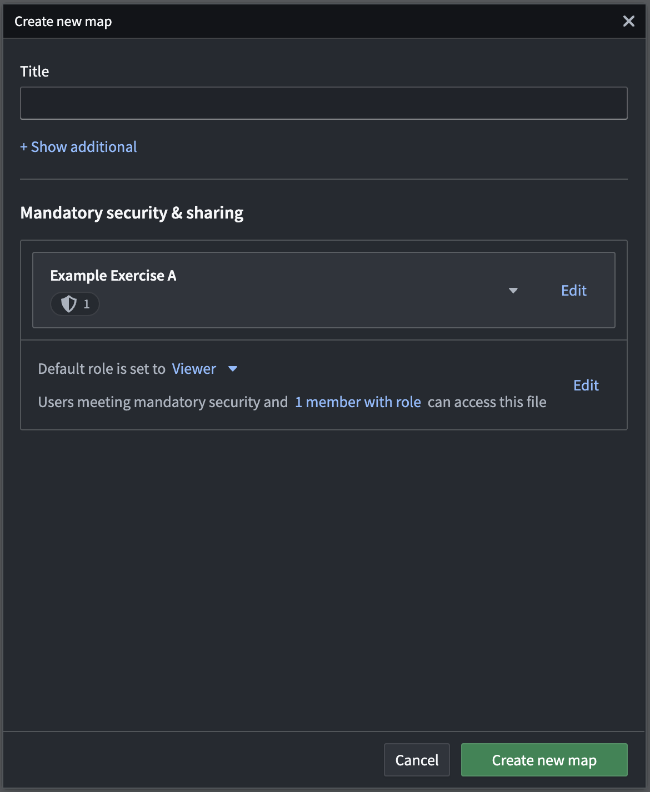

<!-- source: https://palantir.com/docs/foundry/administration/configure-file-access-presets/ · mirrored 2026-08-06 from Palantir Foundry docs -->

# Configure file access presets

:::callout{theme="warning"}
To configure file access presets, your enrollment must use both Foundry and Gotham. Contact Palantir Support with questions about enabling file access preset configuration if its extension is not available in Control Panel.
:::

You can use the **Access presets & settings** extension to configure file access presets for your [Organization](/docs/foundry/security/orgs-and-spaces/#organizations) in [Control Panel](/docs/foundry/administration/control-panel/), granting users quick access to commonly used security settings when they create a file. Consisting of a title and optional description, file access presets can apply both [mandatory markings](/docs/foundry/security/markings/) and [Classification-based Access Controls (CBAC)](/docs/foundry/security/classification-based-access-controls/) markings.

:::callout{theme="neutral"}
CBAC markings are not enabled by default on Foundry. Review the [existing documentation](/docs/foundry/security/classification-based-access-controls/) to learn more about the availability and use of CBAC markings.
:::

To configure file access presets in the **Access presets & settings** extension, you must be able to execute the **Manage Auth Chooser Enterprise Presets** workflow as part of either the `Data governance officer` or `Organization administrator` role in Control Panel's **Organization permissions** extension. If you do not have access to a role with that workflow, then you will need to ask your Organization administrator to grant you access.

## Create a file access preset

To create a file access preset, select **New preset** to launch the **New access preset** popup window. Provide the preset with a **Name** and optionally enter a **Description** before you add the **Markings** the preset applies. Ensure you check **File preset** under **Can be used as** before selecting **Create access preset**.

If your environment uses CBAC, then the **New access preset** popup window will also enable you to add CBAC markings to your file access preset.

### Set a default preset selection ordering

Select **File preset settings** to configure the default selected preset ordering for users. The first preset that is visible to a user will be selected for them by default, but they can change the preset. Presets not visible to users due to a lack of relevant Marking permissions will be ignored in the ordering.

## File access preset visibility

All users in your Organization can view the file access preset if they have the "Apply marking" permission on *all* the Markings configured as part of the preset.

Guest members of your organization will not be able to view or apply presets configured for your organization. They will see presets configured for their primary organization.

## Apply a file access preset

After you configure and save a file access preset, users in your Organization will be able to select the preset when setting the security of certain files created in Gotham.

