<!-- source: https://palantir.com/docs/foundry/administration/configure-languages/ · mirrored 2026-08-22 from Palantir Foundry docs -->

# Configure the platform experience

You can configure settings for the overall platform experience using the **Platform experience**
page in Control Panel. To view the **Platform experience** tab, you must have one of the following
roles:

* **Enrollment administrator** granted in the **Enrollment permissions** extension.
* **Organization administrator** or **User experience administrator** granted in the **Organization
  permissions** extension.

## Configure the home page URL

An Organization's home page URL can be configured per Organization or per user group in the
**Platform experience** tab of Control Panel.

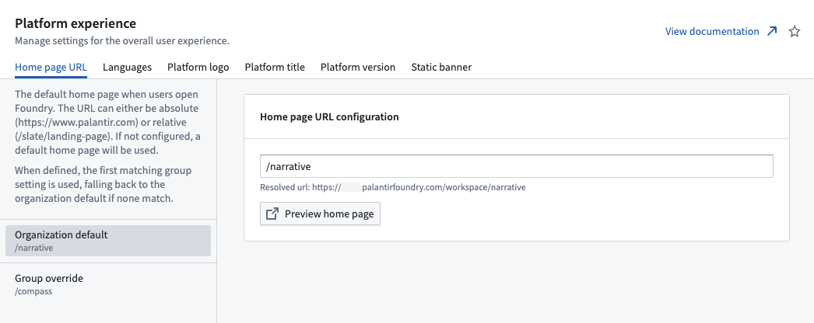

Examples of some common setups:

* Most new Foundry enrollments will display a default narrative home page that helps users learn about the Foundry platform. The URL of this home page is `/narrative`.
* If a [Slate](/docs/foundry/slate/overview/) dashboard should be used as the Organization's home page, set the value to `/slate/<dashboard-rid-or-permalink>`.
* If a [Carbon](/docs/foundry/carbon/overview/) workspace should be used as the Organization's home page, set the value to `/carbon/<workspace-rid>`

If certain user groups should be sent to a home page URL that differs from the Organization default, you can add group-specific overrides under **Group override** from the left sidebar. The first entry in that list, where a user is a member of any of the listed groups, will be used.

## Configure available languages

You can make additional languages besides English available to your users from the **Platform
experience** extension.

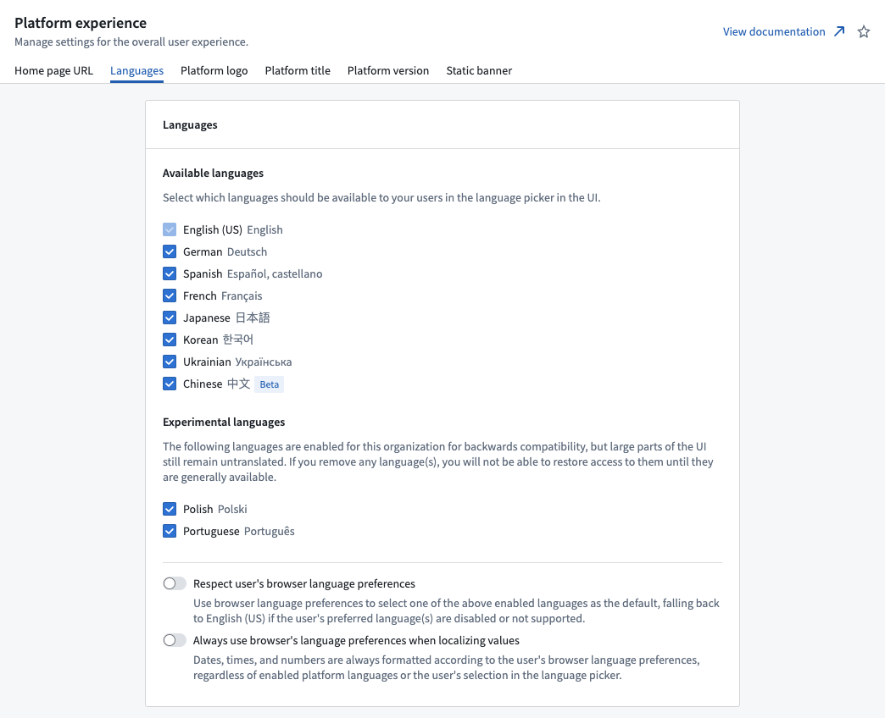

Users who have access to additional languages will see a locale switcher in their Foundry sidebar that enables language selection. If the **Respect user's browser language preferences** or **Always use browser's language preferences when localizing values** options are enabled, users will initially see Foundry in the available language that is set as highest priority in their web browser preferences. Otherwise, English is used by default until the user selects a different language from the language switcher.

:::callout{theme="neutral"}
Certain widgets in Foundry are set to the user's browser language preference and may require the browser language setting to be updated where necessary.
:::

## Configure the platform logo

:::callout{theme="neutral"}
You can configure platform logos per Enrollment if you have **Enrollment administrator**
permissions. If you do not have those permissions, then you can only configure logos per
Organization.
:::

The platform logo can be configured per Enrollment and Organization, replacing any occurrences of
the default Palantir logo with an image of your choice. You can provide up to four different logo
sizes: favicon, small, medium, and large. If you do not provide an image for each size, then Foundry
uses an appropriate fallback size. The favicon does not have any fallback behavior. When customizing
your logo, you should upload a favicon and *at least* one of the other three sizes.

| Size    | Fallback      |
| ------- | ------------- |
| Favicon | (none)        |
| Small   | Medium, Large |
| Medium  | Small, Large  |
| Large   | Medium, Small |

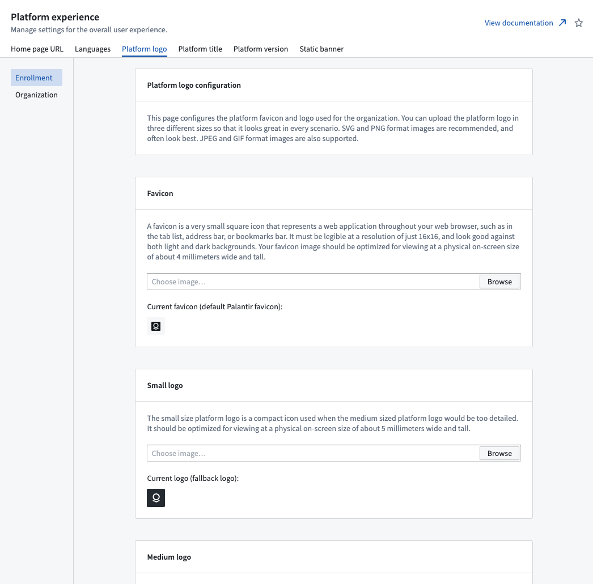

## Configure the platform title

:::callout{theme="neutral"}
You can configure the platform title per Enrollment if you have **Enrollment administrator**
permissions. If you do not have those permissions, then you can only configure logos per
Organization.
:::

The platform title can be configured per Enrollment and Organization and replaces references to the
platform with the provided title. The default platform title is `Palantir`. You can configure this
in the **Platform title** tab of the **Platform experience** extension.

Once you configure a new platform title, this update will also be reflected in the name of your
in-platform documentation. For example, if you rename your platform to `ABC`, the in-platform
documentation application will change from the default `Custom documentation` title to `ABC
documentation`.

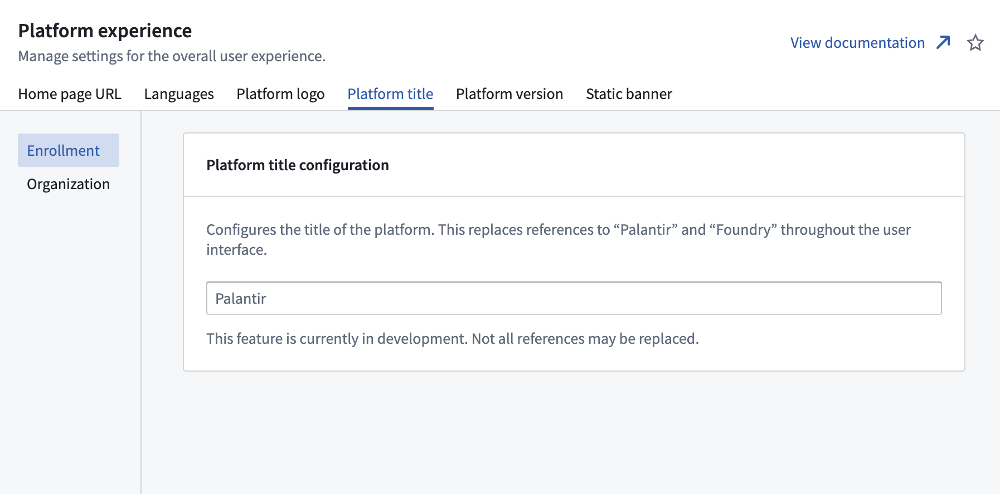

## Configure platform version

The [platform version switcher](/docs/foundry/administration/configure-platform-experience/#platform-version-switcher) lets you choose between using different versions of the platform. For instance, some users may prefer to use the *beta* version of the platform to access new features earlier, before they are available on the *stable* version of the platform.

To view and configure the **Platform version** tab in Control Panel, a user needs the **Manage platform version** workflow, which is granted by the **User experience administrator** role. Roles are administered in the **[Organization permissions](/docs/foundry/administration/enrollments-and-organizations-permissions/#roles)** tab in Control Panel.

### Platform versions

There are three platform versions available through the platform version switcher: [stable](#stable), [beta](#beta), and [prior](#prior).

#### Stable

The stable release has been rigorously tested and has widespread usage. The vast majority of users will be using the stable release.

#### Beta

The beta release is a future stable release that contains new changes and features not yet available on the current stable release. Because the beta release is newer, the changes made in this release may not be as rigorously tested as the stable release, and you may encounter unexpected behaviors. When building in the Palantir platform, opting into the beta release can be useful to get access to features early.

#### Prior

The prior release is the stable release that existed immediately previous to the current stable release. Switching to the prior release can be useful for viewing the old UI in case of changes made in the stable release, but the prior release is not recommended for everyday use. Users can temporarily view the prior version, but will be automatically moved back onto their default version (see [Configuring users' default platform version](/docs/foundry/administration/configure-platform-experience/#configuring-users-default-platform-version)).

### Platform version switcher

To change the platform version, navigate to account settings in the bottom of the left sidebar, then select the current version next to **Platform version** to open the platform version switcher. Choosing a different version will reload the page and load the new version.

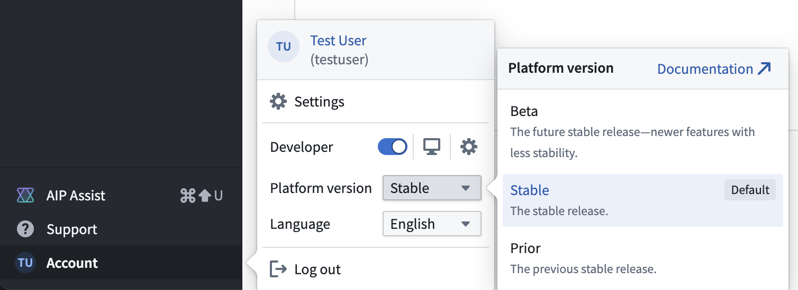

The default version shown to users is determined by the [default platform version setting in Control Panel](/docs/foundry/administration/configure-platform-experience/#configuring-users-default-platform-version). When viewing a platform version other than the stable release, a small tag will be visible in the sidebar to indicate that the user is viewing a different release.

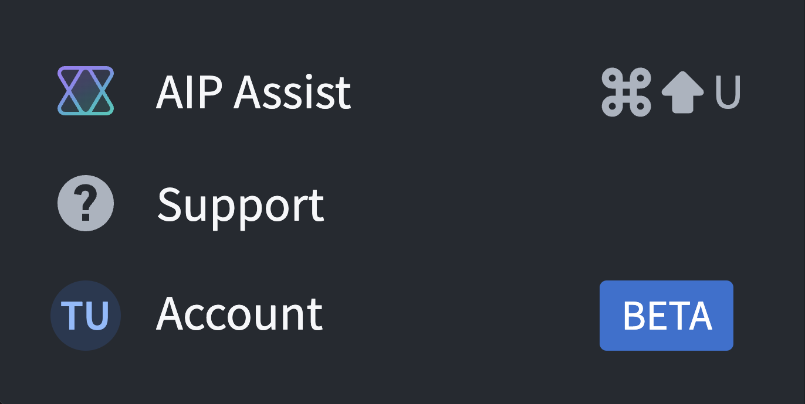

### Restricting access to the platform version switcher

Access to the platform version switcher in the sidebar can be restricted for users in your organization. To change access to the switcher, navigate to the **Platform experience** extension, then go to the **Platform version** tab.

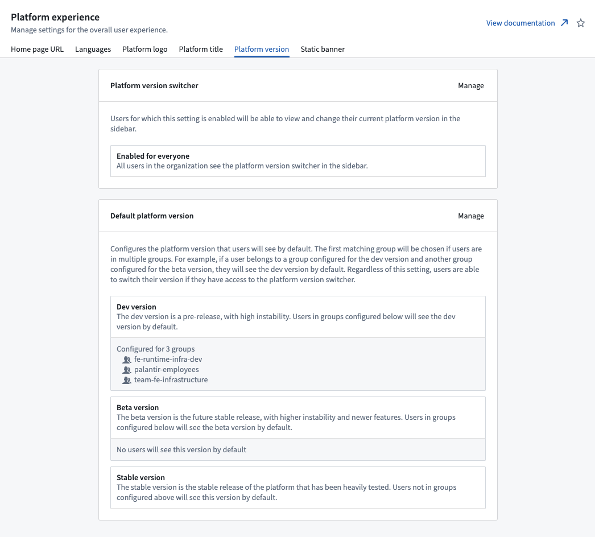

Select **Manage** next to **Platform version switcher** to bring up a dialog to change the platform version switcher setting.

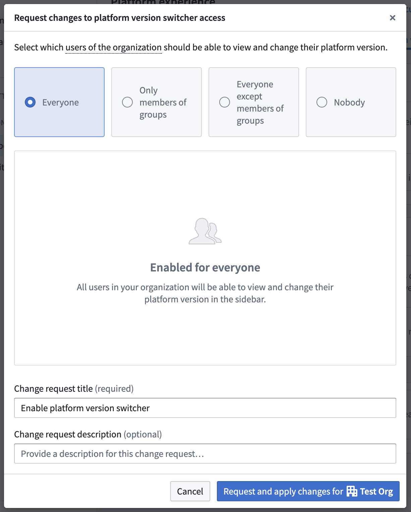

Select the desired access, then select **Request and apply change for your organization**. This will create a change request in the [Approvals inbox in Control Panel](/docs/foundry/administration/control-panel-approvals/) that will automatically be self-approved and applied. To view all past changes, choose **Platform version switcher requests** in the approvals inbox.

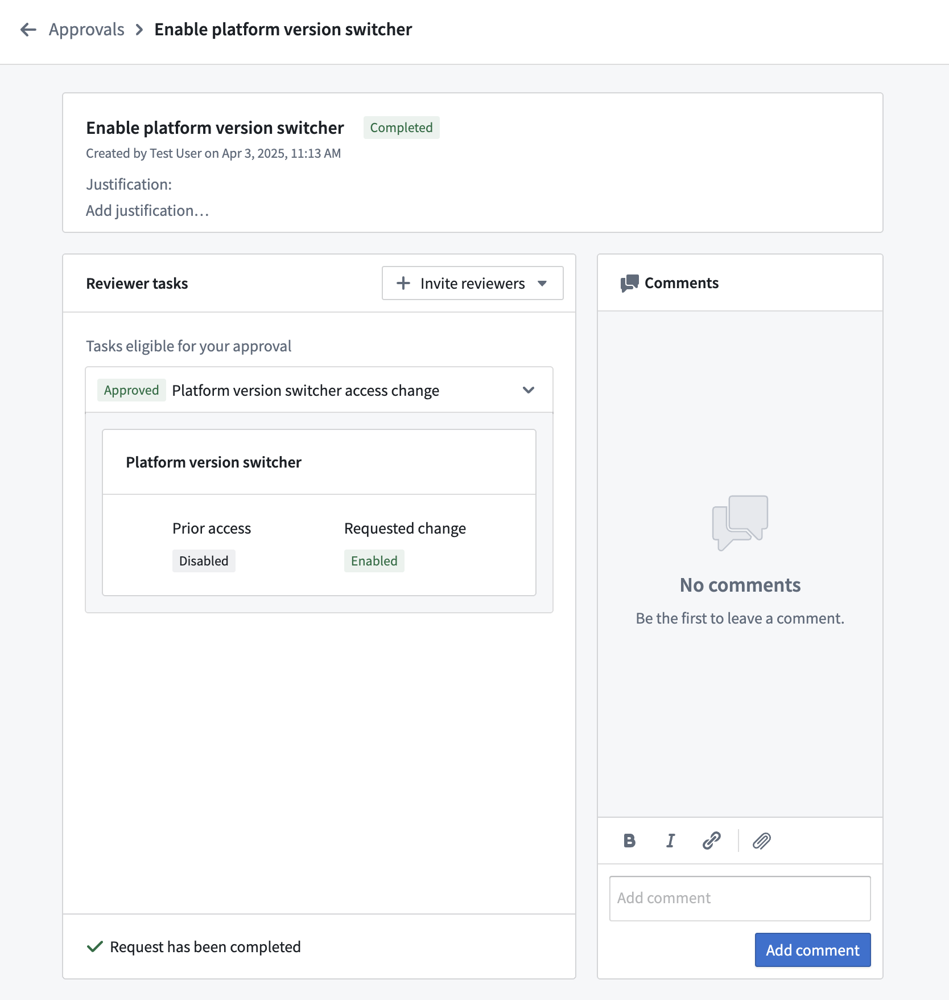

### Configuring users' default platform version

Administrators can additionally configure groups of users to use the beta platform version by default. If any of these users have access to the platform version switcher, they will still be able to switch to a different version from the beta version. This enables you to select a group of power users that should use the beta version by default, so that they can try new features out before the rest of your users see them.

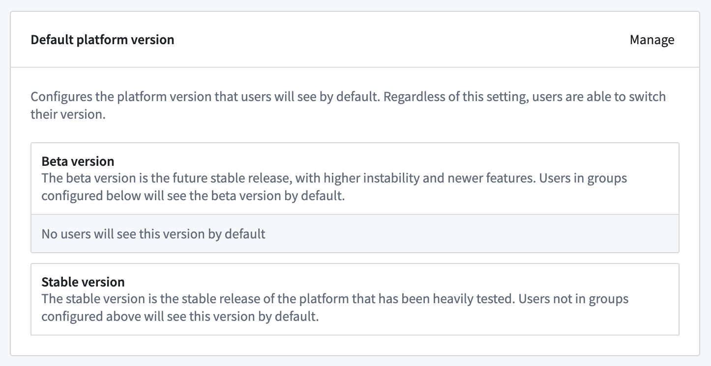

To configure which users should see the beta version by default, select **Manage** next to **Default platform version**. In the dialog, select the desired groups to use the beta version; any users not in the selected groups will see the stable version by default.

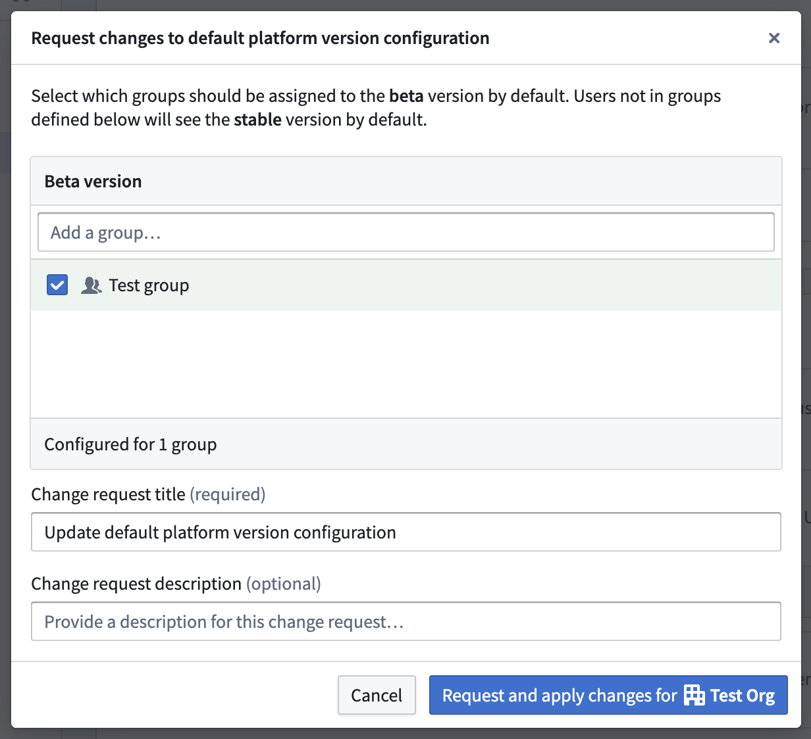

When you are done with configuration, select **Request and apply change for your organization**. This will create a change request in the [Approvals inbox in Control Panel](/docs/foundry/administration/control-panel-approvals/) that will automatically be self-approved and applied. To view all past changes, choose **Platform version default requests** in the approvals inbox.

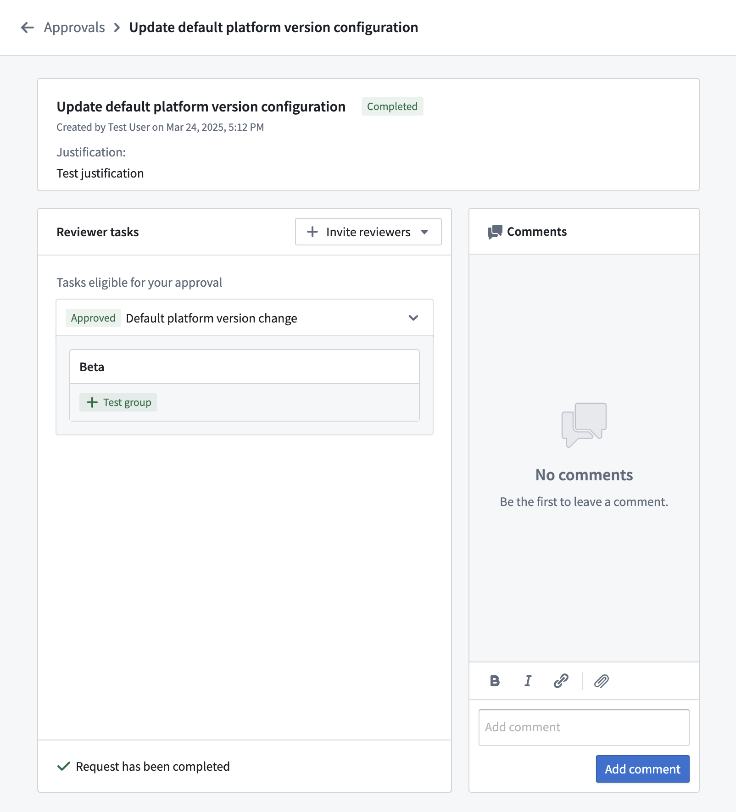

## Configure the static banner

You can configure a static banner per Organization that renders at the top, bottom, or top and
bottom of every page. The **Banner text** field supports basic Markdown syntax. This setting is
disabled by default.

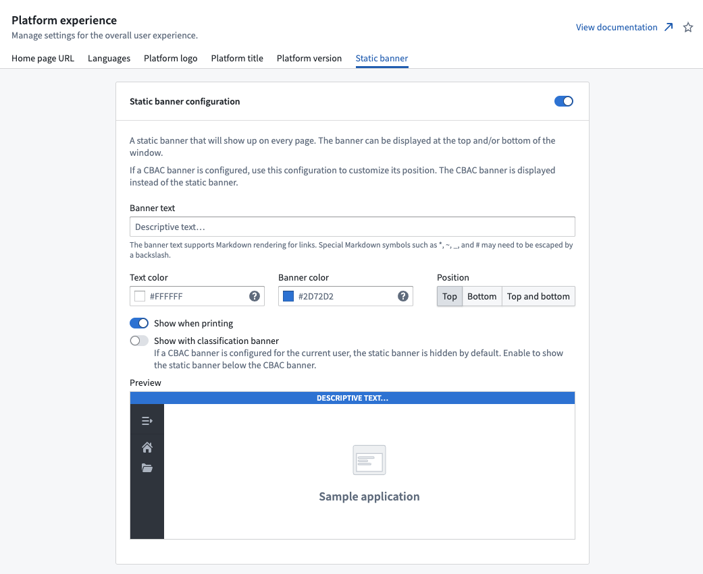
