<!-- source: https://palantir.com/docs/foundry/administration/configure-private-link-egress-aws/ · mirrored 2026-08-06 from Palantir Foundry docs -->

# Configure private link egress for AWS

This page outlines how to configure and manage private link egress for AWS-hosted Palantir platforms connecting to customer services, powered by [AWS PrivateLink ↗](https://docs.aws.amazon.com/vpc/latest/privatelink/what-is-privatelink.html).

Private link egress supports private egress to AWS services, user-owned resources deployed on AWS, or third-party APIs deployed on AWS.

## Configure a private link

Navigate to the **Private links** tab in the **Network egress** page in Control Panel to manage private links.

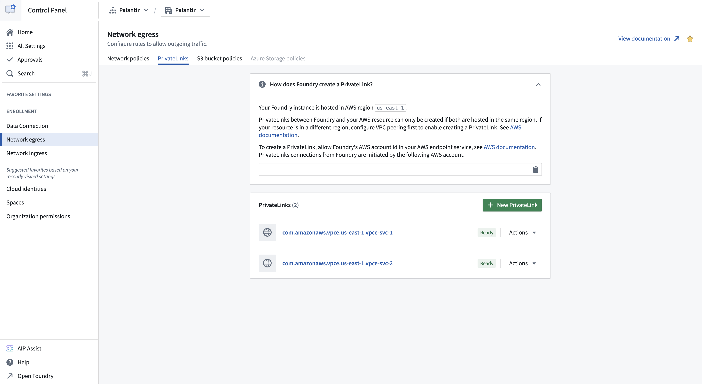

To successfully create a private link connection:

1. [Create an endpoint service for your target resource](#create-an-endpoint-service-for-your-target-resource).
2. [Allow the Palantir platform to access the target resource](#allow-the-palantir-platform-to-access-the-target-resource).
3. [Provide the target resource endpoint service name](#provide-the-target-resource-endpoint-service-name).
4. [Create network egress policies](#create-private-link-egress-policies).

### Create an endpoint service for your target resource

#### AWS services

A list of private link compatible AWS services and their endpoint service names can be found in the [AWS documentation ↗](https://docs.aws.amazon.com/vpc/latest/privatelink/aws-services-privatelink-support.html). Creation of an endpoint service is not required for AWS services; the endpoint service name provided by AWS can be used. An example of an AWS service that supports private links is [Amazon Bedrock ↗](https://docs.aws.amazon.com/bedrock/latest/userguide/usingVPC.html).

:::callout{theme="neutral"}
Private links to AWS S3 are not supported. Use [same region S3 bucket policies](/docs/foundry/administration/configure-egress/#amazon-s3-bucket-policies) for private connectivity to S3.
:::

#### User-owned resources on AWS

For a user-owned resource deployed on AWS, create an endpoint service following the steps in the [AWS documentation ↗](https://docs.aws.amazon.com/vpc/latest/privatelink/create-endpoint-service.html). An example of a user-owned resource is databases powered by [AWS RDS ↗](https://docs.aws.amazon.com/rds/).

#### Third-party APIs on AWS

For user-owned third-party APIs deployed on AWS, create an endpoint service following the steps from the [AWS documentation ↗](https://docs.aws.amazon.com/vpc/latest/privatelink/create-endpoint-service.html). If owned by another party, request their VPC endpoint service name. For example, Snowflake's VPC endpoint service name can be requested as shown in the [Snowflake documentation ↗](https://docs.snowflake.com/en/user-guide/admin-security-privatelink#create-and-configure-a-vpc-endpoint-vpce).

Additionally, request the private domains of third-party APIs if the service uses custom transport layer security (TLS) certificates that are not valid for the [AWS-generated domain ↗](https://docs.aws.amazon.com/vpc/latest/privatelink/privatelink-share-your-services.html#endpoint-service-private-dns) of the private link. For example, Snowflake's private domains can be found following the [Snowflake documentation ↗](https://docs.snowflake.com/en/sql-reference/functions/system_get_privatelink_config). Below is an example of a private third party domain:

```
abc.us-east-1.privatelink.snowflakecomputing.com
```

### Allow the Palantir platform to access the target resource

To access the target resource through a private link, allow the Palantir platform to access the resource. Add the Palantir platform's AWS account in the allowed principal list of your endpoint service by following the [AWS documentation ↗](https://docs.aws.amazon.com/vpc/latest/privatelink/configure-endpoint-service.html). The allowed principal should look as follows:

```
arn:aws:iam::<palantir_platform_aws_account_id>:root
```

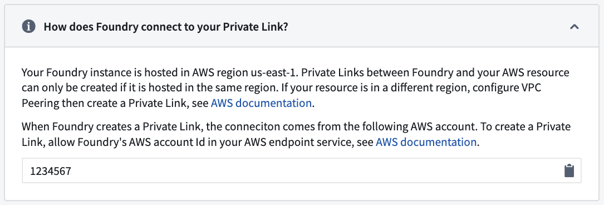

### Provide the target resource endpoint service name

1. Navigate to **Control Panel > Network egress > Private links** and select **New private link** to create a private link.

2. Enter the following details for your target resource for the private link:

   * **Endpoint service name:** The endpoint service name of the target resource that was retrieved in the step above. <br><br>
     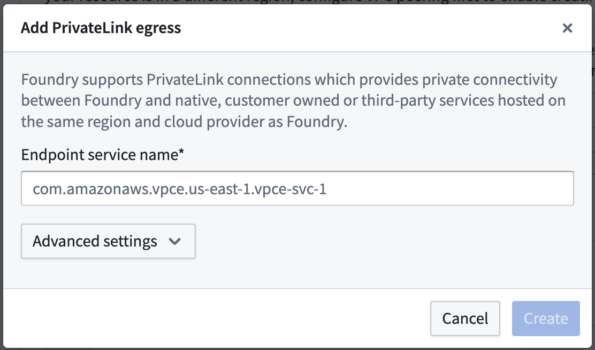 <br><br>
   * **Advanced settings:**

     * **Private domains:** If the private link egresses to a resource that has custom TLS certificates, add those domain entries here. The Palantir platform will create `CNAME` records for these domains that map to the other end of the private link.
     * **TCP ports:** Add ports that should be allowed over this private link; the default port is 443. <br><br>
       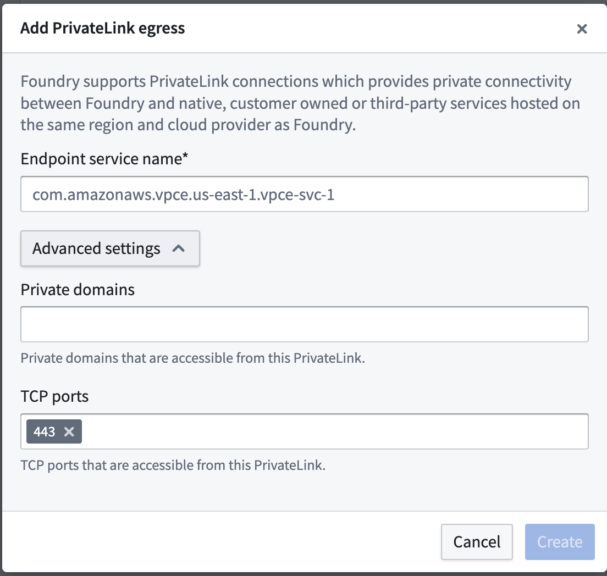 <br><br>

3. After providing the details above, select **Create**.

The private link may have the following states:

* **Creating:** Creation of the private link has begun.
* **Creating cloud resources:** Provisioning cloud resources.
* **Managing DNS:** Managing DNS records.
* **Waiting for cloud resources:** Waiting for resources to be created by the cloud provider.
* **Pending acceptance:** The private link is awaiting acceptance by the service provider.
* **Ready:** The private link has been successfully created.

If the private link is in the **Failed** state, one of the following errors has occurred:

* **Failed:** The connection request failed. Check permissions for your virtual private cloud (VPC) endpoint service configuration in AWS and recreate.
* **Rejected:** The service provider rejected the connection request. The owner of the VPC endpoint service has rejected the connection, contact them to move forward.
* **Expired:** The connection request expired. The owner of the VPC endpoint service has not accepted the connection in time, recreate the private link.
* **Timeout:** Private link creation timed out. This could be a transient error, you should delete and retry. Contact Palantir Support if retrying does not solve the issue.
* **Validation failed:** Private link validation failed. Contact your Palantir administrator to move forward.
* **Cloud provider error:** Cloud resource creation failed. Contact your Palantir administrator to move forward.
* **DNS management failed:** DNS management failed. Contact your Palantir administrator to move forward.

### Create private link egress policies

After successful creation of a private link, create [private link egress policies](/docs/foundry/administration/configure-egress/#private-link-egress-policies) to allow egress to the target resource.

1. Create network egress policies by selecting **Actions > Create network egress policy** in Control Panel.
2. Select a **Private link** type of address and input the port of the target resource per item when creating a network egress policy. These created policies are visible under **Actions > View network egress policy** in Control Panel.

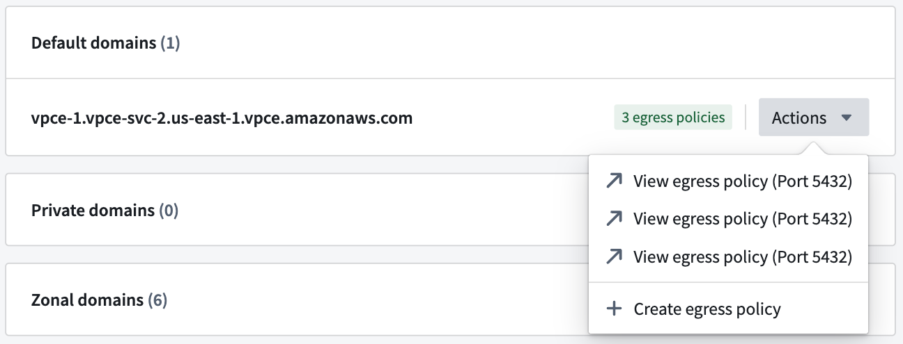

#### Cases that require egress policies

* A network egress policy is required for the default domain. If you are connecting to a third-party API, and the AWS generated default domain is not intended for use, a network egress policy is **not** required. <br><br>
  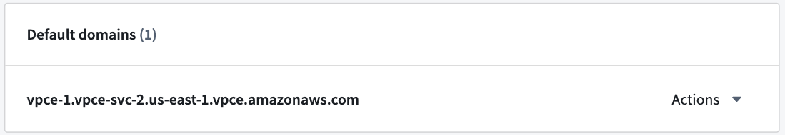 <br><br>
* If you intend to use zonal domains, create network egress policies for the zonal domains. If your VPC is in the same AWS zone as the Palantir platform, then using the same zone domain may be more efficient. <br><br>
  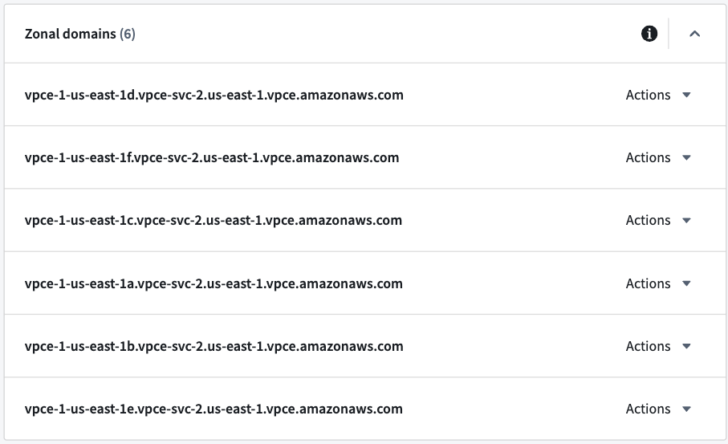 <br><br>
* Create network egress policies for private domains, if configured. <br><br>
  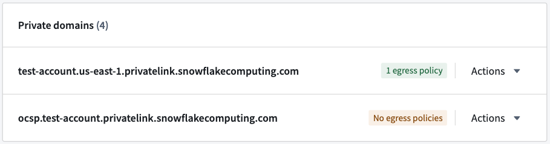 <br><br>
  Once the private link is in the **Ready** state and network egress policies are created, the private link can be used in the Palantir platform.

## Manage private links

Possible actions on the private link are displayed under **Actions** in the private link details page, and in the private links page for each item.

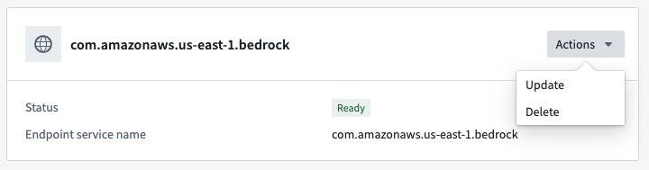

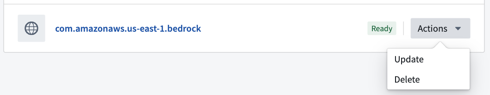

### Update a private link

A private link's **Private domains** and **TCP ports** can be updated by selecting **Actions > Update**.

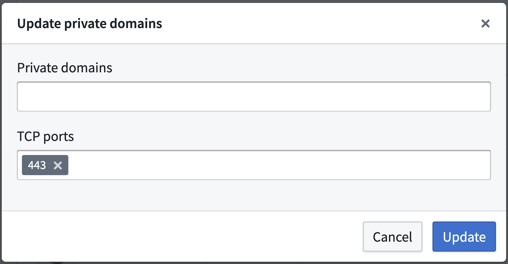

### Delete a private link

Private links can be deleted by selecting **Actions > Delete**.

### Share network egress policies

Share the created network egress policies with users who intend to egress to the target resource through the private link. On the domain or IP that is to be shared, select **Actions > View network egress policy** and navigate to the network policy page. On the network policy page, select **Actions > Manage sharing** and add the intended user or user group to share the network egress policy.

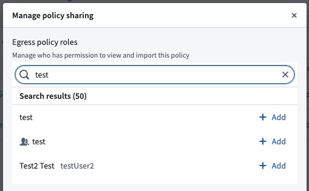

## Use a private link

### Data Connection source

In Data Connection, [configure a source](/docs/foundry/data-connection/set-up-source/) using the default domain or the third-party API domain, and attach the created network egress policies. After configuring, test connectivity by previewing or exploring the source and verifying that the source's data is accurate.

### Snowflake source

To create a Snowflake source connected through a private link, follow these steps:

1. [Allowlist the Palantir platform cloud provider account in Snowflake](#allowlist-the-palantir-platform-cloud-provider-account-in-snowflake).
2. [Create the private link in Control Panel](#create-the-private-link-in-control-panel).
3. [Create the Snowflake source in Data Connection](#create-the-snowflake-source-in-data-connection).

#### Allowlist the Palantir platform cloud provider account in Snowflake

For the Palantir platform to create a private link to Snowflake, the Palantir platform's account needs to be allowlisted in your Snowflake account. To do this:

1. Find the Palantir platform's cloud provider account ID in **Control Panel > Network egress > Private links** as shown below: <br><br>
    <br><br>
2. Open a [support case ↗](https://community.snowflake.com/s/article/How-To-Submit-a-Support-Case-in-Snowflake-Lodge) with Snowflake and provide the following information:
   * The Palantir platform's cloud provider account ID (include the cloud provider; AWS, Azure, or GCP).
   * The Snowflake account URL.
   * Include that the above account ID needs to be allowlisted for private connectivity with Palantir. Note that `SYSTEM$AUTHORIZE_PRIVATELINK` cannot be used, since Palantir users do not have direct access to the underlying cloud provider infrastructure and are not provided with the required `federated_token`.

Once Snowflake has allowlisted the Palantir platform's cloud provider account, continue to the next step.

#### Create the private link in Control Panel

Before creating a private link between the Palantir platform and Snowflake, retrieve the private link configuration from Snowflake by running the command [`SYSTEM$GET_PRIVATELINK_CONFIG` ↗](https://docs.snowflake.com/en/sql-reference/functions/system_get_privatelink_config). This command outputs the required information to create a private link in the Palantir platform.

1. To create a private link, navigate to **Control Panel > Network egress > Private links > New private link**. <br><br>
   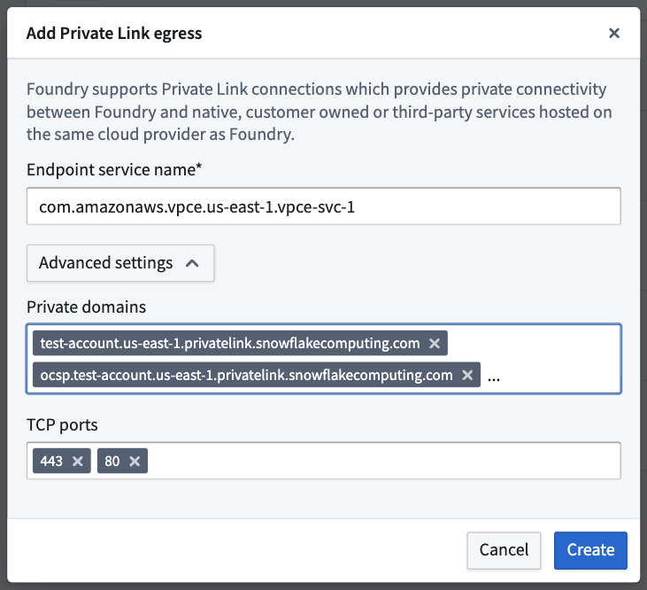 <br><br>
2. Enter the following details from the output above to create a private link:
   * **Endpoint service name:** Enter the `privatelink-vpce-id` from the output of `SYSTEM$GET_PRIVATELINK_CONFIG`.
   * **Advanced settings:**
     * **Private domains:** The Palantir platform will map these URLs to the other end of the Snowflake private link and route traffic over the private link, maintaining Snowflake's use of Online Certificate Status Protocol (OCSP) for security. Read more about [configuring your VPC network ↗](https://docs.snowflake.com/en/user-guide/admin-security-privatelink#configure-your-vpc-network) in the Snowflake documentation. The following values can be obtained using `SYSTEM$GET_PRIVATELINK_CONFIG`:
       * `privatelink-account-url`
       * `privatelink-connection-ocsp-urls`
       * `privatelink-connection-urls`
       * `privatelink-ocsp-url`
       * `regionless-privatelink-account-url`
       * `regionless-snowsight-privatelink-url`
       * `snowsight-privatelink-url`
     * **TCP ports:** Enter `443` and `80` as mentioned in the [Snowflake documentation ↗](https://docs.snowflake.com/en/user-guide/admin-security-privatelink#create-and-configure-a-vpc-endpoint-vpce).

Once configured, select **Create** to create the private link. When the private link is in the **Ready** state, continue to the next step.

#### Create the Snowflake source in Data Connection

1. To create a Snowflake data source in Data Connection, navigate to **Data Connection > New Source > Snowflake**.
2. Configure the source, and do the following in **Connection details** to use the created private link:
   * **Account identifier:** Input the account ID of the Snowflake account that the private link was created for.
   * **Private link:** Toggle this to use the private link.

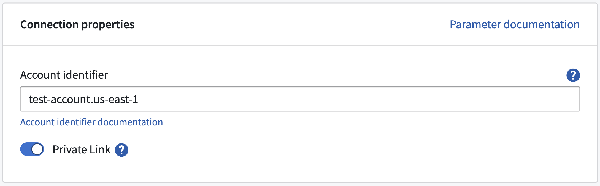

#### Network egress policies

Create network egress policies for all of the URLs output by the command [`SYSTEM$ALLOWLIST_PRIVATELINK` ↗](https://docs.snowflake.com/en/sql-reference/functions/system_allowlist_privatelink). Additionally, create an [S3 bucket policy](/docs/foundry/administration/configure-egress/#amazon-s3-bucket-policies) for the `STAGE` of the output as shown below:

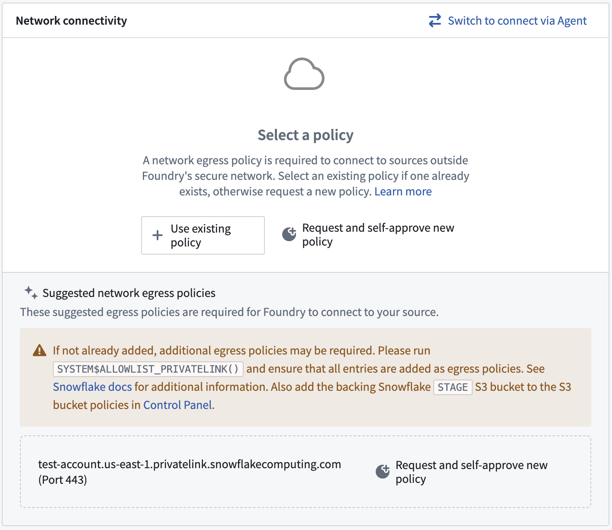

For more information on Snowflake configuration refer to Palantir's [Snowflake documentation](/docs/foundry/available-connectors/snowflake/).
