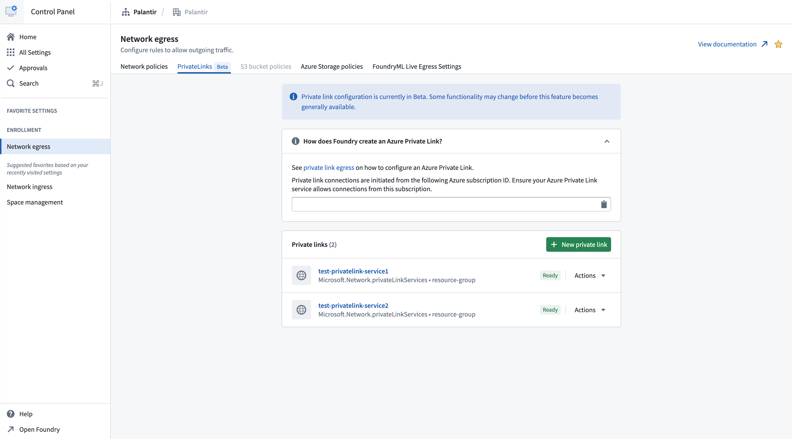
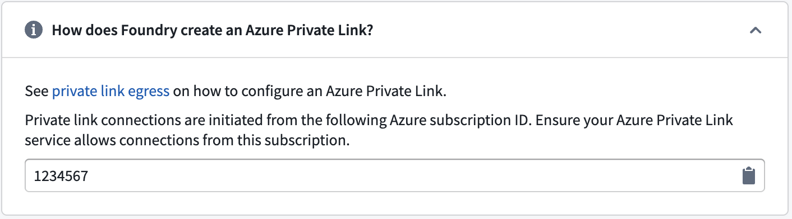
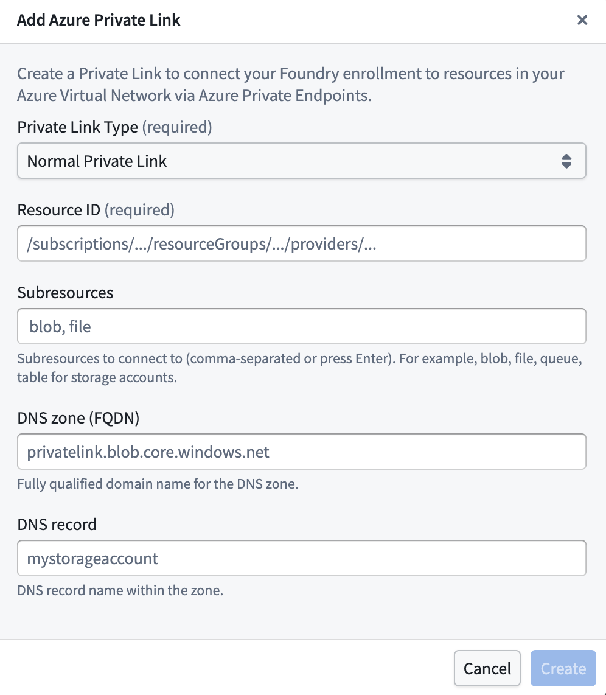
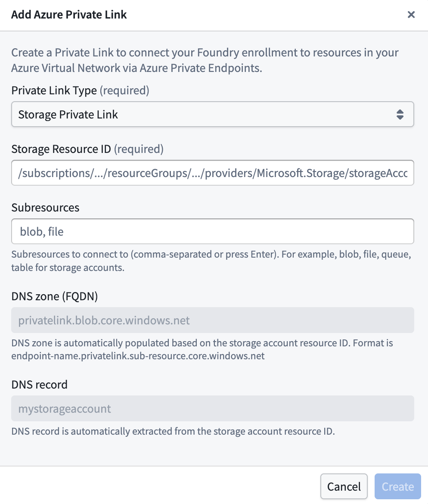
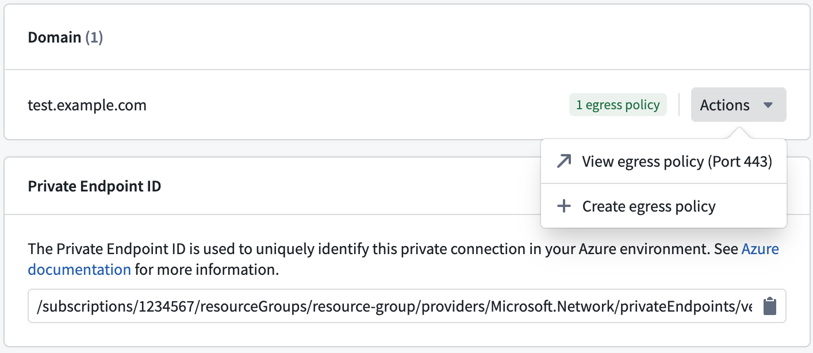
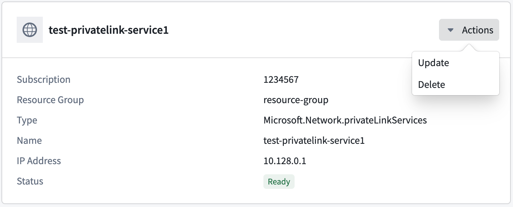
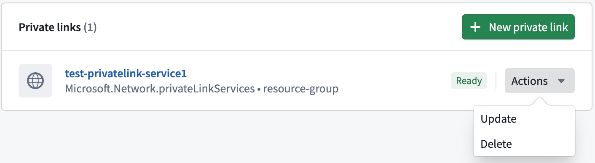
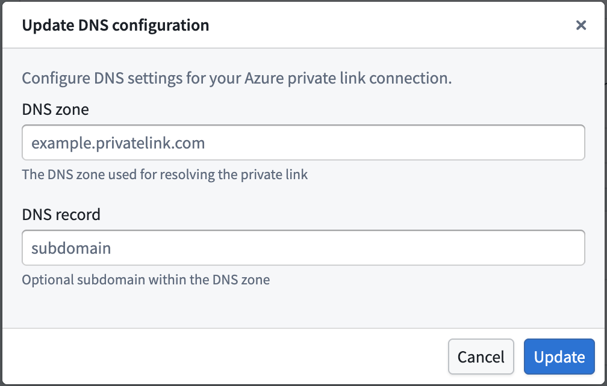

<!-- source: https://palantir.com/docs/foundry/administration/configure-private-link-egress-azure/ · mirrored 2026-08-22 from Palantir Foundry docs -->

# Configure private link egress for Azure

This page outlines how to configure and manage private link egress for Azure-hosted Palantir platforms connecting to customer services hosted in Azure, powered by [Azure Private Link ↗](https://learn.microsoft.com/en-us/azure/private-link/private-link-overview).

Private link egress supports private egress to Azure services, user-owned resources deployed on Azure, or third-party APIs deployed on Azure.

## Configure a private link

Navigate to the **Private links** tab in the **Network egress** page in Control Panel to manage private links.

To successfully create a private link connection:

1. [Create a private link service for your target resource](#create-a-private-link-service-for-your-target-resource).
2. [Allow the Palantir platform to access the target resource](#allow-the-palantir-platform-to-access-the-target-resource).
3. [Provide the target resource details](#provide-the-target-resource-details).
4. [Create network egress policies](#create-private-link-egress-policies).

### Create a private link service for your target resource

#### Azure services that support private endpoints

Many Azure services support private endpoints natively, allowing you to connect to them through private link without creating a custom private link service. A comprehensive list of Azure services that support private endpoints can be found in the [Azure documentation ↗](https://learn.microsoft.com/en-us/azure/private-link/availability).

For these services, Azure automatically provides the necessary private link service configuration, and you only need to create a private endpoint connection.

### Allow the Palantir platform to access the target resource

To enable the Palantir platform to create private endpoint connections to your Azure resources, you must configure visibility and optionally, auto-approval settings.

#### For custom private link services

For custom [private link services ↗](https://learn.microsoft.com/en-us/azure/private-link/private-link-service-overview), follow the steps below:

1. Find the Palantir platform's Azure subscription ID in **Control Panel > Network egress > Private links**.   
      

2. Add the Palantir subscription ID to the list of subscriptions that have visibility to your private link service. This allows the Palantir platform to request access to the service.

3. Optionally, enable auto-approval for the Palantir subscription ID to automatically approve connection requests, eliminating the need for manual approval.

#### For Azure PaaS services

For most Azure PaaS services such as Azure Storage, Azure SQL Database, Azure Key Vault, Cosmos DB, and so on, the default behavior is as follows:

* The resource is visible to anyone who knows its resource ID or name.
* Anyone with sufficient Azure permissions in their subscription can attempt to create a private endpoint to your resource.
* This triggers a manual approval workflow where you must accept or reject the connection request.

:::callout{theme="neutral"}
Auto-approval configuration varies by Azure service. Some services support pre-approved subscriptions, while others require manual approval for each connection request. Consult the Azure documentation for your specific service for detailed instructions.
:::

### Provide the target resource details

To create a private link in Control Panel, you need the Azure resource ID of the target resource you want to connect to.

1. Navigate to **Control Panel > Network egress > Private links** and select **New private link**.
2. Enter the **Resource ID** of your Azure resource. The resource ID is the full Azure Resource Manager path to your resource.
3. Optionally, specify **Sub-resources** if you want to connect to specific sub-resources of the target resource (for example, `blob` for Azure Storage or `sqlServer` for Azure SQL Database).

#### Standard private links

Standard private links are the default configuration for connecting to most Azure resources and custom private link services. Use standard private links for Azure SQL Database, Azure Key Vault, Azure Cosmos DB, custom private link services, and other Azure PaaS services. When creating a standard private link, you need to provide the resource ID and optionally specify sub-resources.

**Advanced settings:**

* **DNS zone:** The private DNS zone to use for name resolution (for example, `privatelink.blob.core.windows.net`). Required if a DNS record is specified.
* **DNS record:** Optionally specify a custom DNS record for the private link. If you add a DNS record, you must also specify a DNS zone.

:::callout{theme="neutral"}
DNS configuration is optional for standard private links. If not specified, you must use the Azure-generated private endpoint IP address directly.
:::

#### Storage private links

Use storage private links specifically for Azure Storage accounts (resources containing `/Microsoft.Storage/storageAccounts/` in their resource ID). Unlike standard private links, storage private links automatically define DNS configuration to handle Azure networking edge cases for storage resources. The system generates the required DNS zones and records in the format `{storage-account-name}.privatelink.{sub-resource}.core.windows.net`.

**Important notes for storage private links:**

* The DNS configuration is automatically managed by the system and cannot be changed.
* The system will create the appropriate DNS records for the storage account's private endpoints.
* Sub-resources (blob, file, table, queue, dfs) must be specified based on which storage services you want to access.

After providing the details above, select **Create**.

The private link may have the following states:

* **Creating:** Creation of the private link has begun.
* **Creating cloud resources:** Provisioning Azure Private Endpoint and related cloud resources.
* **Waiting for cloud resources:** Waiting for Azure to complete provisioning of the Private Endpoint.
* **Pending acceptance:** The private link is awaiting acceptance by the service provider (applies to certain Azure services).
* **Ready:** The private link has been successfully created and is operational.

### Create private link egress policies

After successful creation of a private link, create private link egress policies to allow egress to the target resource.

1. Create network egress policies by selecting **Actions > Create network egress policy** in Control Panel.
2. Select a **Private link** type of address and input the port of the target resource per item when creating a network egress policy. These created policies are visible under **Actions > View network egress policy** in Control Panel.

Once the private link is in the **Ready** state and network egress policies are created, the private link can be used in the Palantir platform.

## Manage private links

Possible actions on the private link are displayed under **Actions** in the private link details page, and in the private links page for each item.

### Update a private link

A private link's **DNS zone**, **DNS record**, and **TCP ports** can be updated by selecting **Actions > Update**.

### Delete a private link

Private links can be deleted by selecting **Actions > Delete**.
