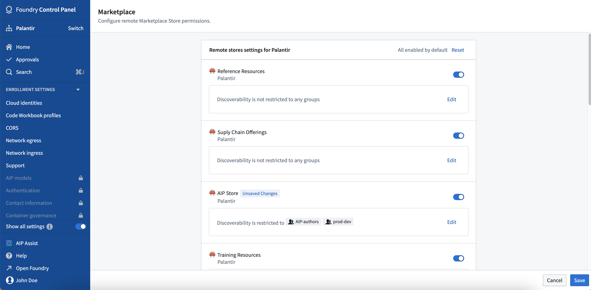
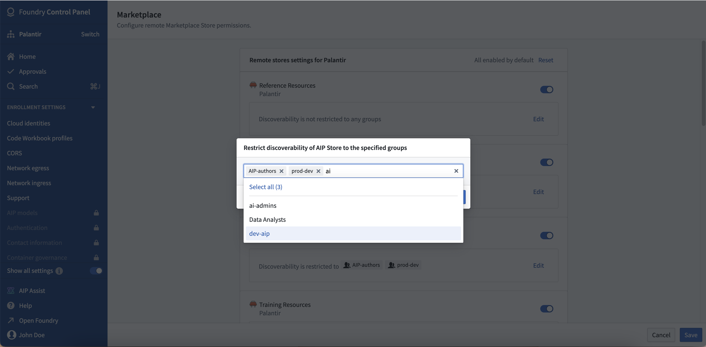

<!-- source: https://palantir.com/docs/foundry/administration/configure-remote-marketplace-stores/ · mirrored 2026-08-06 from Palantir Foundry docs -->

# Configure remote Marketplace stores

Some [Marketplace](/docs/foundry/marketplace/overview/) stores are remote, meaning that they are created on one Foundry enrollment and then made available on other Foundry enrollments. For example, the **Foundry Store** is provided by Palantir and includes products such as [Mapbox boundary datasets](/docs/foundry/geospatial/ontology/#mapbox-boundaries). While stores created on your Foundry enrollment will [inherit the access permissions of their save location](/docs/foundry/foundry-devops/create-products/#choose-a-store), access to remote stores is configurable in Control Panel. Remote stores are made available on your Foundry enrollment by Palantir. Some stores are available for all customers (such as **Foundry Store** and **Reference Resources**) while others may have been added to facilitate specific use cases within your organization.

:::callout{theme="neutral"}
User-created Marketplace stores are local to an enrollment by default. See the [DevOps documentation](/docs/foundry/foundry-devops/export-import-products/) for information on sharing products across enrollments.
:::

## Remote store permissions

Remote store settings are configured per organization. Settings can be configured by users with the **Organization Administrators** role and viewed by those with the **Organization Settings Viewer** role.

Once a remote store has been made available on your Foundry organization:

* If the store is turned on, the store and its products will be visible to all users in [Marketplace](/docs/foundry/marketplace/browse-products/). By default, if a new store is made available to your organization from another enrollment, it will be enabled.
* You can limit access to specific members of user groups within your organization. If you set permissions to a group whose users spans multiple organizations, only the members of the group in your organization will be able to view the store.
* If the store is turned off, no users will be able to see the store or its products in [Marketplace](/docs/foundry/marketplace/browse-products/).

