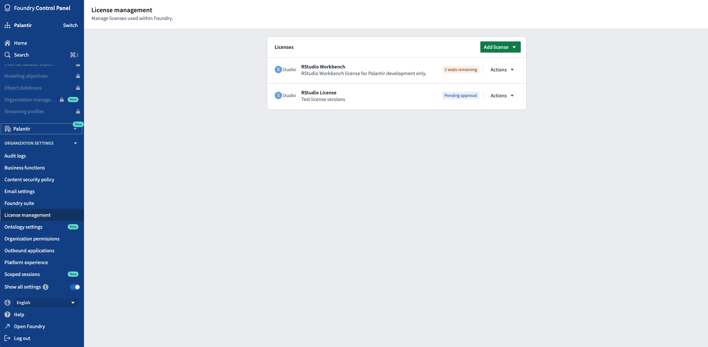
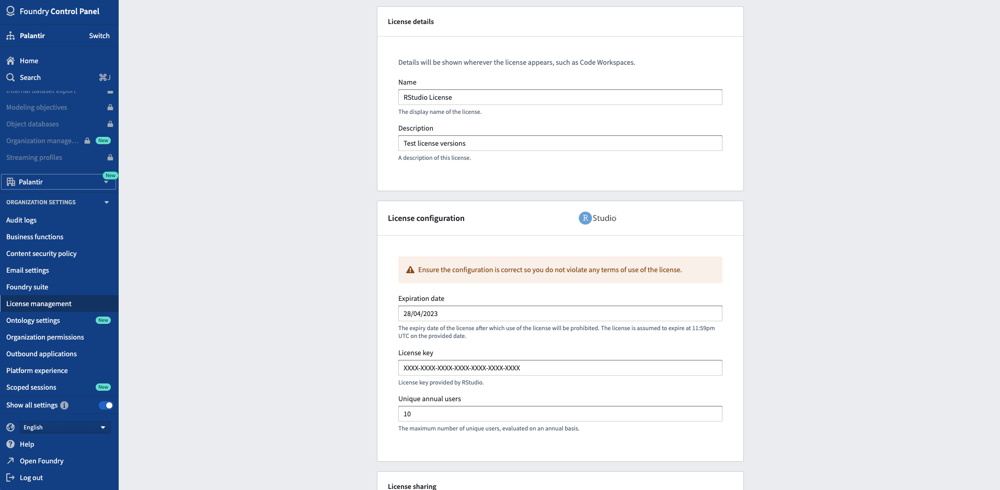
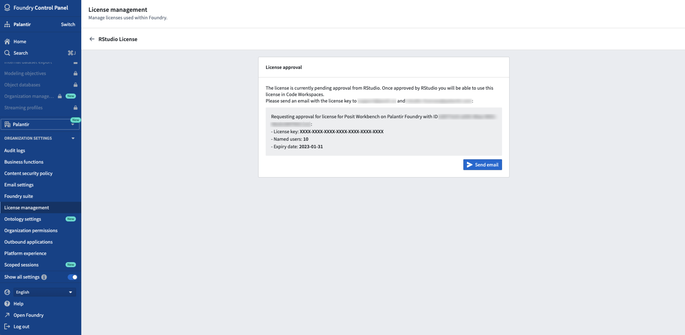
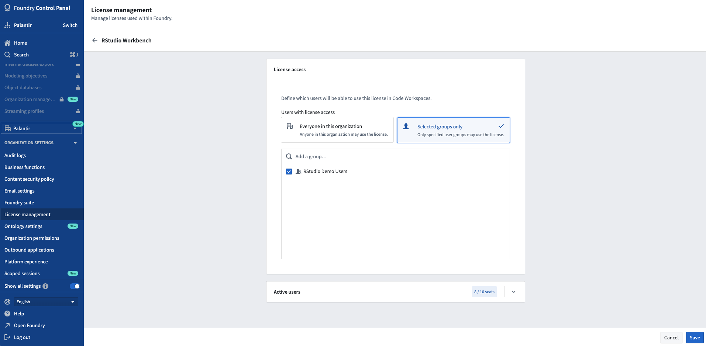

<!-- source: https://palantir.com/docs/foundry/administration/configure-rstudio-license/ · mirrored 2026-08-06 from Palantir Foundry docs -->

# Configure RStudio® license

Code Workspaces uses RStudio® Workbench, which requires a corresponding operational license. To enable RStudio® Workbench, Organization administrators should first reach out to Posit™ to either obtain a Posit™ Workbench license for Foundry or to confirm that an existing license is sufficient. The license must then be added to Foundry so that the application can be whitelisted.

:::callout{theme="neutral"}
If you renewed or upgraded an existing RStudio® license, ensure uninterrupted access to your existing workspaces by updating the corresponding license in Foundry instead of creating a new one. The last validated license remains in effect until your update has been validated by Posit™.
:::

## Add RStudio® license

To add an RStudio® license to Foundry, follow the instructions below:

1. Navigate to the **License management** section in Control Panel.

2. Provide information about the license (license key, number of named users, expiry date).

3. Follow the prompt to contact both Posit™ and Palantir to have the license whitelisted.

4. Once Posit™ confirms the specified license information is accurate and operational, Palantir will whitelist the license and enable RStudio® Code Workspaces in Foundry.

:::callout{theme="neutral"}
Foundry does not validate the license information but requires confirmation from Posit™ that it can be used. Foundry manages the license internally; if all the license seats have been used, the next new user will not be allowed to launch RStudio® in Foundry.
:::

Access to a given license can be restricted to a subset of user groups from **License management**.

***

RStudio® and Shiny® are trademarks of Posit™.

All third-party trademarks (including logos and icons) referenced remain the property of their respective owners. No affiliation or endorsement is implied.
