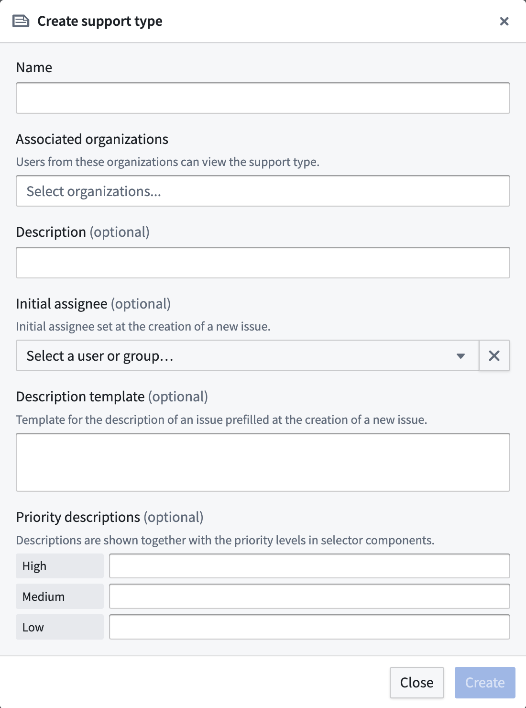
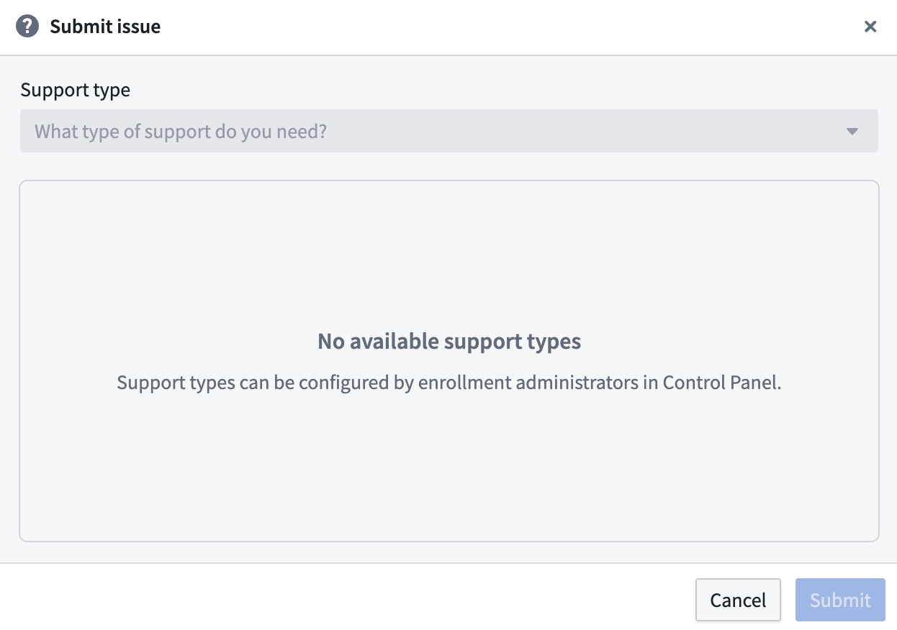

<!-- source: https://palantir.com/docs/foundry/administration/configure-support-types/ · mirrored 2026-08-22 from Palantir Foundry docs -->

# Configure support types

Use support types to tailor the [Issues application](/docs/foundry/getting-help/issues/) to your workflows and operating model, making it easier for users to file tickets and reducing the risk of tickets going to the incorrect assignee.

To configure custom support types, open Control Panel and navigate to **Enrollment settings > Support > Support types** and select **Add**.

If you have not configured support types, users will be unable to file issues even if they have access to the Issues application.

## Create a link to the Submit Issue modal with the support type pre-populated

You can create and share a link that opens the **Submit Issue** modal with a support type pre-populated. Append the `supportTypeRid` query parameter to the Issues application's `create` route:

`https://<FOUNDRY_URL>/workspace/issues-app/create?supportTypeRid=<supportTypeRid>`

As an example, you can embed a **Report an issue** button in a [Workshop](/docs/foundry/workshop/overview/) application that passes the `create` route with the relevant `supportTypeRid` appended, enabling users to bypass manual support type selection when filing an issue. To find a support type's RID, navigate to **Enrollment settings > Support > Support types** in Control Panel.
