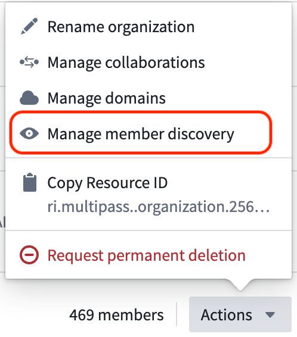
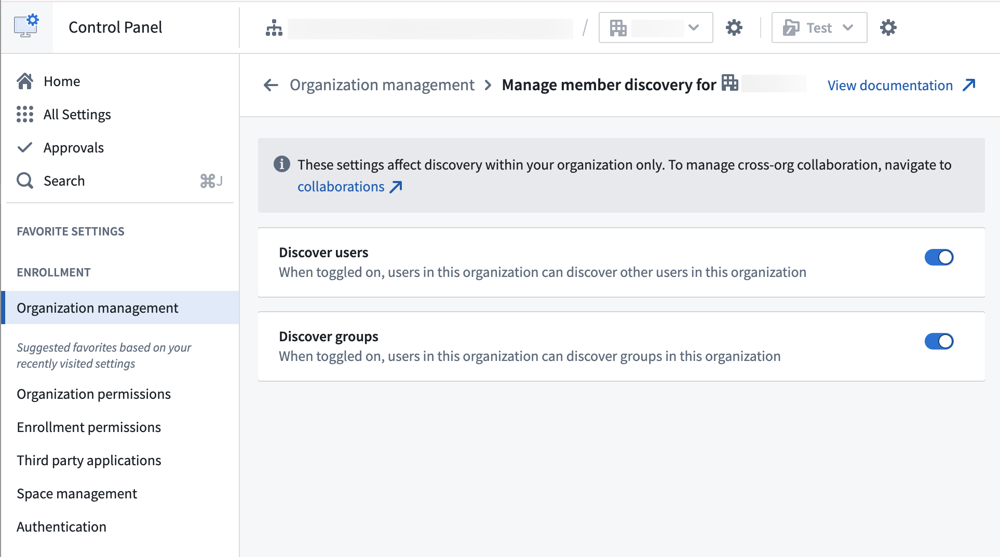

<!-- source: https://palantir.com/docs/foundry/administration/configure-user-and-group-visibility/ · mirrored 2026-08-06 from Palantir Foundry docs -->

# Configure user and group visibility

**Member discovery** settings in Control Panel allow administrators to control whether users within an organization can discover other users and groups in the same organization. This feature provides enhanced privacy and security isolation by preventing users from seeing other members of their organization.

By default, users in an organization can discover other users and groups within the same organization. Disabling member discovery prevents this visibility while maintaining normal functionality for administrators and application operations.

When user discovery is disabled for an organization, only organization administrators can view other users within that organization.

:::callout{theme="neutral"}
Guest members of an organization may also be organization administrators for that organization. For more information on guest members, navigate to [enrollments and organization access](/docs/foundry/administration/enrollments-and-organizations-access/#guest-access-to-organizations).
:::

:::callout{theme="neutral"}
These settings only affect discovery within your organization. To manage cross-organization collaboration, navigate to [cross-organization collaboration](/docs/foundry/security/cross-organization-collaboration/).
:::

## Configure member discovery settings

Follow the guide below to configure member discovery settings for an organization:

1. Navigate to **Control Panel > Organization management**.
2. Find your organization and select **Actions > Manage member discovery**.       
3. Configure member discovery settings:
   * **Discover users:** Toggle off to prevent users in this organization from discovering other users in the same organization.
   * **Discover groups:** Toggle off to prevent users in this organization from discovering groups in the same organization.   
      
     
4. Select **Save** to apply changes.

## Consumer mode benefits

Configuring private organizations provides significant benefits when operating in consumer mode.

### User privacy

Consumers cannot see other consumer users, maintaining privacy between different customer accounts. This ensures that users from different organizations or customer bases cannot discover each other's existence.

### Group isolation

Prevents discovery of internal administrative groups and other consumer-specific groups. Users will not be able to browse or discover groups that are not visible to them.

### Security enhancement

Reduces information disclosure about organization structure and membership. This limits attack surface by preventing users from gathering intelligence about the organization's structure.

### Expected behavior

Administrators can see all users as expected, ensuring that administrative functions continue to work normally while consumer users have restricted visibility.

## Impact on functionality

:::callout{theme="warning"}
Member discovery settings do not affect existing permissions or access rights. When user or group visibility is disabled, any logic that depends on a user's ability to access user or group details may fail. Restricted views will continue to work, but any user-defined logic that relies on user or group visibility will not be able to access that information.
:::

When member discovery is disabled, features will be impacted as follows:

* **Users cannot:** Browse or search for other users and groups within their organization.
* **Users can:** Collaborate with users and groups from other organizations based on cross-organization visibility settings.
* **Administrators retain:** Full visibility and management capabilities across all users and groups.
* **Applications can:** Function normally with existing permissions and access patterns.
