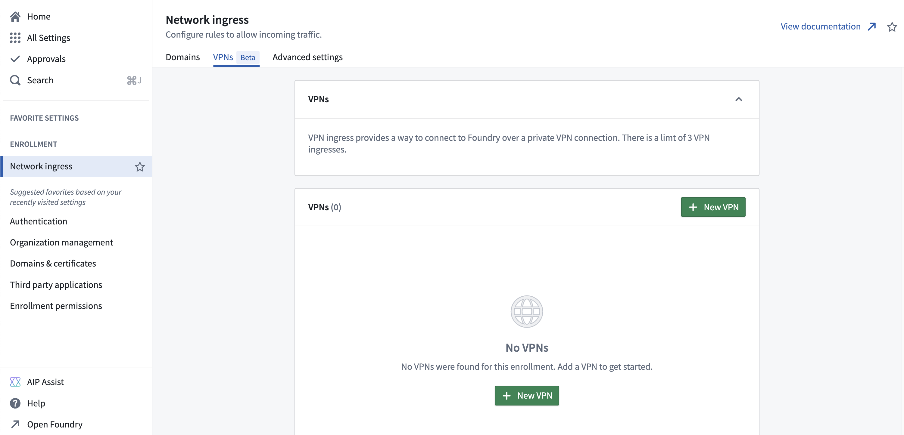
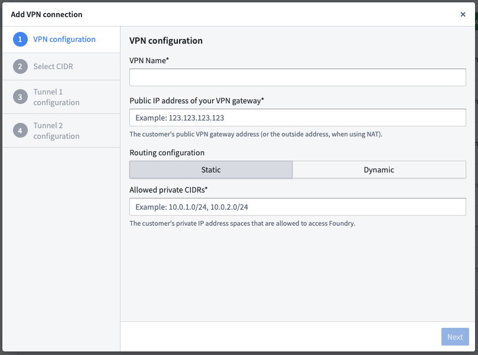
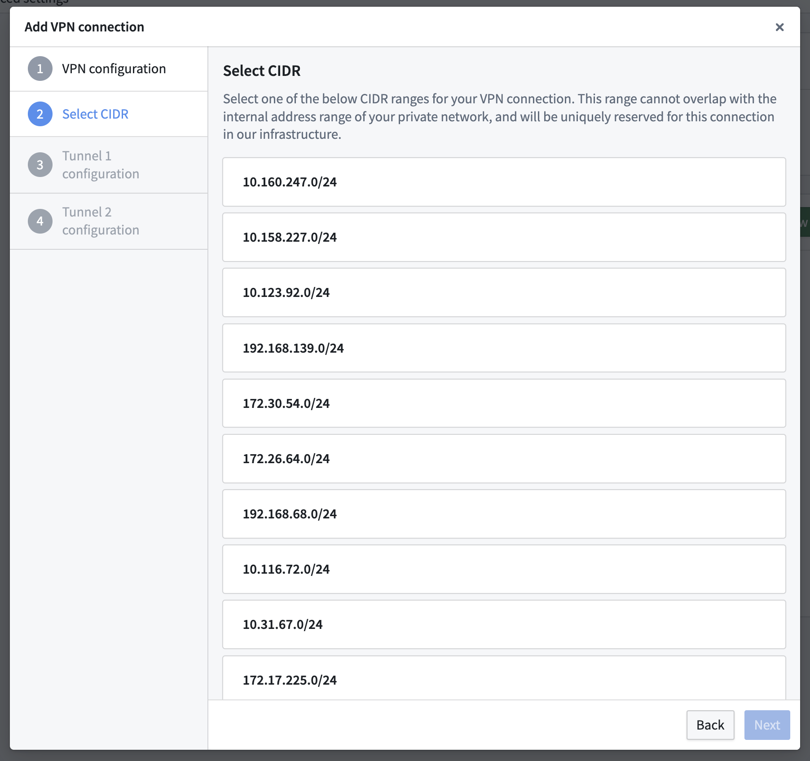
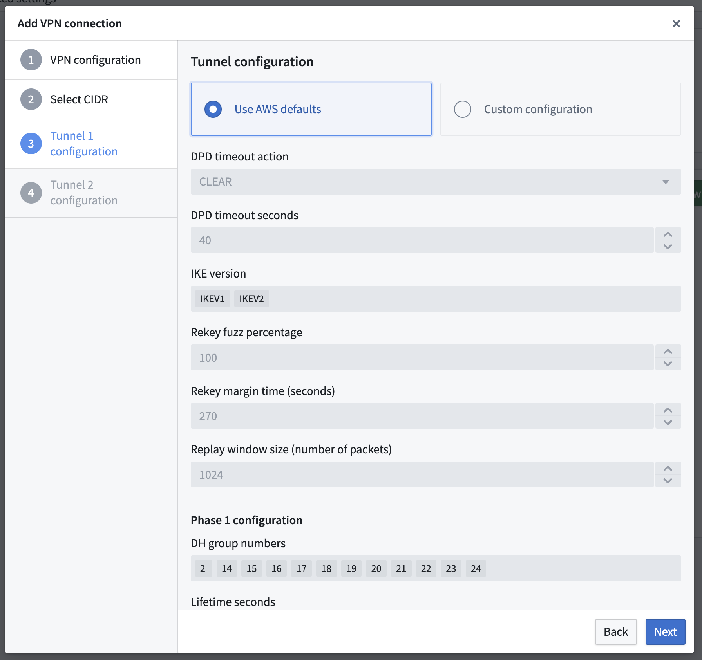
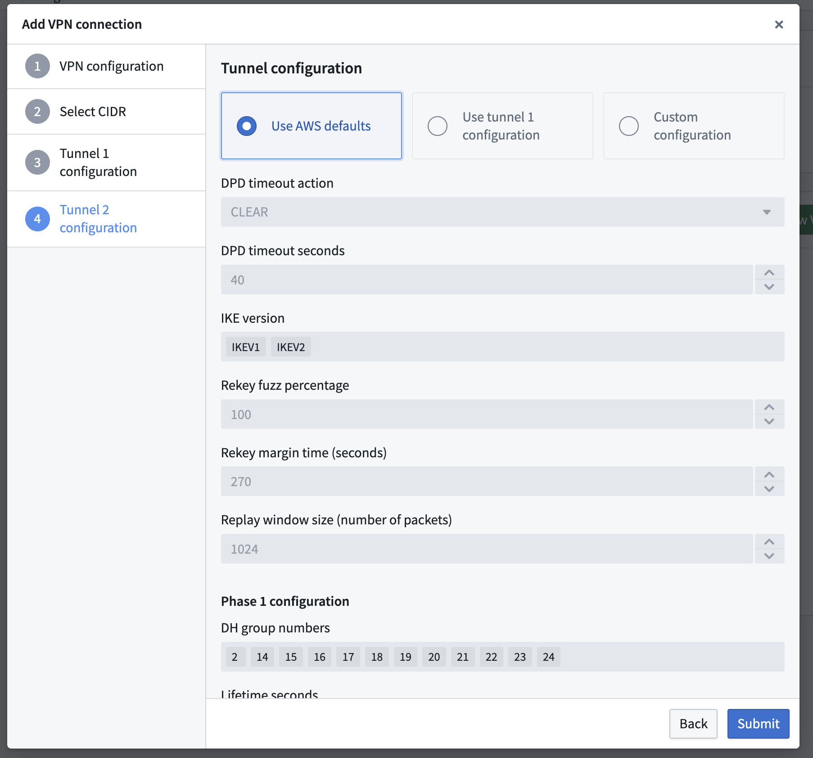
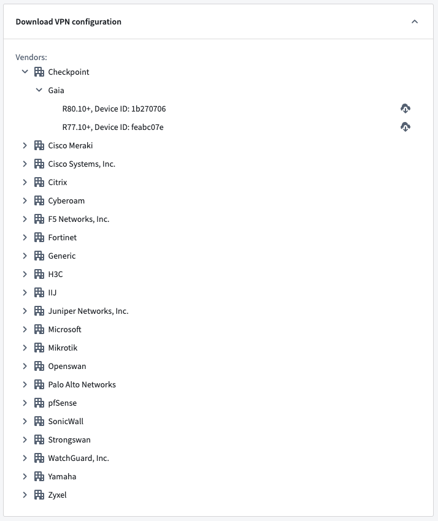
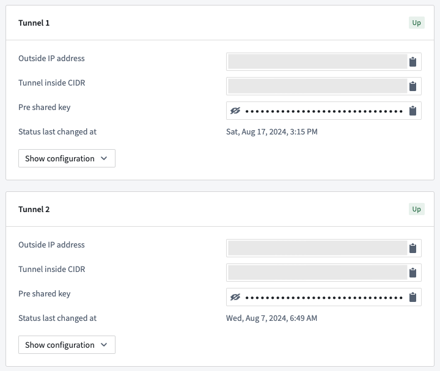
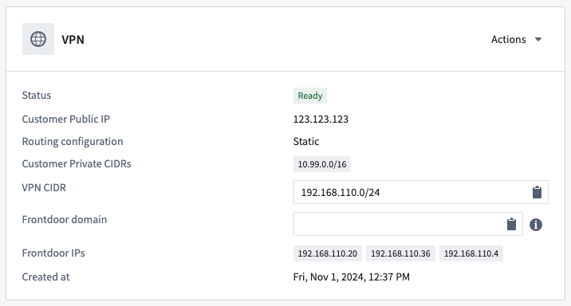
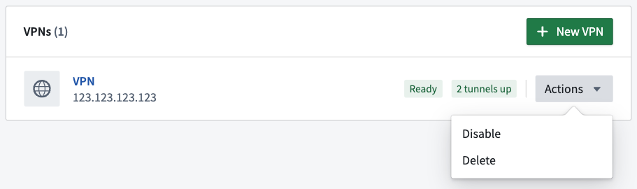
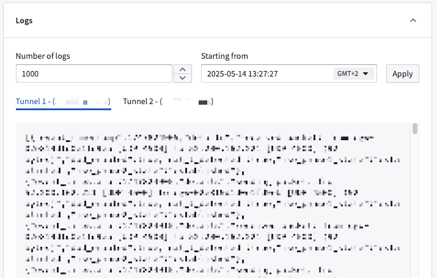

<!-- source: https://palantir.com/docs/foundry/administration/configure-vpn-ingress/ · mirrored 2026-08-22 from Palantir Foundry docs -->

# Configure VPN ingress \[Beta]

:::callout{theme="neutral" title="Beta"}
The ability to configure VPN ingress is in beta and may not be available on all enrollments. Some functionality may change before this feature becomes generally available. Contact your Palantir representative to enable self-service VPN ingress.
:::

:::callout{theme="warning"}
VPN ingress is only supported for AWS-hosted Foundry instances via the [AWS Site-to-Site VPN service ↗](https://docs.aws.amazon.com/vpn/latest/s2svpn/VPC_VPN.html).
:::

Platform administrators can configure VPN network ingress through an [AWS Site-to-Site VPN ↗](https://docs.aws.amazon.com/vpn/latest/s2svpn/VPC_VPN.html) service. This allows you to establish a connection to AWS-hosted Foundry instances without connecting over the internet.

## Ingress limits

You can configure up to three distinct ingresses through a VPN connection per Foundry enrollment. Contact your Palantir representative to request a limit increase.

## Configure a VPN

Navigate to the **VPNs** tab in the **Network ingress** page in Control Panel to manage VPNs.



To create a VPN connection, select **+ New VPN** and follow the steps below:

### 1. Enter configuration details for the VPN to connect to Foundry

You can enter the following details in the **VPN configuration** section:

* **VPN Name:** Name your VPN to identify the ingress.
* **Public IP address of your VPN gateway:** Enter the customer’s public VPN gateway address *or* the outside address when using NAT.
* **Routing configuration:**
  * **Static:** Enter the customer's private IP address spaces that may access Foundry in the **Allowed private CIDRs\*** text box.
  * **Dynamic:** Enter the Border Gateway Protocol (BGP) Autonomous System Number (ASN) of the customer gateway in the **Autonomous System Number (ASN)** text box.



### 2. Select a CIDR range for Foundry to use

Select one of the displayed CIDR ranges that Foundry may reserve to establish the VPN connection. The CIDR range you select must not overlap with the CIDR range of your private network. Foundry reserves the connection's CIDR in its infrastructure to support the VPN connection.



### 3. Configure tunnels

Each VPN connection contains two Internet Protocol Security (IPsec) tunnels for redundancy. Foundry configures these tunnels to **Use AWS defaults**, and you can configure the IPsec tunnels as a subset of the AWS defaults by referencing the [current AWS VPN Tunnels documentation ↗](https://docs.aws.amazon.com/vpn/latest/s2svpn/VPNTunnels.html). Select **Custom configuration** to customize a tunnel beyond the AWS defaults.



If Tunnel 1 uses the AWS default configuration, then Tunnel 2 will also use the AWS default configuration. If Tunnel 1 has a custom configuration, then Tunnel 2 may also use that custom configuration if you select **Use tunnel 1 configuration**. Additionally, you can configure Tunnel 2 separately from Tunnel 1 when you select **Custom configuration** from the **Tunnel 2 configuration** step in the **Add VPN connection** pop-up window.



Select **Submit** to complete the VPN configuration process and initialize the connection, which may take a few minutes. The VPN connection will progress from `Creating` to `Ready` once Foundry completes the installation.

### 4. Configure your gateway device

Once the VPN connection is ready, the **Download VPN configuration** window in Control Panel will display a list of example gateway configurations for various gateway devices. Download the configuration corresponding to your gateway device and follow the instructions to configure it to allow traffic to be routed via the created tunnels.

You can find the list of supported gateway devices in the [AWS VPN documentation ↗](https://docs.aws.amazon.com/vpn/latest/s2svpn/example-configuration-files.html).



Your tunnel status will display as `Up` to indicate the IPsec tunnel's establishment once you configure your gateway device.



### 5. Connect to Foundry

To connect to Foundry, you will:

1. [Allow ingress into Foundry from a VPN.](#allow-ingress-into-foundry)
2. [Override DNS resolution in a VPN.](#override-dns-in-a-vpn)

#### Allow ingress into Foundry

You can reference the existing [ingress configuration documentation](/docs/foundry/administration/configure-ingress/#configure-network-ingress-in-control-panel) to allow ingress from a customer's private CIDRs into Foundry.

#### Override DNS in a VPN

You can reach Foundry over the **Frontdoor domain** displayed in the **VPN** configuration details panel once its tunnels are `Ready`.



To connect to Foundry, you can:

* (Preferred) Create a CNAME record in your organization's DNS management system to point the current Foundry front door domain to the VPN's **Frontdoor domain** value, so that traffic to Foundry will go through the created IPsec tunnels of the VPN connection. For example, point `<mycompany>.palantirfoundry.com` to `vpn-xxxx.palantircloud.com`.
* (Optional) Add an entry to the host that resolves Foundry's front door `<mycompany>.palantirfoundry.com` to **Frontdoor IPs**. For example, `10.x.x.x. <mycompany>.palantirfoundry.com` in `/etc/hosts` in the desired system. This method of overriding DNS is not preferred as **Frontdoor IPs** may change.

In addition, certain Foundry services such as Code Workspaces may use other dedicated domains in the background, which must also be routed through the VPN tunnels. Contact your Palantir representative to obtain the full list of custom domains for your enrollment.

To test the VPN's successful configuration, you should receive `pass` when you run the command below:

```bash
curl -s https://<mycompany>.palantirfoundry.com/magritte-coordinator/api/ping > /dev/null && echo pass || echo fail
```

## Manage a VPN

### Manage VPN state

You can manage a VPN's state by navigating to your VPN list and selecting the **Actions** dropdown to **Disable** or **Delete** a VPN. There is a 24-hour grace period in which you can restore a VPN after you select **Delete**. Additionally, you can disable or enable a `Ready` VPN connection.



A VPN's configuration is immutable after you create the connection. To make configuration changes, you can **Delete** and recreate the VPN connection.

### Access and review VPN logs

You can access up to 10,000 tunnel logs from the VPN page, which include details on the tunnel's establishment, Internet Key Exchange (IKE) negotiations, and dead peer detection (DPD) protocol messages. Use the **Starting from** filter to narrow your search, which pulls logs for the most recent week by default.


