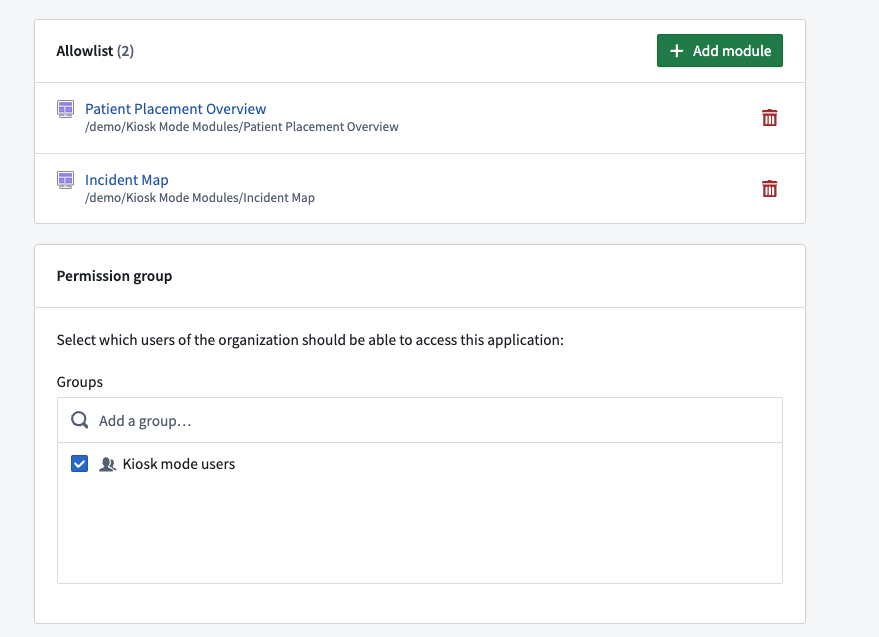
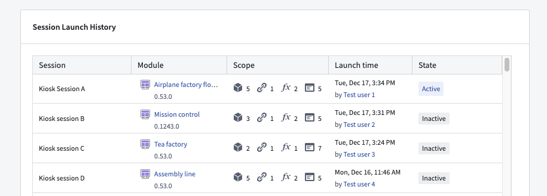

<!-- source: https://palantir.com/docs/foundry/administration/configure-workshop/ · mirrored 2026-08-22 from Palantir Foundry docs -->

# Configure Workshop settings

## Kiosk mode

[Kiosk mode](/docs/foundry/workshop/kiosk-mode/) settings are configured and managed on the Organization level. Administrators with the **Data Governance Officer** role have the ability within Control Panel to set which modules may enable kiosk mode as well as which group of users may launch kiosk mode sessions.

For Workshop modules in Projects shared across multiple Organizations, kiosk mode can be enabled for the module in one Organization but not another. The user launching a kiosk mode session for that module will have the Control Panel settings of their primary Organization checked when verifying their access.

To access and configure kiosk mode settings, navigate to the **All settings** tab of the relevant Organization and select **Workshop** from the **Application Configuration** section. Within the **Kiosk mode** tab, you can view the following sections:

* **Allowlist:** Add or remove Workshop modules from the allowlist to set which modules may or may not enable kiosk mode.
* **Permission group:** Search for, add, or remove user groups to set which users will have permission to launch kiosk mode sessions for modules with kiosk mode enabled.
* **Session Launch History:** Provides a view of all historical and active kiosk mode sessions.

