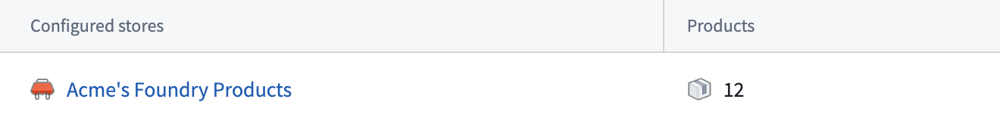
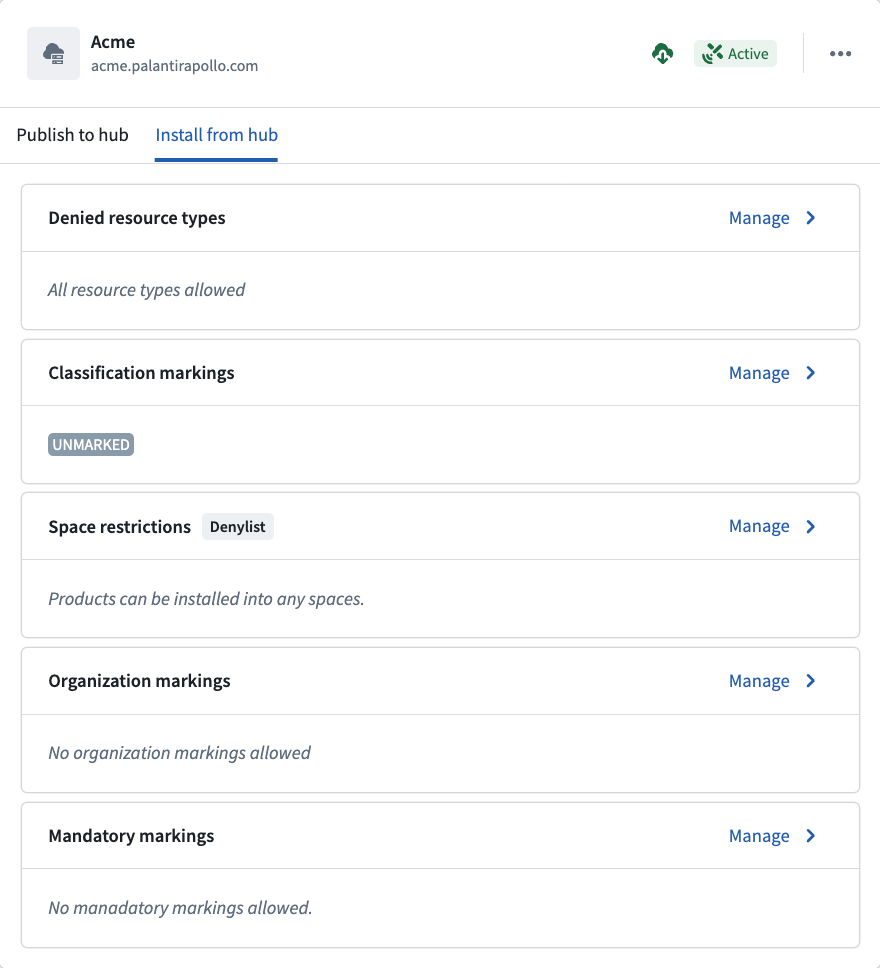

<!-- source: https://palantir.com/docs/foundry/administration/connected-hubs/ · mirrored 2026-08-22 from Palantir Foundry docs -->

# Connected hubs

The **Connected hubs** extension in Control Panel enables you to authenticate connections between your Foundry enrollment and [Apollo](../../apollo/core/introduction.md) hubs. Once a connection is established, you can add [Marketplace](/docs/foundry/marketplace/overview/) stores to a publishing whitelist so that new product releases in those stores are automatically published to the connected Apollo hub.

This enables cross-network shipping of Marketplace products: users can build products on top of their own data, publish to an Apollo hub that they control, and install those products onto other Foundry environments without requiring any Palantir-specific permissions.

Individual Marketplace stores can be connected to multiple Apollo hubs, and each hub can receive products from multiple stores.

## Prerequisites

To access the **Connected hubs** extension in Control Panel, you must have the **Enrollment administrator** role, granted in the **Enrollment permissions** extension. For more details, see [Permissions](/docs/foundry/administration/enrollments-and-organizations-permissions/).

## Connect an Apollo hub

Before connecting an Apollo hub, ensure the following setup has been completed:

1. **Network connectivity:** The Apollo hub must allow inbound traffic from your Foundry enrollment. To configure this:

   a. In your Foundry enrollment's **Control Panel**, navigate to the **[Network egress](/docs/foundry/administration/configure-egress/)** extension and select **What IPs do connections from Foundry come from?** to copy the CIDRs.

   b. In the Apollo hub's **Control Panel**, navigate to the **[Network ingress](/docs/foundry/administration/configure-ingress/)** extension and add those CIDRs.

2. **Third-party application credentials:** Create credentials on the Apollo hub that your Foundry enrollment will use to authenticate:

   a. In the Apollo hub's **Control Panel**, navigate to the **[Third-party applications](/docs/foundry/platform-security-third-party/third-party-apps-overview/)** extension.

   b. Create a new application and select **Confidential client**, then **Client credentials grant**.

   c. Enable the application and turn on **Organization level consent**.

Once the setup is complete, connect the hub in Control Panel:

1. Navigate to **Control Panel** and select **Connected hubs** from the side panel under **Enrollment settings**.
2. Select **Add**.

3. Provide the following information:

| Field | Description |
| --- | --- |
| Apollo hub URL | The URL of the Apollo hub to connect to. |
| Apollo Space ID | The identifier for the Apollo space associated with the hub. This value is case sensitive. |
| Client ID | The client ID generated when creating the third-party application on the Apollo hub. |
| Client secret | The client secret generated when creating the third-party application on the Apollo hub. |

4. Select **Submit** to establish the connection.

Once the connection is saved, the extension displays the connection status, indicating whether the authentication is valid.

## Verify a hub connection

After connecting an Apollo hub, the **Connected hubs** extension displays the current status of each connection. Use this to verify that authentication credentials are valid and the hub is reachable.

## Publish products to a connected Apollo hub

To publish Marketplace products to a connected Apollo hub, ensure the following additional setup has been completed on the Apollo hub:

1. **Apollo hub permissions:** Add the third-party application user to a team (or create a new team) that has the following [permissions](../../apollo/core/authorization.md#authorization-via-roles):
   * **Artifacts:** Creator, Viewer
   * **Products:** Release Creator, Creator, Viewer

### Add Marketplace stores to the publishing whitelist

After the hub permissions are configured, you can add Marketplace stores to the publishing whitelist for that hub.

1. Select the connected hub you want to configure.
2. Select **Configure**, or the cog icon.
3. Add the Marketplace store to the whitelist.

When a Marketplace store is on the publishing whitelist, cutting a new release of a product in that store will automatically publish it to all Apollo hubs that the store is configured for. Only products that use **[strict folder tracking](/docs/foundry/foundry-devops/folder-tracking/)** and have a **[Maven coordinate](/docs/foundry/foundry-devops/manage-products/#configure-a-maven-coordinate)** configured will be successfully published; products that do not meet these requirements will not block other products from publishing.

### Publishing workflow

Once a store is on the whitelist and properly configured:

1. In DevOps, create a release for a product in the whitelisted store.
2. The product is automatically published to all connected Apollo hubs that the store is whitelisted for.

## Install products from a connected Apollo hub

To install [Foundry Products](/docs/foundry/marketplace/foundry-products/) from Apollo, first make sure you have a valid connection to the corresponding hub and attach the environment ID of the [Apollo environment](../../apollo/core/environments.md) to install from.
Then, contact Palantir Support to enable third-party Foundry Product installations from connected hubs.

## Configure installation settings

Select the **Install from hub** tab to configure the behavior of products installed from a connected Apollo environment. For each connection, you can control which resource types may be installed, which spaces products may be installed into, and which markings the installed content may reference.

Attempting to install or upgrade to a product version that violates these settings will result in the Apollo plan failing.

The following installation settings are available:

| Setting | Description |
| --- | --- |
| **Denied resource types** | The resource types, such as Ontology object types, Automations, or Compute Modules, that may not be installed from this connection. A product that attempts to install the denied resource types will be blocked from installing. By default, all resource types are allowed. |
| **Space restrictions** | The spaces that products may be installed into. Select **Allowlist** to permit installation only into the listed spaces, or **Denylist** to block the listed spaces and permit all others. By default, products can be installed into any space. |
| **Classification markings** | The highest classification that installed content may reference. This setting appears only when your enrollment uses classification-based access controls (CBAC). By default, this is unmarked. |
| **Organization markings** | The organization markings that installed content may reference. By default, no organization markings are allowed. |
| **Mandatory markings** | The mandatory markings that installed content may reference. By default, no mandatory markings are allowed. |

:::callout{theme="warning"}
If you attempt to install a product in Apollo that references any **Organization markings** or **Mandatory markings** that do not exist on the connection, the installation will fail.
:::
