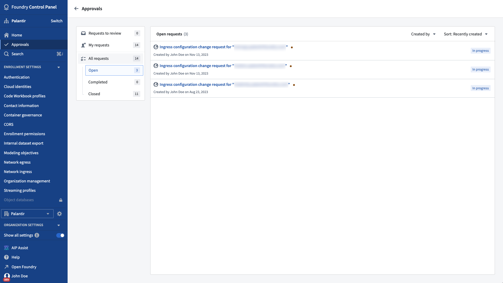

<!-- source: https://palantir.com/docs/foundry/administration/control-panel-approvals/ · mirrored 2026-08-22 from Palantir Foundry docs -->

# Approvals in Control Panel

Control Panel features a dedicated [Approvals](/docs/foundry/approvals/overview/) integration designed to facilitate the process of requesting, approving, and maintaining a history of sensitive workflows within Control Panel.

## Approvals inbox

All approvals appear in Control Panel's approvals inbox. To access, select on the **Approvals** tab at the very top of Control Panel's sidebar.

## Supported workflows

Control Panel's integration with Approvals is under active development. Current supported workflows include:

* [Configuring network ingress](/docs/foundry/administration/configure-ingress/)
* [Configuring network egress](/docs/foundry/administration/configure-egress/)
* [Configuring Ontology SDK web hosting](/docs/foundry/developer-console/deploy-custom-application-on-foundry/)
