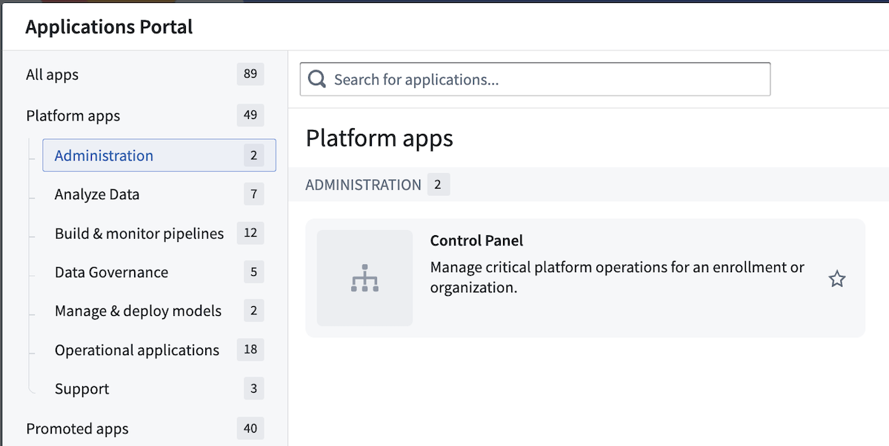
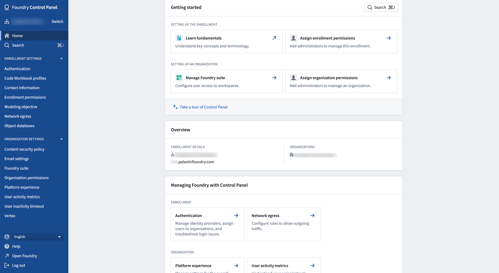

<!-- source: https://palantir.com/docs/foundry/administration/control-panel/ · mirrored 2026-08-06 from Palantir Foundry docs -->

# Control Panel

All administrative workflows can be performed in **Control Panel**, Foundry's centralized interface for administering the platform. You can access Control Panel from the Applications Portal.

The Control Panel home page provides an overview of your enrollment and organization(s) as well as links to perform common administrative workflows.

Additional settings in Control Panel are presented as tabs on the side panel, grouped by enrollment/Organization levels. To search for a specific setting, open the search dialog by selecting **Search** in the side panel or using `Cmd+J` (macOS) or `Ctrl+J` (Windows).
