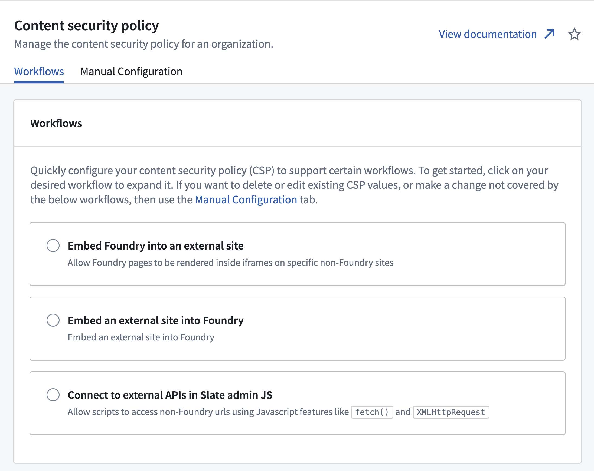
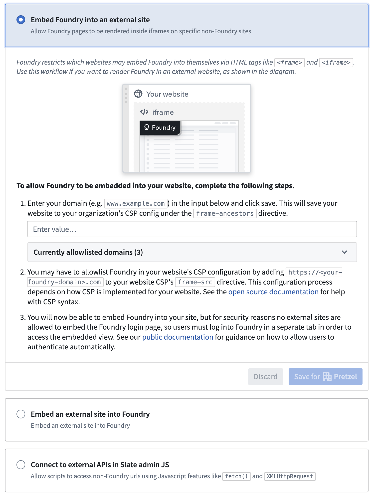
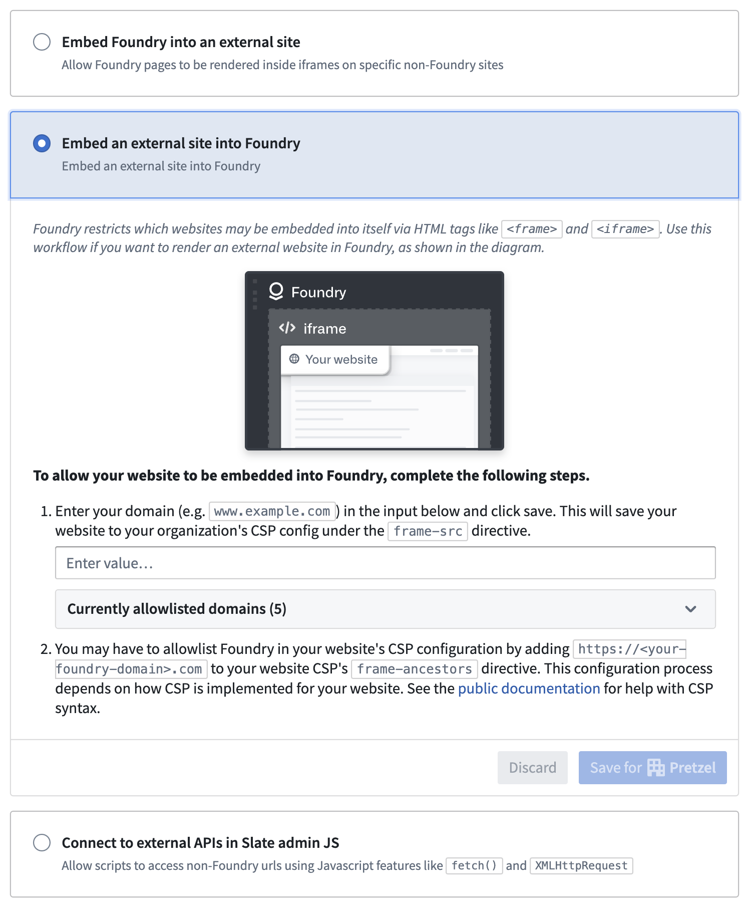
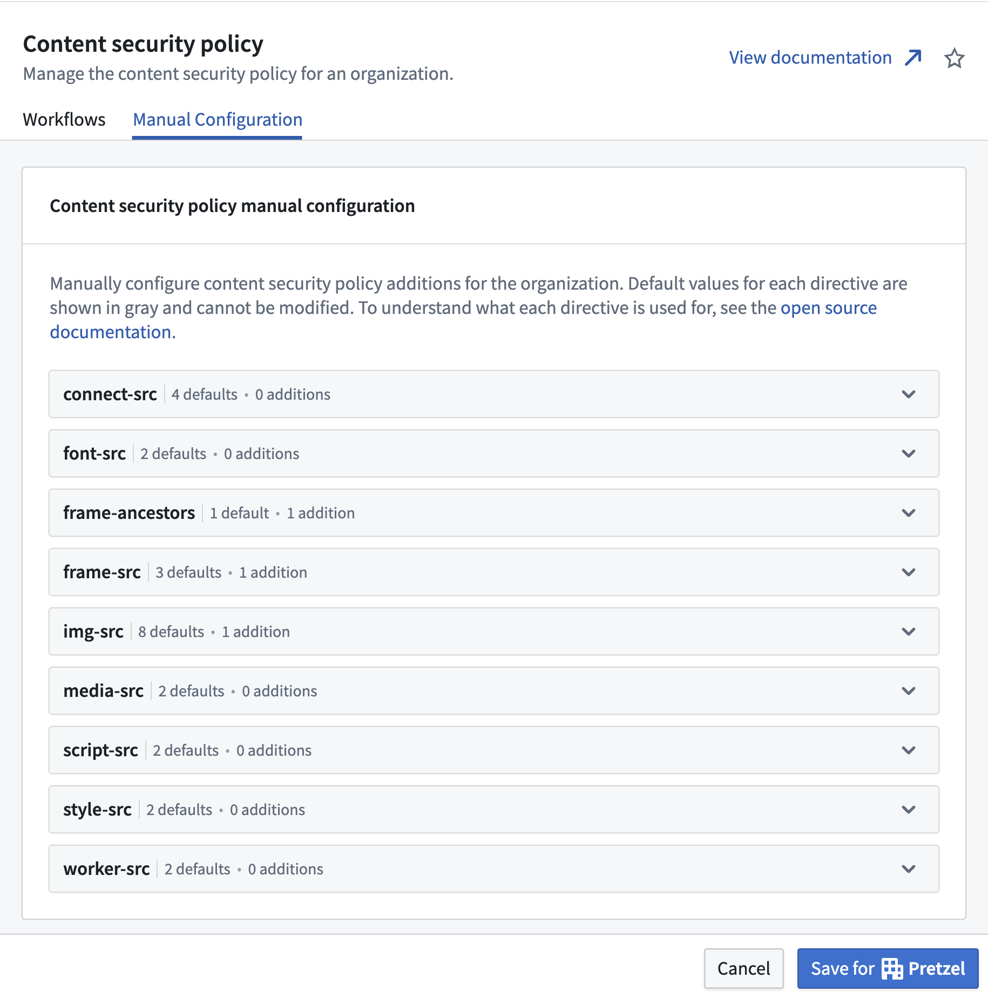

<!-- source: https://palantir.com/docs/foundry/administration/embed-foundry-externally/ · mirrored 2026-08-06 from Palantir Foundry docs -->

# Configure the Content Security Policy for embedding

This section reviews how to embed a Foundry resource, such as a [Workshop](/docs/foundry/workshop/overview/) module, on your organization’s own website, and vice versa.

The configuration requires editing the Content Security Policy configuration found in [Control Panel](/docs/foundry/administration/control-panel/) for your Foundry environment. Note that this section is only available to those who are designated as organization administrators or data governance officers in Control Panel.

## Using workflows

The following sections describe how to use workflows to configure your Content Security Policy (CSP) to support embedding. If you need to make other changes, you can also use the manual configuration tab to configure your CSP directly. See the [manual configuration](#manual-configuration) documentation for more information.

### Embed a Foundry resource externally

:::callout{theme="warning"}
Users of your site will be able to see the URL of your embedded Foundry resource. Do not embed Foundry into sites accessed by users who you don't want to know about your Foundry environment.
:::

To allow Foundry to be embedded into external resources, select the **Embed Foundry into an external site** workflow in the workflows tab. Follow the provided instructions to configure your CSP automatically.

#### Authentication

When the Foundry resource is successfully embedded on your organization’s website, users must be logged in to both your organization’s website and to Foundry. For security reasons, the login flow cannot be shown in an iframe; users must log into Foundry in another tab or window.

You can configure an automation for your organization's website to automatically open the URL `https://{my-foundry-url}/workspace/auth-redirect` in a new tab or pop-up window and initiate the login flow. When login is complete, the tab or window will automatically close.

Foundry’s [core security principles](/docs/foundry/security/overview/) will continue to apply to the embedded resource. This means that a user’s permissions, as configured in Foundry, will dictate their access to the embedded Foundry resource on your organization’s site.

### Embed external resources in Foundry

You can also embed external resources into Foundry applications. To do so, select **Embed an external site into Foundry** in the workflows tab. Follow the provided instructions to configure your CSP automatically. The embedded external resource must also allow itself to be embedded in Foundry, by setting the appropriate [`frame-ancestors` directive for the `Content-Security-Policy` header ↗](https://developer.mozilla.org/en-US/docs/Web/HTTP/Reference/Headers/Content-Security-Policy/frame-ancestors).

## Manual configuration

You can manually configure your Content Security Policy settings if your use case does not fall into the existing workflows. Navigate to the **Content Security Policy** section of Control Panel in your Foundry environment and select the manual configuration tab.

