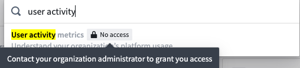
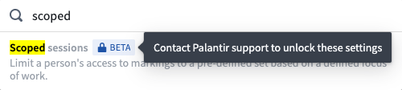
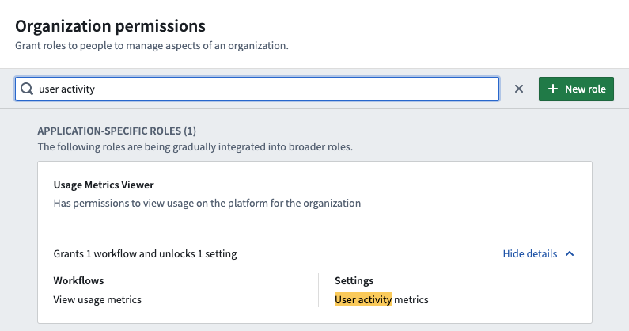
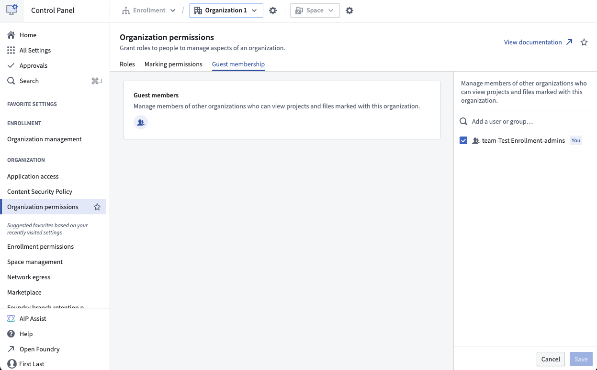

<!-- source: https://palantir.com/docs/foundry/administration/enrollments-and-organizations-access/ · mirrored 2026-08-06 from Palantir Foundry docs -->

# Managing access

### Who can manage permissions in Control Panel?

Users granted the **Enrollment administrator** role can manage permissions for their enrollment in the **Enrollment permissions** tab. Conversely, users granted the **Organization administrator** role can manage permissions for their Organization(s) in the **Organization permissions** tab. Users that are not granted those roles will not have access to these tabs.

### Why do I not see a certain settings tab in Control Panel?

Settings in Control Panel are presented as tabs on the side panel grouped by enrollment / organization levels. These settings tabs are only visible to users who have the relevant permissions. For instance, the **Authentication** tab requires the **Manage SAML providers** workflow.

If you're unable to see a specific settings tab in Control Panel, open the search dialog by clicking on Search in the side panel or using the Cmd+J (MacOS) or Ctrl+J (Windows) keyboard shortcut. You can then search for the relevant setting. If you see a message such as `Contact your organization administrator to grant you access` (as shown below), ask the person who manages permissions for your enrollment/organization to grant you the correct role.

In some cases, you may see a message like `Contact Palantir Support to unlock these settings`, which indicates a beta or limited-release feature.

If you're unsure which role to grant, use the search feature in **Enrollment/Organization permissions** to look for keywords. This will search over role names, descriptions, and workflows, as well as the setting(s) that each role enables.

## Managing Organization access

There are two ways in which a user can access an Organization: as the user's [primary Organization](#primary-organization), or as an Organization for which the user has [guest access](#guest-access-to-organizations).

### Primary Organization

Every user has exactly one primary Organization. A user's primary Organization can be assigned upon user creation, mapped via your SAML setup (available at [**Admin > Authentication > Organization assignment**](/docs/foundry/authentication/org-assignment/)), or managed in the **Users** interface.

A user's primary Organization determines:

* The Organization that shows up in a user's profile.
* A user's visibility to users from other Organizations.
* The default Organization markings for new Projects and groups created by the user; by default, resources are restricted to users within the primary Organization.

### Guest access to Organizations

In addition to their primary Organization, users can be granted guest access to other Organizations. A guest of an Organization is a user who can view Projects, files, users, groups, tag categories, and collections in this Organization. Guests can be users or groups.

:::callout{theme="neutral"}
Assume user Alice has guest access to Organization X. Guest access to Organization X allows Alice to view users that have Organization X as their primary Organization, but not other guest users of Organization X. Users who have Organization X as their primary Organization will always be able to view users who are guests of Organization X, except when [user visibility](/docs/foundry/administration/configure-user-and-group-visibility/) is disabled for Organization X.
:::

You can add guests to your Organization from the **Guest membership** tab of the **Organization Permissions** page.

