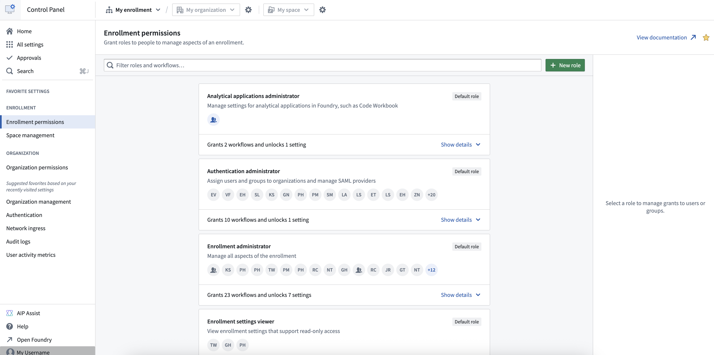
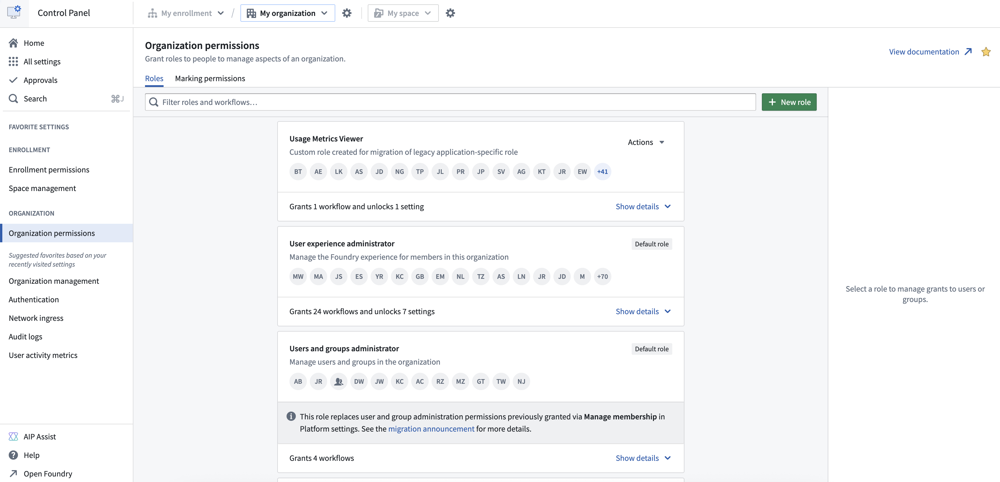

<!-- source: https://palantir.com/docs/foundry/administration/enrollments-and-organizations-permissions/ · mirrored 2026-08-22 from Palantir Foundry docs -->

# Permissions

## Levels of permissions

Permissions in Control Panel are managed at two different levels: [*Enrollments* and *Organizations*](/docs/foundry/administration/enrollments-and-organizations/). Each level has a dedicated page to manage permissions.

To manage permissions for your enrollment, use the **Enrollment permissions** tab.

To manage permissions for your Organization(s), use the **Organization permissions** tab. If you are able to manage permissions for multiple Organizations, use the dropdown menu on top to select the desired one.

The levels are strictly independent. For example, a user who can manage permissions for an enrollment will not necessarily be able to manage permissions for the enrollment's Organization(s). This provides the ability to delegate or separate responsibilities, in particular for cases where multiple companies collaborate on the same Foundry platform.

## Roles

At each level, **roles** can be granted to users and/or groups. Each role contains a number of *workflows* which correspond to capabilities or actions that the people granted the role will be able to take.

Each level has different roles, but within each level there is a role with the highest level of permissions (**Enrollment administrator** and **Organization administrator**, respectively). These roles should be granted carefully, usually to top-level administrators, as they:

* Grant the ability to manage permissions for the enrollment/Organization, and therefore the ability to grant other roles; and
* Incorporate all workflows from other roles of that level.

[Learn more about roles.](/docs/foundry/security/projects-and-roles/#roles)

### Technical Compliance Officer Role

Each Organization should have at least one user granted the **Technical Compliance Officer** role. If the role is not explicitly granted to anyone, the **Organization administrator** will be considered the Technical Compliance Officer by default.

A key responsibility of the Technical Compliance Officer is that they are an *Upgrade Assistant Operator*. As an Operator, they are the primary contact to be made aware of planned [Platform changes](/docs/foundry/upgrade-assistant/platform-changes/) that require attention and may need manual action by users. Upgrade Assistant Operator is expected to use the Operator View in the [Upgrade Assistant application](/docs/foundry/upgrade-assistant/overview/) to track and drive the progress of users carrying out any required actions.

:::callout{theme="neutral"}
**Application-specific roles** under **Organization permissions** are legacy standalone roles that are in the process of migrating to roles as described above.
For now, application-specific roles are not incorporated in the **Organization administrator** role and cannot be included in custom roles.
:::

## Custom roles

In addition to the default roles, **Enrollment administrators** and **Organization administrators** can define custom roles in Control Panel by selecting individual *workflows*. This can be used to create more narrow roles to separate and delegate responsibilities.

Custom roles are not shared across organizations, so different custom roles can be defined for different organizations.
