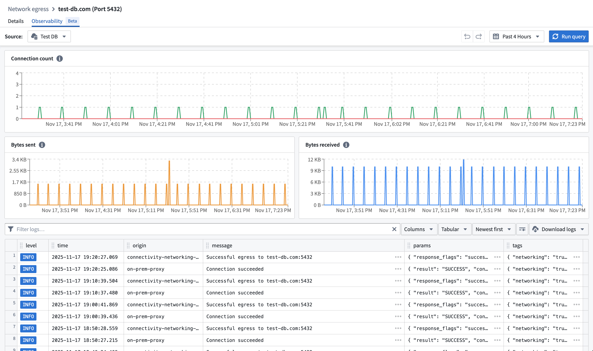
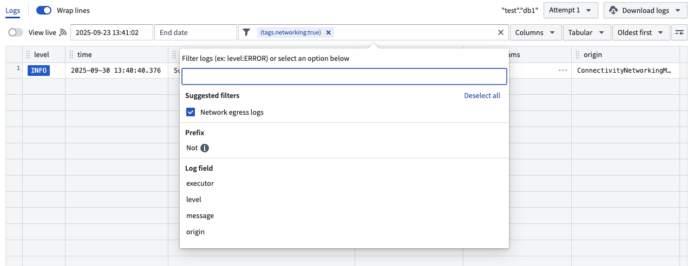
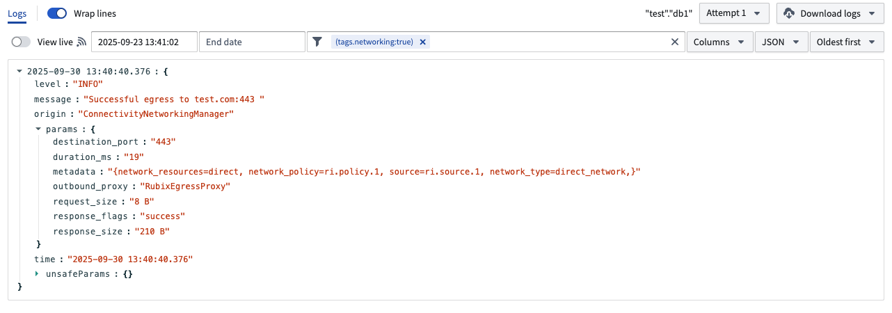

<!-- source: https://palantir.com/docs/foundry/administration/network-egress-observability/ · mirrored 2026-08-22 from Palantir Foundry docs -->

# Network egress observability

## Observability in Control Panel

In the [network egress policy](/docs/foundry/administration/configure-egress/#network-egress-overview) page, the **Observability** tab contains logs and metrics for uses of the network egress policy per data connection source that imports this policy.

Select a data connection source in the source picker and view the network egress logs and metrics that were created with the policy.

## Observability in Builds

Network egress logs are included in build telemetry. To view only network egress logs, add the suggested `Network egress logs` filter .

## Log definition

Network egress logs derived from different origins are available to help diagnose connectivity issues across all Foundry networking layer methods, such as [direct connection](/docs/foundry/administration/configure-egress/#direct-connection-egress-policies) or [agent proxy](/docs/foundry/administration/configure-egress/#agent-proxy-egress-policies) policies.

### `connectivity-sidecar` origin

`connectivity-sidecar` routes connections to the appropriate network egress policy used for transparent proxy routing.

#### Egress log

Egress logs contain the following parameters:

* `connection_id`: A unique identifier for the connection.
* `response_flags`: Response can be either success or failed.
* `bytes_sent`: The number of bytes sent from the sidecar to the outbound proxy.
* `bytes_received`: The number of bytes received by the sidecar from the outbound proxy.
* `duration_ms`: The duration of the connection in milliseconds.
* `destination_port`: The destination port of the connection.
* `metadata`:
  * `network_policy`: Resource identifier of the network egress policy that egress was attempted with.
  * `source`: Resource identifier of the data connection source that egress was attempted for.
  * `network_type`: Type can be either direct or agent proxy.
  * `network_resources`: Data connection agent IDs if agent proxy network egress policy.

#### DNS query log

DNS query logs contain the following parameters:

* `answer_count`: The number of DNS records returned in a DNS response.
* `connection_id`: A unique identifier for the connection.
* `parse_status`: The result of parsing the incoming DNS message.
* `pod_name`: The name of the pod that initiated the DNS request.
* `query_class`: The class of DNS resource record being requested. This should almost always be 1 for Internet.
* `query_name`: The hostname in the DNS query. This is logged as an **unsafe parameter**.
* `query_type`: The type of DNS resource record being requested (for example, 1 for IPv4, 2 for NS).
* `response_code`: The DNS response code.
* `return_message`: The human-readable string version of `response_code`.
* `sources`: The source IDs associated with the DNS query.

### `egress-proxy` origin

`egress-proxy` is the service that handles explicit proxy connections.

### `on-prem-proxy` origin

`on-prem-proxy` is the service running in Foundry that proxies traffic to a [data connection agent](/docs/foundry/data-connection/core-concepts/#agents) when using [agent network egress policies](/docs/foundry/administration/configure-egress/#agent-proxy-egress-policies).

### `agent-proxy` origin

`agent-proxy` is the service running on a [data connection agent](/docs/foundry/data-connection/core-concepts/#agents) in a private network. It opens the connection to the end destination for [agent network egress policies](/docs/foundry/administration/configure-egress/#agent-proxy-egress-policies).

## Direct connection

There are two possible outcomes for direct connection egress: successful or failed.

### Successful egress

Traffic successfully egressed out of the Palantir platform. The connection could still fail due to issues with ingress firewalls on the destination, authentication, or TLS handshake, but this is considered a successful egress as traffic has left the Palantir platform.

### Failed egress

Traffic failed to egress out of the Palantir platform.

Next steps:

* Verify the existence of the address and port through which egress was attempted and ensure that they are resolvable by the Palantir platform's direct connected network.
* If traffic is still failing to egress, contact Palantir Support.

## Agent proxy

There are two possible outcomes for agent proxy: successful egress or failed egress.

### Successful egress

Traffic was successfully proxied to one of the data connection agents of the policy. The connection could still fail due to issues with ingress firewalls on the destination, authentication, or TLS handshake, but this is considered a successful egress as traffic was proxied to a backing data connection agent.

### Failed egress

Traffic failed to egress out of the Palantir platform.

Next steps:

* Verify that the address and port through which egress was attempted have a corresponding network egress policy imported in the data connection source.
* Ensure that all of the backing data connection agents of the agent proxy policy are healthy.
* If traffic is still failing to proxy to the data connection agent, contact Palantir Support.

## Limits

Network egress observability is only provided for network egress policies which use TCP-level allowlisting.
