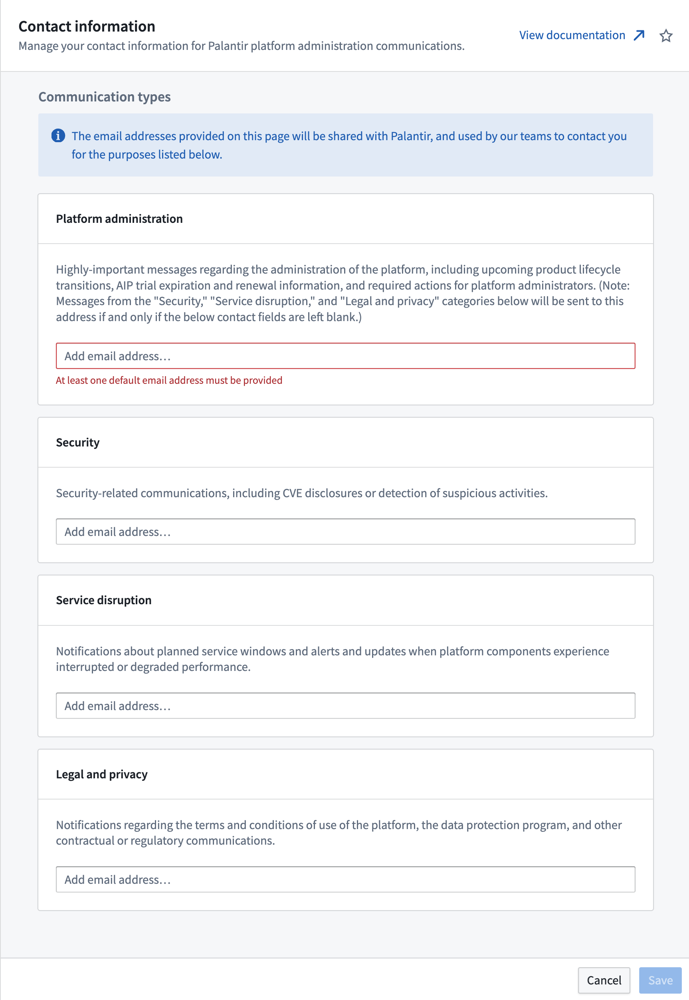

<!-- source: https://palantir.com/docs/foundry/administration/platform-communications/ · mirrored 2026-08-06 from Palantir Foundry docs -->

# Configure contact information

Recipients for communications related to the operations and administration of Foundry can be configured in the **Contact information** section of Control Panel.

There are four channels that allow for subsets of relevant communications to route to different inboxes. A common best practice is to subscribe a mailing list rather than individual accounts to ensure that critical communications are not missed. Note that it is required for at least one email address to be registered to receive **Platform administration** messages.

The four channels for routing communications are:

* **Platform administration:** Highly-important messages regarding the administration of the platform, including upcoming product lifecycle transitions, AIP trial expiration and renewal information, and required actions for platform administrators. (Note: Messages from the "Security," "Service disruption," and "Legal and privacy" categories below will be sent to this address if and only if they are left blank.)
* **Security updates:** Security-related communications, including CVE disclosures or detection of suspicious activities.
* **Service disruption announcements:** Notifications about planned service windows and alerts and updates when platform components experience interrupted or degraded performance.
* **Legal and privacy:** Notifications regarding the terms and conditions of use of the platform, the data protection program, and other contractual or regulatory communications.

These communication channels are intended for Foundry administrators and program team members. Communications intended for users and developers, such as product and feature announcements, are available in the [Announcements](/docs/foundry/announcements/) section of the platform documentation.

For [platform changes](/docs/foundry/upgrade-assistant/platform-changes/) that require user attention, [Upgrade Assistant](/docs/foundry/upgrade-assistant/overview/) handles tracking affected resources and contacting responsible individuals.
