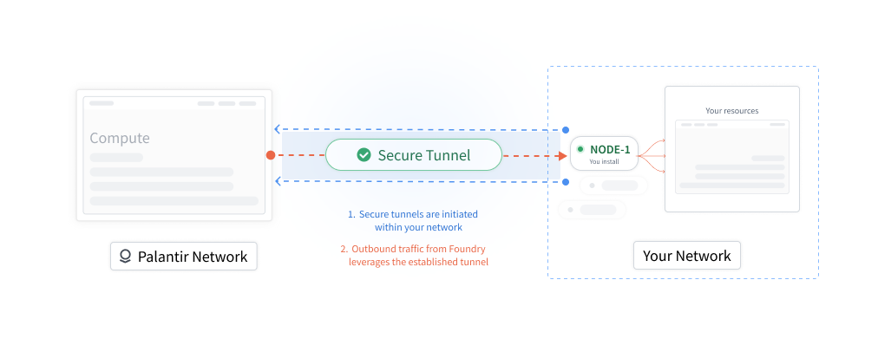
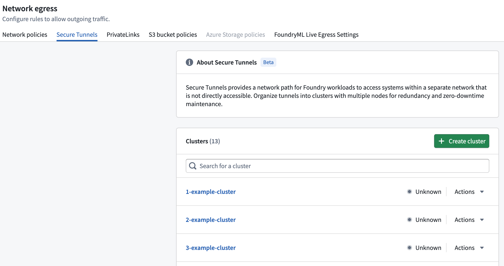
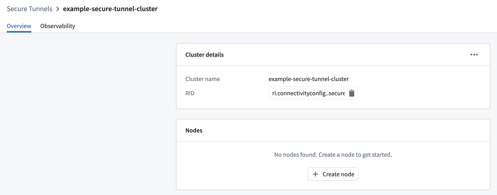
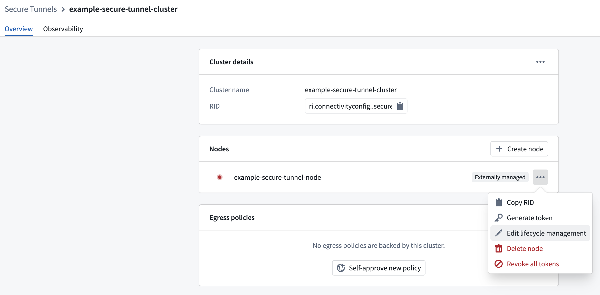
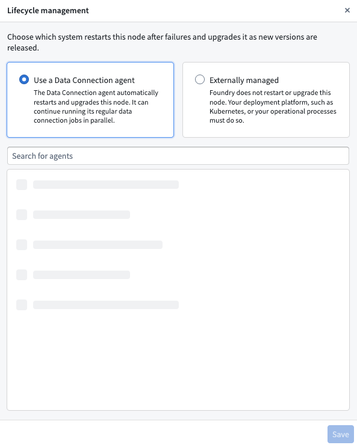

<!-- source: https://palantir.com/docs/foundry/administration/secure-tunnels/ · mirrored 2026-08-22 from Palantir Foundry docs -->

# Configure secure tunnels

:::callout{theme="neutral" title="Beta"}
Secure tunnels are in the [beta](/docs/foundry/platform-overview/development-life-cycle/) phase of development and a replacement for [agent proxies](/docs/foundry/data-connection/agent-proxy/). Functionality and configuration options may change during active development, and the feature may not be available on all enrollments. Contact your Palantir representative or Palantir Support before adopting secure tunnels for production workloads.
:::

**Secure tunnels** provide a network path for services in the Palantir platform to reach systems on a separate, privately-hosted network, without exposing those systems to inbound connections. They serve the same purpose as an [agent proxy](/docs/foundry/data-connection/agent-proxy/); applications connect to a source as if it were directly reachable over the platform network, while all traffic is brokered through a component that runs inside your network.

Unlike an agent, which is a single downloadable program, secure tunnels are built from a set of managed components. The secure tunnels **initiator** is the only component that runs inside your network. This page explains its role and how to install and configure it within your network.

## How secure tunnels work

A secure tunnel is established by three components:

| Component | Location | Role |
| --------- | -------- | ---- |
| Initiator | Your network | Runs inside your network and makes only **outbound** connections to the platform. It initiates outbound connections to the control plane, establishes tunnels to the responder, and forwards brokered traffic to destination systems in your network. |
| Control plane | Palantir platform | Authenticates the secure tunnels initiator, issues and refreshes its access token, and serves as its network configuration. |
| Responder | Palantir platform | Accepts the tunnels opened by the secure tunnels initiator. Platform services route egress traffic to the responder, which carries it back through the tunnel. |

Because the secure tunnels initiator only makes outbound connections, you do not need to open any inbound ports or expose any endpoint in your network to the platform. The secure tunnels initiator opens **tunnels** to the responder; it establishes the connections outbound, and the platform then sends request traffic back over the open connections. When a platform service connects to a source that uses a secure tunnel, traffic flows as follows:



All connections between your network and the platform are encrypted with TLS and mutually authenticated.

## Secure tunnels initiator

The secure tunnels initiator is the only secure tunnels component that runs inside your network. It is a single-purpose [Envoy ↗](https://www.envoyproxy.io/) proxy that connects to the platform using Envoy's [reverse tunnel ↗](https://www.envoyproxy.io/docs/envoy/latest/configuration/other_features/reverse_tunnel) capability. The secure tunnels initiator establishes every connection outbound while the platform sends request traffic back. It has the following characteristics:

* **Outbound only:** The secure tunnels initiator never accepts inbound connections from the platform. It requires network egress to the platform but no inbound firewall rules.
* **Token authentication:** The secure tunnels initiator authenticates to the platform with a short-lived access token. The token is issued and rotated automatically by the control plane, so no long-lived credentials are stored in your network.
* **Deny-by-default egress:** The secure tunnels initiator can only reach destination systems [that you explicitly allow](#configure-the-egress-allowlist).

## Secure tunnel cluster and node

Secure tunnel initiators are organized into clusters and nodes:

* A cluster is a logical group of secure tunnel initiators that provide access to the same network and destination systems. Egress policies are associated with the cluster, so every node in the cluster provides the same logical connectivity.

* A node represents an individual secure tunnel initiator deployment within a cluster. You can add multiple nodes to improve availability and distribute traffic. Each node establishes and maintains its own outbound tunnels to the platform.

### Create a secure tunnel cluster and node

Before deploying the secure tunnels initiator, create a cluster and node to establish its identity in the platform. The initiator uses the generated cluster and node resource identifiers (RIDs) to
authenticate with the control plane and register as the correct node.

Cluster and node names must be unique within the enrollment. Choose descriptive names that identify the network and initiator deployment they represent.

1. Go to the **Network egress** section of Control Panel.

2. Open the **Secure Tunnels** tab.

3. Select **Create cluster**, enter a unique cluster name, and then select **Create cluster**.

   

4. Select **Create node**, enter a unique node name and then select **Create**.

   

## Deployment models

The secure tunnels initiator runs as one or more nodes in an environment within your network. You can use a [Data Connection agent](/docs/foundry/data-connection/core-concepts/#agents) or [Apollo](../../apollo/core/introduction.md) to manage the lifecycle of these nodes. With either deployment model, token issuance, token rotation, TLS certificate provisioning, and configuration delivery are handled for you once the initiator is deployed.

An infrastructure or platform administrator is responsible for the following:

1. Provide an environment in your network where the secure tunnels initiator can run.
2. Allow [network egress](#network-egress-requirements) from that environment to the platform.
3. Define the [egress allowlist](#configure-the-egress-allowlist) that determines which destination systems the secure tunnels initiator may reach.

The secure tunnels initiator supports the following deployment models:

| Deployment model | Lifecycle management |
| ---------------- | -------------------- |
| [Managed by a Data Connection agent](#managed-by-a-data-connection-agent) | An existing or new Data Connection agent automatically restarts and upgrades the node. |
| [Helm chart managed by Apollo](#helm-chart-managed-by-apollo) | Apollo deploys, restarts, and upgrades the node. |

### Prerequisites

Before installing the secure tunnels initiator, confirm the following:

* You have an environment in your network where the secure tunnels initiator can run.
* The environment can make outbound network connections to your Palantir platform instance. See [Network egress requirements](#network-egress-requirements) for more information.
* You know the set of destination systems (IP ranges and ports) that Palantir platform workloads require to reach through the tunnel.

### Network egress requirements

The environment that runs the secure tunnels initiator must be able to make outbound connections to the platform. No inbound connectivity to your network is required.

Allow outbound (egress) network access from that environment to your Palantir platform instance. If your network denies egress by default, you may need to open a firewall or configure a proxy to permit these outbound connections.

### Managed by a Data Connection agent

You can use an existing [Data Connection agent](/docs/foundry/data-connection/core-concepts/#agents) or [set up a new agent](/docs/foundry/data-connection/set-up-agent/) to manage a secure tunnels node. The agent automatically restarts the node after failures and upgrades it as new versions are released. The agent can continue running its regular Data Connection jobs in parallel.

To assign a Data Connection agent as the lifecycle manager for a node:

1. Open the node and select **Edit lifecycle management**.

   

2. Select **Use a Data Connection agent**.

3. Search for and select the agent that will manage the node.

4. Select **Save**.



### Helm chart managed by Apollo

The secure tunnels initiator is deployed as a Helm chart managed through [Apollo](../../apollo/core/introduction.md), Palantir's continuous deployment system. Apollo deploys the chart into the prepared environment and configures it with the following:

* The address of the control plane to which it connects.
* A trust bundle used to validate the platform's TLS certificates.
* An initial access token used to bootstrap authentication. The secure tunnels initiator then rotates its own token automatically.

Once the secure tunnels initiator is running, it establishes tunnels to the responder and reports its health to Apollo. No further action is required to keep the secure tunnels initiator authenticated or updated.

## Configure the egress allowlist

The secure tunnels initiator enforces a **deny-by-default** egress allowlist. A destination system is only reachable through the tunnel if it matches an entry in the allowlist. With an empty allowlist, all egress is blocked.

The allowlist is a list of CIDR blocks with an associated port or port range. Each entry has the following fields:

| Field | Required? | Description |
| ----- | --------- | ----------- |
| `cidrBlock` | Yes | The IP range to allow, in CIDR notation. Use a `/32` suffix to allow a single IPv4 address. |
| `port` | Yes | The destination port to allow. |
| `endPort` | No | The end of an inclusive port range that begins at `port`. If omitted, only `port` is allowed. |

For example, the following allowlist permits connections to a single host on ports `7000` through `9000`, and to a subnet on port `443`:

```yaml
allowListedCidrs:
  - cidrBlock: '192.168.1.1/32'
    port: 7000
    endPort: 9000
  - cidrBlock: '192.168.2.2/24'
    port: 443
```

To allow all egress, allow every address on every port:

```yaml
allowListedCidrs:
  - cidrBlock: '0.0.0.0/0'
    port: 1
    endPort: 65535
```

Connections to a destination that does not match any allowlist entry are rejected by the secure tunnels initiator.

### Always-denied destinations

Regardless of the allowlist, the secure tunnels initiator always denies egress to link-local address ranges, including the cloud instance metadata service (for example, `169.254.169.254`). These destinations remain blocked even when the allowlist permits all egress, which prevents tunneled traffic from reaching sensitive infrastructure endpoints in the environment where the secure tunnels initiator runs.

## Next steps

Once the secure tunnels initiator is running and its egress allowlist is configured, create a [secure tunnel egress policy](/docs/foundry/administration/configure-egress/#secure-tunnel-egress-policies) in Control Panel and assign it to a [source](/docs/foundry/data-connection/set-up-source/) in Data Connection to route the source's traffic through the tunnel.
