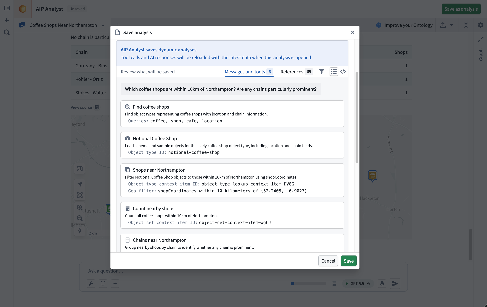
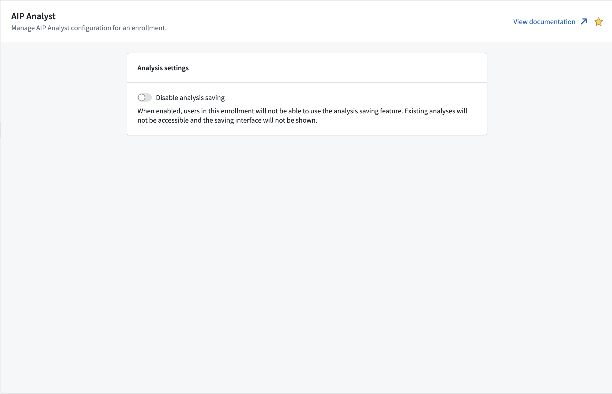

<!-- source: https://palantir.com/docs/foundry/aip-analyst/analysis-resources/ · mirrored 2026-08-18 from Palantir Foundry docs -->

# Analysis resources

AIP Analyst lets you save an analysis as a [Compass resource](/docs/foundry/compass/overview/), so you can return to your work, share it with collaborators, and organize it alongside your other Foundry projects.

Analyses are **dynamic**, meaning they stay current with your data. When you reopen an analysis, AIP Analyst re-runs the agent's tools against the latest state of your Ontology, so the results always reflect the current truth and respect each viewer's permissions.

To support this behavior, an analysis stores the conversation state needed to recreate the analysis: your messages, the tools called, and the referenced resources. It does not store tool results or agent responses.

## Review saved content

Before saving, the save dialog includes a **Review** panel that lets you preview the content that will be stored. It splits the analysis into two views:

* **Messages and tools:** The user messages and tool calls the agent generated during the session.
* **References:** The Foundry resources the agent had access to during the analysis, such as object sets, datasets, and functions.

## Per-analysis settings

Settings travel with each saved analysis. When you save, AIP Analyst records your [analysis settings](/docs/foundry/aip-analyst/using-aip-analyst/#settings), model choice, and enabled tools, so reopening the analysis restores the same configuration.

## Permissions

Saved analyses follow the standard [Compass permissions model](/docs/foundry/compass/move-and-share-resources/).

Opening an analysis resource does not grant access to every resource referenced by that analysis. When an analysis loads, AIP Analyst checks the viewer's permissions for each referenced resource. References the viewer cannot access may show an error or be skipped.

If your enrollment uses [classification-based access controls](/docs/foundry/security/classification-based-access-controls/), the save dialog will prompt you to apply classification markings to the analysis before saving.

## Admin configuration

Analysis saving can be disabled at the enrollment level from Control Panel. AIP Analyst checks the enrollment of each user's **primary organization** to determine whether saving is available. When analysis saving is disabled, AIP Analyst hides the analysis sidebar and resource header, and users cannot create or open analysis resources from AIP Analyst.

