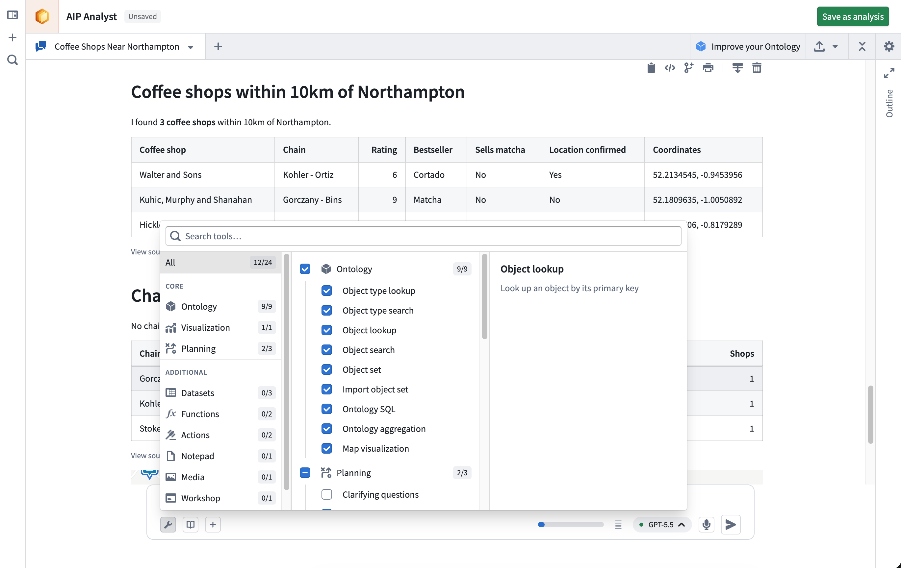

<!-- source: https://palantir.com/docs/foundry/aip-analyst/capabilities/ · mirrored 2026-08-18 from Palantir Foundry docs -->

# Capabilities

AIP Analyst uses tools to search, analyze, and present answers to your questions. Tools are grouped into categories in the **Tools** menu, where you can enable or disable an entire category or an individual tool. AIP Analyst can also adjust the enabled categories itself using the **Manage tools** tool.

## Ontology

These tools search, load, and analyze data from your Ontology. The [search scope](/docs/foundry/aip-analyst/using-aip-analyst/#analysis-settings) settings apply to the **Object type search** and **Object search** tools.

* **Object type lookup:** Retrieves comprehensive metadata for a specific object type, including its properties and links to related object types.
* **Interface type lookup:** Retrieves metadata for a specific interface type, including its properties and the object types that implement it.
* **Object type search:** Identifies relevant object types based on object type metadata, such as display name, ID, description, aliases, or status. Matching interface types are returned alongside object types.
* **Object lookup:** Retrieves a specific object by its primary key, returning all property values for that object.
* **Object search:** Searches across the entire Ontology or specified object types, returning matched objects grouped by object type.
* **Object set:** Creates an object set, optionally filtered or transformed by applying operations such as filters, search-arounds, or semantic search.
* **Import object set:** Imports an existing saved object set into the current analysis context.
* **Ontology SQL:** Executes SQL queries against object sets, returning tabular data that can be used for complex analysis.
* **Ontology aggregation:** Performs aggregation operations on object sets with optional grouping properties. Supported operations include count, sum, average, min, max, percentile, cardinality, standard deviation, and variance.
* **Map visualization:** Visualizes the geospatial properties of an object set on an interactive map.

## Visualization

* **Create visualization:** Renders a chart defined by a Vega-Lite specification, built from tabular data such as Ontology aggregations, SQL results, or dataset queries.

## Planning

These tools help AIP Analyst structure its work, manage its own context, and reuse prior analysis.

* **Analysis lookup:** Loads a template of a specific saved [analysis](/docs/foundry/aip-analyst/analysis-resources/) by its resource identifier (RID), making its structure of resources used and tool calls made available.
* **Clarifying questions:** When a query is ambiguous, AIP Analyst may ask clarifying questions to refine its analysis approach before proceeding.
* **Context cleanup:** Hides outdated or unnecessary tool responses from earlier in the conversation, keeping the agent focused on the data relevant to your current question.
* **Manage tools:** Enables or disables tools by category during an analysis so AIP Analyst can focus on the capabilities relevant to the current question. You can still configure tools manually from the **Tools** menu.
* **Write skill:** Creates or updates a reusable AIP Skill from the current analysis, capturing an approach so it can be applied again later.
* **Skill lookup:** Loads the full instructions of an AIP Skill when the agent determines the skill is relevant.

## Datasets

* **Backing dataset lookup:** Retrieves the backing dataset for a given object type, enabling direct dataset-level analysis of Ontology data.
* **Dataset SQL:** Executes SQL queries against datasets to retrieve and analyze data, returning tabular data that can be used for further analysis or chained into subsequent queries. Supports referencing multiple dataset branches.
* **Dataset lookup:** Finds and previews a specific dataset, including schema information and sample data.

## Functions

* **Function lookup:** Retrieves a function's signature and a preview of its source code.
* **Execute function:** Executes a function with a given set of input parameters. You can review the inputs and outputs directly within the analysis session.

## Actions

* **Action lookup:** Retrieves metadata for a specific action type, including its parameters.
* **Execute action:** Executes an action to create or modify objects. Actions require your approval before execution unless the action is configured to submit automatically.

## Media

* **Media item lookup:** Retrieves a specific item from a media set, such as an image or a PDF, for processing and analysis.
* **Read PDF pages:** Reads specific page ranges from a PDF in a media set, allowing AIP Analyst to work through documents that are too large to load at once.
* **PDF semantic search:** Runs a semantic search across a PDF in a media set to find the passages most relevant to a query.

## Time series

* **Time series transform:** Transforms and visualizes time series data drawn from time series properties or time series syncs.
* **Time series lookup:** Creates a single time series from a time series sync or from an object's time series property.
* **Time series sync lookup:** Retrieves a specific time series sync by its RID.

## Notepad

* **Notepad documents:** Creates and edits Notepad documents from the results of an analysis.
* **Notepad lookup:** Retrieves the content of an existing Notepad document.

## Quiver

* **Quiver analyses and dashboards:** Creates and edits Quiver analyses, and publishes them as shareable dashboards.
* **Import Quiver analysis:** Imports an existing Quiver analysis into the current analysis context.

## Contour

* **Contour analyses:** Creates and modifies Contour analyses for further data exploration.
* **Import Contour analysis:** Imports an existing Contour analysis into the current analysis context.

## Workshop

* **Workshop lookup:** Retrieves the object types, links, functions, and action types referenced by a Workshop module.

## Machinery

* **Machinery lookup:** Retrieves a Machinery process graph.

## File and media support

You can upload files into an analysis for AIP Analyst to process:

* **Spreadsheets:** Excel (`.xlsx` and `.xls`) and CSV files.
* **Documents:** Word (`.docx`) files. Embedded images are extracted alongside the text, so the agent can interpret charts, diagrams, and screenshots from the document rather than only the prose.
* **Images:** JPEG, PNG, GIF, and WebP.
* **PDFs:** Both text and visual content are processed, so the agent can interpret charts, diagrams, and tables rendered on the page.

You can also attach media items from media sets as analysis context.
