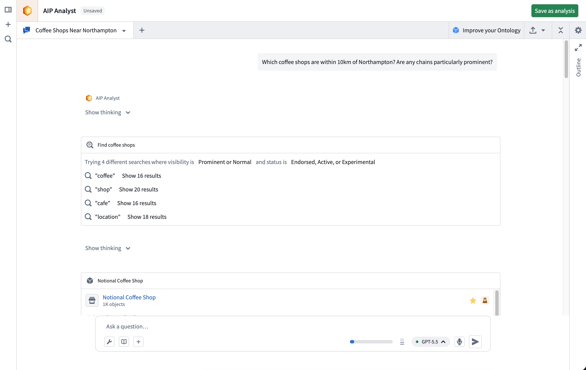
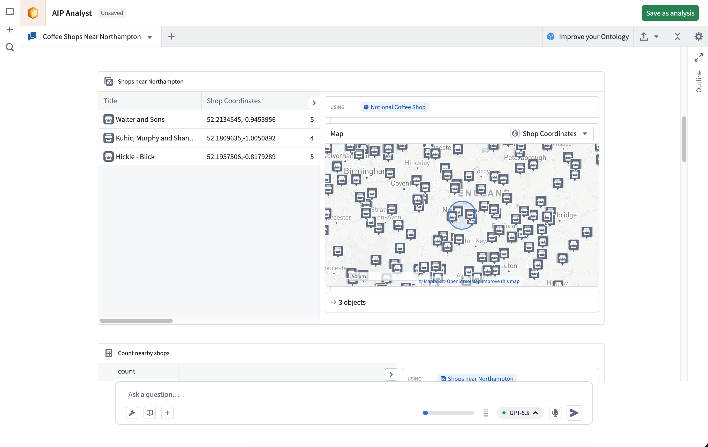
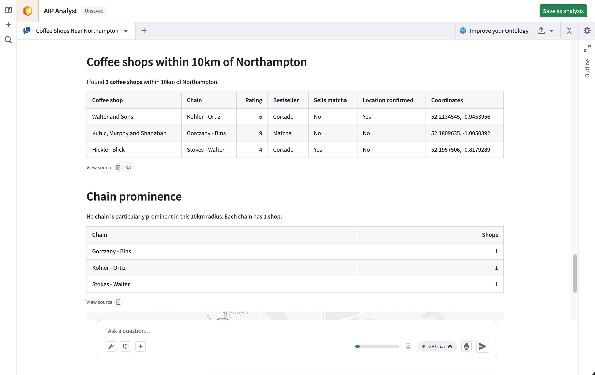

<!-- source: https://palantir.com/docs/foundry/aip-analyst/overview/ · mirrored 2026-09-04 from Palantir Foundry docs -->

# AIP Analyst

AIP Analyst is an interface for agentic workflows that lets you use natural language to perform ad-hoc analyses across your Ontology. You can ask AIP Analyst a question, and the agent will answer by autonomously searching your Ontology, creating object sets, and transforming data before generating summaries and visualizations.

## Example workflow

As an example, imagine a user that runs a coffee chain and wants to perform a competitive analysis. They want to examine whether it is viable to open a new location in Northampton, England. To start an analysis, this user can ask "Which coffee shops are within 10km of Northampton? Are any chains particularly prominent?"

AIP Analyst searches across your Ontology for relevant data using multiple search terms to increase the likelihood of finding a relevant object type.

Having found some coffee shops, AIP Analyst examines the data and applies a geospatial filter centered around Northampton.

Finally, after performing some additional aggregations on the chains, it generates a summary of the shops within the specified area and competing chains.

## More ways to use AIP Analyst

In addition to running ad-hoc analyses, AIP Analyst can:

* **Save analyses as Compass resources:** Return to your work later or share with collaborators using [analysis resources](/docs/foundry/aip-analyst/analysis-resources/).
* **Embed in other applications:** Add a [Workshop widget](/docs/foundry/aip-analyst/workshop-widget/) for tighter integration inside a Workshop module, or use [URL parameters](/docs/foundry/aip-analyst/embed/) for iframe embedding in OSDK or other Foundry applications.

## Resource consumption

Because AIP Analyst is agentic, a single question can result in many model calls and many queries against Foundry. Usage comes from two sources: LLM tokens for the agent's own reasoning, and the compute of the Foundry system behind each tool call. That system might be the Ontology, a dataset, or a function.

[Compute usage with AIP Analyst](/docs/foundry/aip-analyst/compute-usage/) covers what each [capability](/docs/foundry/aip-analyst/capabilities/) consumes, how usage is attributed to projects and resources, and how to monitor it. It also includes guidance on when to move work out of the agent's tool loop and into a function or a pro-code agent.

***

Note: AIP feature availability is subject to change and may differ between customers.
