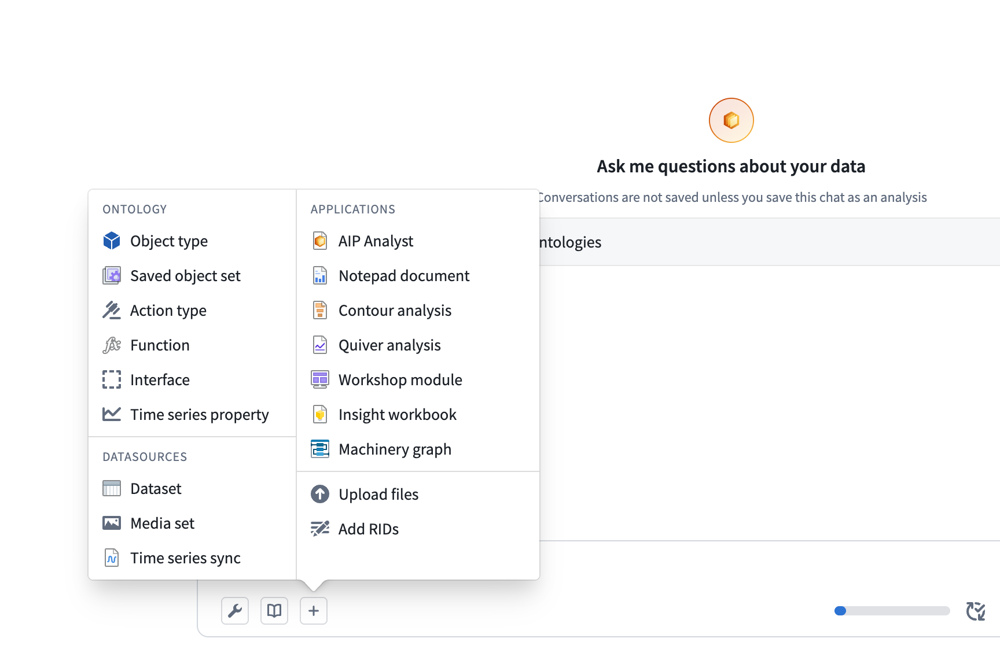
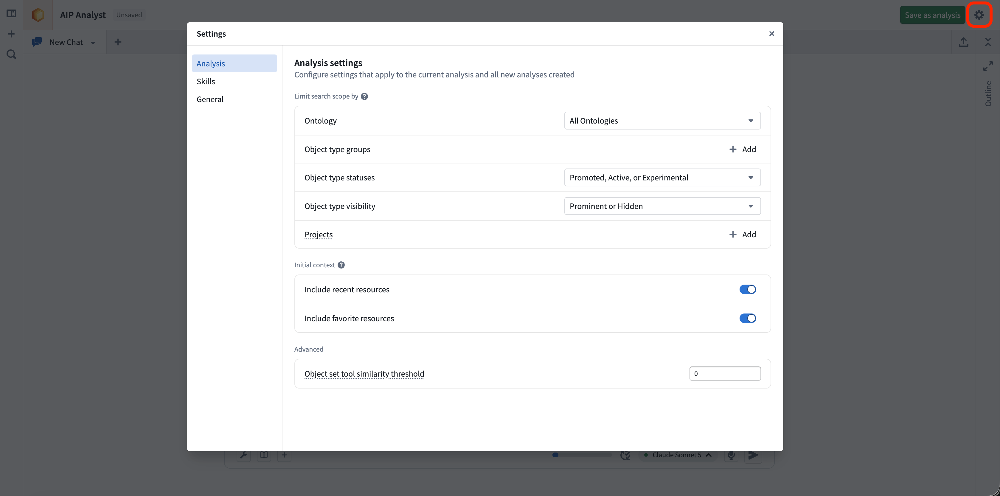
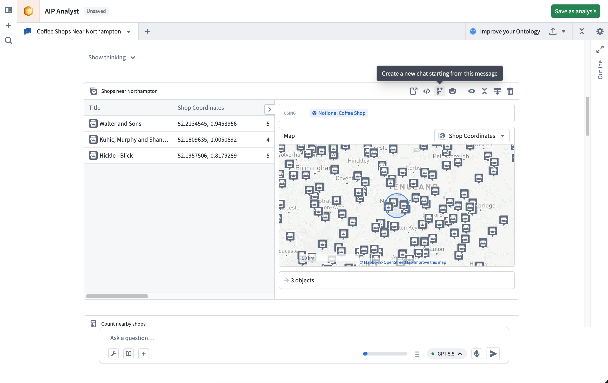
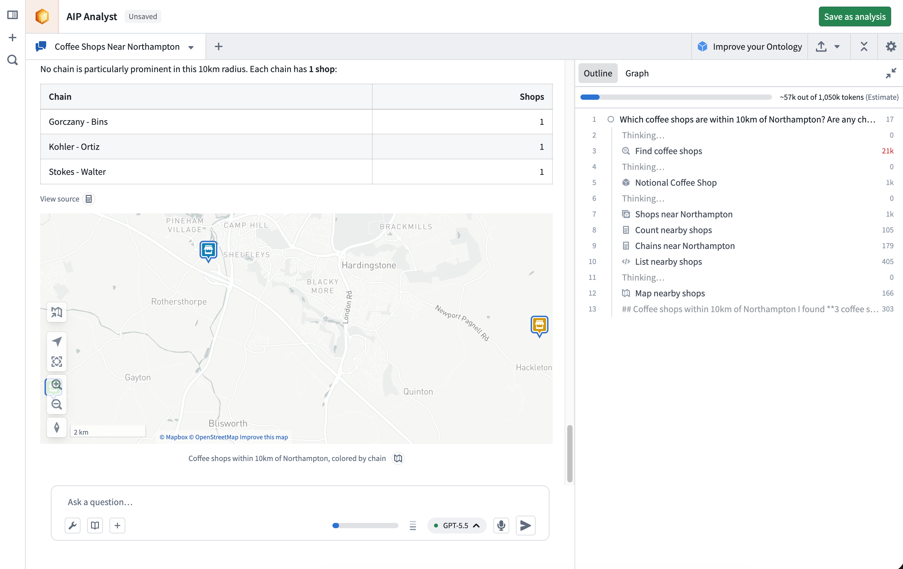
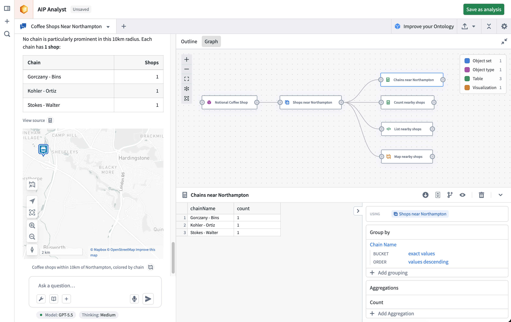
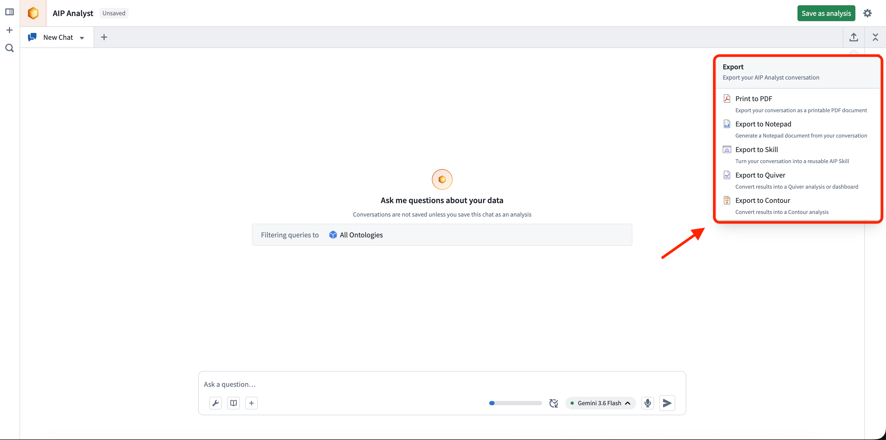

<!-- source: https://palantir.com/docs/foundry/aip-analyst/using-aip-analyst/ · mirrored 2026-08-18 from Palantir Foundry docs -->

# Using AIP Analyst

This page covers the features and concepts that make up an AIP Analyst session.

## Context

Context is the information AIP Analyst has access to during an analysis, such as your previous messages, the agent's tool results, and any Foundry resources you have added.

You can add resources to context manually using the **+** button in the input field. You can also drag and drop Foundry resources directly into the chat input area to add them as context. Dragging a resource URL from another browser tab or from within Foundry will automatically resolve the resource and load it into your analysis. Supported resources include datasets, object sets, Notepad documents, Workshop modules, functions, and more. You can also paste Foundry resource identifiers (RIDs) directly into the input to import them.

You can manage context manually using the [outline](#outline), or let AIP Analyst handle it using the [context cleanup](/docs/foundry/aip-analyst/capabilities/#planning) tool.

## Settings

The **Settings** dialog is organized into three tabs: **Analysis**, **Skills**, and **General**.

### Analysis settings

Analysis settings control search scope, initial context, and advanced agent behavior. Where these settings are stored depends on whether the analysis has been saved:

* **Unsaved analyses:** Changes apply to the current analysis and become your defaults for all new analyses.
* **Saved analyses:** The tab is marked with a **Current analysis** tag, and changes apply only to that [analysis resource](/docs/foundry/aip-analyst/analysis-resources/). To promote the current values to your defaults for new analyses, select **Save as user defaults** and confirm.

#### Limit search scope

Use these settings to restrict which Ontology entities AIP Analyst searches. When limits are set, the **Object type search** and **Object search** tools only return results that match. For an Ontology with hundreds or thousands of object types, applying these filters can improve performance.

* **Ontology:** Limit search to a single Ontology.
* **Object type groups:** Limit search to specific object type groups within the chosen Ontology.
* **Object type statuses:** Filter discoverable object types by status: `Endorsed`, `Active`, `Experimental`, `Deprecated`, or `Example`.
* **Object type visibility:** Filter discoverable object types by visibility: `Prominent`, `Normal`, or `Hidden`.
* **Projects:** Limit search to Ontology entities contained within specific projects. This setting does not apply to manually added context, and any selected folders that are not projects are ignored.

#### Initial context

These settings control the resources that are automatically added to AIP Analyst when it starts:

* **Include recent resources:** Include context about your recently viewed resources in the conversation.
* **Include favorite resources:** Include context about your favorite resources in the conversation.

#### Advanced

* **Object set tool similarity threshold:** Set the threshold for semantic search in the object set tool, between `0` (broadest) and `1` (exact). Higher values return fewer but more relevant results.

### Skills

The **Skills** tab lists the AIP skills available in your analyses. A skill packages reusable instructions that AIP Analyst can load when it determines the skill is relevant to your question.

From this tab, you can:

* Select **Add skills** to add a skill to your library, or search across all skills you can access.
* Search your library by name.
* Toggle each skill on or off. When a skill is enabled, the agent can discover and invoke it on its own.
* Select a skill to open its detail panel, where you can review its name, description, and last update, or remove it from your library.

You can also create a skill from a conversation using the [export](#export) menu.

### General

General settings are application-wide preferences that apply across all your analyses:

* **Appearance:** Set the color theme to light or dark.
* **Notifications:** If enabled, AIP Analyst can send notifications when in the background, allowing you to ask questions and be informed when an analysis requires your attention. Your browser and system settings must also allow notifications.
* **Unsaved analysis cost attribution:** Select the project that the cost of unsaved analyses is attributed to. Saved and embedded analyses are attributed based on their owning resource.

## Tabs and branching

An analysis path can be forked at any point, creating a new tab that only contains the prior context and enables users to explore multiple analysis paths from identical starting states. Empty analysis paths can be created using the **+** button in the tab header. Tabs will continue running even when not in focus.

## Outline

The analysis outline provides a structured summary of your session, displaying your questions, manually added context, and the agent's tool usage. Your messages appear with circle icons, while tool calls are marked with icons corresponding to their function.

You can use the outline to:

* Navigate quickly through prior analysis steps.
* Review token usage for each tool call.
* Hide specific tool results by selecting the eye icon that appears when hovering over outline items.

## Graph

To improve confidence in AIP Analyst output, you can trace the analysis by reviewing the **graph** view, which is a directed graph showing the provenance and logic path of each step in the analysis. The graph view allows you to:

* Trace how the agent arrived at its conclusions and check the logic of each step.
* Audit data transformations applied during analysis and ensure reproducibility of results.
* Verify that results are grounded in actual data rather than hallucinations. With AIP Analyst, you can view the Ontology data that is used at each step and ensure that all conclusions are accurate.

## Audio input

You can record audio input directly from the chat interface, enabling voice-driven analysis.

## Export

Select the **Export** button in the session header to turn the current conversation into a durable artifact.

* **Print to PDF:** Export your conversation as a printable PDF document. The export dialog lets you select which context items to include, expand or collapse tool results, and preview the document before printing. This uses your browser's print dialog, allowing you to save the output as a PDF file.
* **Export to Notepad:** Generate a Notepad document from your conversation.
* **Export to Skill:** Turn your conversation into a reusable AIP Skill, which AIP Analyst can then apply to similar questions in future analyses. See [skills](#skills) for more information.
* **Export to Quiver:** Convert results into a Quiver analysis or dashboard.
* **Export to Contour:** Convert results into a Contour analysis.

In the [Workshop widget](/docs/foundry/aip-analyst/workshop-widget/#view-configuration), the PDF, Notepad, Quiver, and Contour targets can each be hidden individually.
