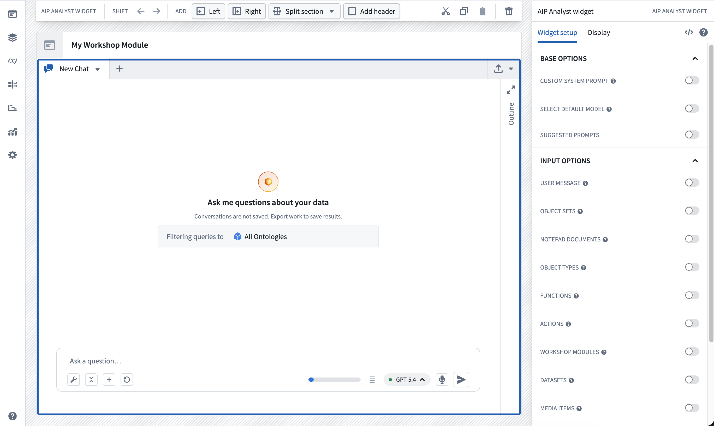
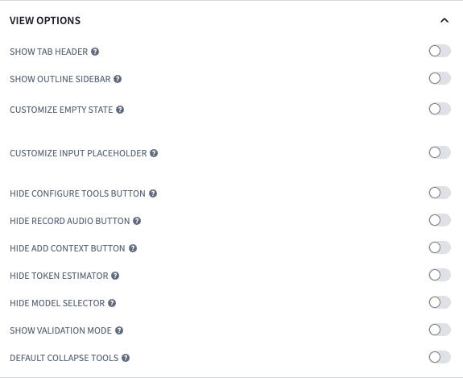

<!-- source: https://palantir.com/docs/foundry/aip-analyst/workshop-widget/ · mirrored 2026-08-18 from Palantir Foundry docs -->

# AIP Analyst Workshop widget

AIP Analyst can be embedded as a Workshop widget to provide AI-powered analysis capabilities directly in Workshop modules. The widget supports extensive configuration options to control data access, tool availability, and user interface customization.

## Widget configuration

The AIP Analyst widget can be configured to customize the analysis experience for your users. Configuration is organized into several sections that control how the widget behaves and what capabilities are available.

### Base configuration

The base configuration controls the fundamental behavior of the AIP Analyst widget:

* **Custom system prompt:** Provide specific instructions that guide the agent's behavior for this particular widget instance. Use this to set analytical focus, define response style, or establish domain-specific guidelines. The prompt is appended to the end of the default AIP Analyst system prompt. This can be a static value or connected to a Workshop variable for dynamic prompts.
* **Select default model:** Override the application default with a specific AI model for this widget. This ensures consistent behavior across all users of your Workshop module. If the selected model cannot be attributed to this project, a fallback model is used instead.
* **Suggested prompts:** Define a set of pre-populated prompts that appear when the chat is empty. These help guide users toward common questions or analytical workflows relevant to your use case. Provide a static list, or connect a Workshop variable to vary the prompts based on application state.

### Input configuration

Input configuration allows you to pre-load [context](/docs/foundry/aip-analyst/using-aip-analyst/#context) and trigger analyses automatically. Preloading context gives users immediate access to relevant data without manual searching.

* **User message:** Connect a Workshop variable to automatically start an analysis. When the variable changes, a user message containing the variable value is sent and the agent begins processing without user intervention. This enables dynamic, event-driven analyses within your Workshop application.
* **Object sets:** Add a list of object sets to the context. Each object set's object type is added by default. In the chat, these object sets are named `Input 1`, `Input 2`, and so on, in the order they are specified. Once a chat has started, it stops listening for object set updates until it is reset or a new chat is created.
* **Notepad documents:** Add a list of Notepad documents to the context.
* **Skills:** Add a list of AIP skills that are made available to the agent. Skill names and their triggers are added to the system prompt, and the agent loads a skill's full instructions only when relevant.
* **Enable user skills:** Make each user's own skill library available to the agent, and show a skills button in the chat input so they can manage it.
* **Object types:** Add a list of object types to the context.
* **Functions:** Add a list of functions to the context.
* **Actions:** Add a list of actions to the context. For each action, you can set **Should auto-submit action**. When enabled, the agent submits the action autonomously; when disabled, a form is displayed for the user to submit.
* **Workshop modules:** Add a list of Workshop modules to the context.
* **Datasets:** Add a list of datasets to the context.
* **Media items:** Add a list of media sets to the context. Individual items from each media set must be specified by RID. Only media sets of type image or PDF are supported.
* **Recent resources context:** Include the user's recent resources in context when the widget loads.
* **Favorite resources context:** Include the user's favorite resources in context when the widget loads.

Each preloaded resource accepts an optional **Title and description** rationale. Use it to tell the agent why the resource was provided and how it should be used.

### Output configuration

Output configuration enables you to extract analysis results into Workshop variables for use in other parts of your application:

* **Last object set:** Capture the most recent object set produced during analysis. You can optionally specify an object type, in which case the variable captures the last object set of that type.
* **Last user message:** Extract the user's most recent question.
* **All user messages:** Retrieve the complete list of user questions from the session.
* **Last assistant message:** Capture AIP Analyst's most recent response.
* **All assistant messages:** Extract all responses generated by the agent.
* **All Vega chart specs:** Extract all resolved Vega-Lite chart specifications as strings, enabling you to render charts elsewhere in your Workshop module. Data is embedded in these specifications, so they are snapshots rather than live views.
* **All messages:** Retrieve all messages from the session, including tool calls, with an option to include the configured input context items. The JSON shape of tool use and tool result messages is subject to change and carries no backwards compatibility guarantee.
* **Selected cited object:** Capture the object referenced by the most recently selected inline citation. Setting this variable overrides the default inline reference behavior.
* **Selected cited media reference:** Capture the media reference of the most recently selected inline citation. The variable must be a struct with the fields `mediaItemRid`, `mediaSetRid`, and `mediaItemReadToken`. Setting this variable overrides the default inline reference behavior.
* **Active tab agent running:** A boolean indicating whether the agent is currently running in the active tab. Use this to show loading states or disable inputs while analysis is in progress.

These outputs can drive visualizations, filters, or other logic in your Workshop module.

#### Apply actions

You can configure actions that trigger in response to analysis events. Each action must be configured with all required parameters, because it is executed exactly as configured. Both options can optionally display a toast notification indicating whether the action succeeded, which may also allow reverting the action.

* **On user message send:** Execute an action each time a user sends a message. The **Text input value** and **Chat session ID** parameters are provided by the widget. This action executes before the message is submitted, so the **All user messages** output will not yet contain the submitted message.
* **On agent stopped:** Execute an action when the agent in the active tab stops running. The **Chat session ID** parameter is provided by the widget. This is useful for logging, auditing, or triggering subsequent workflows. New user messages cannot be sent while the action is running.

### Tool configuration

Tool configuration allows you to control AIP Analyst's capabilities and scope. The filters below apply to all **Object type search** and **Object search** tool calls.

* **Customize default enabled tools:** Select which tools are enabled by default when the widget loads. Combine this with **Hide configure tools button** to guarantee that AIP Analyst only uses the tools you select.
* **Filter to Ontology:** Restrict search results to a single Ontology.
* **Filter to object type groups:** Restrict search results to specific object type groups. Provide a static list, or connect a Workshop variable containing object type group RIDs.
* **Filter to projects:** Restrict search results to entities in specific projects. Selected folders that are not projects are ignored.
* **Filter to object type statuses:** Restrict search results to object types with the selected statuses.
* **Filter to object type visibilities:** Restrict search results to object types with the selected visibilities.
* **Default semantic search threshold:** Set the object set tool semantic search similarity threshold, as a number between `0` and `1`.

See [Analysis settings](/docs/foundry/aip-analyst/using-aip-analyst/#analysis-settings) for more detail on how each scope filter behaves.

### View configuration

View configuration controls which interface elements are visible to users, allowing you to create streamlined experiences tailored to your use case.

#### Empty state and input

* **Customize empty state:** Customize the title, description, and picture of the empty chat state. The picture can be either an icon with a custom color, or an uploaded image.
* **Customize input placeholder:** Set the chat input box's empty state placeholder text.
* **Hide input area:** Remove the chat input field, preventing users from sending messages directly in the widget. Messages can still be triggered by the **User message** input variable.
* **Hide input resources section:** Hide the preloaded resource section in the widget's empty state.

#### Header and export

* **Hide tab header:** Remove the chat tab headers and disable creating new tabs. This also disables chat branching.
* **Hide PDF export button:** Remove the option to export a chat as a PDF. If the tab header is hidden, the export button is shown in the bottom row instead.
* **Hide Quiver export button:** Remove the option to export a chat to Quiver.
* **Hide Contour export button:** Remove the option to export a chat to Contour.
* **Hide Notepad export button:** Remove the option to export a chat to Notepad.

#### Chat controls

* **Hide outline sidebar:** Remove the analysis outline and graph sidebar.
* **Hide configure tools button:** Remove the tool configuration button, so AIP Analyst can only use the default enabled tools.
* **Hide record audio button:** Remove the audio recording button from the input area.
* **Add context options:** Control which options are available in the **Add context** menu, such as object types, object sets, datasets, media sets, Notepad documents, or file uploads. Context loaded from pasted URLs, drag and drop, or message text is unaffected, and this setting does not change which tools AIP Analyst can use.
* **Hide token estimator:** Remove the token usage estimator.
* **Hide model selector:** Remove the AI model selector, so AIP Analyst can only use the default model.
* **Hide thinking details:** Hide the model's extended thinking output from users.
* **Default collapse tools:** Collapse tool usage messages by default, showing only the tool name rather than full results.
* **Hide upgrade to media set panel:** Hide the prompt that offers to upgrade uploaded files into a media set.

#### Session lifecycle

* **Clear chat on navigation:** Clear the chat session when the user navigates away from the page, so a new session starts each time they return.
* **Reset key:** Connect a Workshop variable that resets the widget to a fresh session whenever its value changes. Use this to trigger a reset from elsewhere in the module.

### Save configuration

Enable **Analysis saving** to control how the widget saves and loads [analyses](/docs/foundry/aip-analyst/analysis-resources/). If analysis saving is disabled for your enrollment, the widget displays an error when these options are configured.

* **Save location:** Define the folder where newly created analyses are stored. Enable **Require save location** to prevent users from changing it; note that users without permission to that folder will not be able to save analyses.
* **Loaded analysis source:** Open a specific saved analysis in the widget. Hard-code a Compass resource, or connect a Workshop variable to load different analyses based on application state.
* **Unsaved analysis header:** Set the header text shown for an analysis that has not yet been saved.
* **Only show analyses created in this module:** Filter discoverable analyses to those created within this Workshop module. If the widget is consumed through an embedded module, the top-level module is used instead.

:::callout{theme="neutral"}
When a saved analysis is loaded, the tool options configured on this widget take precedence over the settings stored on the analysis. Existing chats in a saved analysis do not use this widget's configured inputs; creating a new chat or resetting the chat does.
:::

### Session persistence

By default, the AIP Analyst widget keeps draft chat state in memory while the user's browser tab remains open. This lets the widget retain conversation history, context items, and tool results when it is hidden and shown again within the same Workshop module, such as when the widget is placed in a tab or collapsible section. Refreshing or closing the browser tab clears this unsaved draft state.

To reset the chat each time the widget is hidden, enable the **Clear chat on navigation** option in the view configuration. When enabled, the draft state is discarded when the widget is removed from the page, and a fresh session begins when it is shown again.

You can also force a reset programmatically with the **Reset key** view option — connect a Workshop variable and the widget will reset to a fresh session whenever the variable's value changes.

## Best practices

When configuring the AIP Analyst widget for your Workshop module, consider the following approaches:

* **Preload context for faster results:** Adding relevant object types, datasets, or object sets in the input configuration eliminates initial search time and guides users toward the right data.
* **Use custom system prompts for specialized analysis:** Tailor the agent's behavior by providing domain-specific instructions or analytical frameworks in the system prompt.
* **Connect variables for automated workflows:** Link Workshop variables to the user message input to create dynamic, event-driven analyses that respond to user interactions elsewhere in your module.
* **Extract outputs to drive additional logic:** Use output variables to incorporate AIP Analyst results into other visualizations, filters, or analytical components.
* **Limit scope for focused analysis:** Apply Ontology, object type group, and project restrictions when building purpose-specific applications to improve performance and prevent access to irrelevant data.
* **Streamline the interface:** Hide advanced features and controls when building guided experiences for non-technical users.
* **Use applied actions for integration:** Configure the **On user message send** and **On agent stopped** actions to trigger subsequent workflows, such as logging analysis activity or saving results.
* **Provide suggested prompts:** Define suggested prompts to guide users toward common questions and reduce the barrier to starting an analysis.
