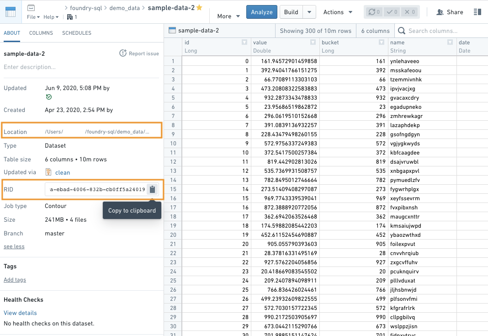

<!-- source: https://palantir.com/docs/foundry/analytics-connectivity/identify-dataset-rid/ · mirrored 2026-08-22 from Palantir Foundry docs -->

# Identify a dataset's RID or filepath

In order to work with Foundry data inside third-party BI tools, you will need to specify the dataset you wish to work with. Some third-party tools offer graphical interfaces for exploring and selecting datasets. Others will require you to directly input information about the dataset you wish to work with.

Foundry provides two options for specifying your dataset details:

* "RID", which is the dataset identifier
* "Location", which specifies the filepath location of the dataset

You can locate these values in Foundry by navigating to your dataset's "About" page, clicking on "see more", and copying either the "RID" value or the "Location" from the left sidebar.

