<!-- source: https://palantir.com/docs/foundry/analytics-connectivity/microstrategy/ · mirrored 2026-08-06 from Palantir Foundry docs -->

# Connecting to Foundry datasets from MicroStrategy

The MicroStrategy analytics platform includes a MicroStrategy-certified connector that enables users to easily create MicroStrategy reports and dossiers backed by Foundry datasets. The connector offers compatibility with Foundry access controls, including granular permissions.

### Supported products:

* MicroStrategy Workstation as preview feature (2021 Update 8 release)
* MicroStrategy Workstation (2021 Update 9 release or later)
* MicroStrategy Library (2021 Update 9 release or later)

### Authentication methods

* User-generated tokens

## Installation

### Part 1: Verify connector is installed in MicroStrategy

If you are on the **2021 Update 8 release** of MicroStrategy, the Palantir Foundry connector should already be installed as a [preview feature ↗](https://www2.microstrategy.com/producthelp/Current/Workstation/en-us/Content/preview_features.htm). Verify this with the following steps:

1. Open the Microstrategy Workstation and enable preview features.
2. Select the plus sign beside **Data Sources**, found under the **Administration** section of the left sidebar.
3. Search for "Palantir Foundry" in the list of supported data sources. If you find it in the list, proceed to Part 2 to install the JDBC driver.

If you are on the **2021 Update 9 release or later**, the Palantir Foundry connector should already be installed in your version of MicroStrategy. Verify this with the following steps:

1. Open the Microstrategy Workstation.
2. Select **Data Sources** under the **Administration** section of the left sidebar.
3. Search for "Palantir Foundry" in the list of supported data sources. If you find it in the list, you do not need to install the JDBC driver separately; proceed to the [Usage](#usage) section below.

If you do not see `Palantir Foundry` in the list of supported data sources, contact your MicroStrategy support representative for next steps. You may need to upgrade to the latest MicroStrategy release and MicroStrategy Workstation.

### Part 2: Install Palantir Foundry JDBC driver

If you are on the **2021 Update 8 release**, complete the setup of the Foundry MicroStrategy integration by first installing the JDBC driver for Foundry datasets. Navigate to [Downloads: Foundry Datasets JDBC Driver](/docs/foundry/analytics-connectivity/downloads/#foundry-datasets-jdbc-driver) to download and install the driver.

If you are on the **2021 Update 9 release or later**, the Foundry JDBC driver is pre-installed in the MicroStrategy Windows Workstation and MicroStrategy Intelligence Server. You only need to install the JDBC driver for MicroStrategy Mac Workstation if you want to access Foundry data using a local dossier.

:::callout{theme="neutral"}
Contact your Palantir representative if you encounter any issues with installation.
:::

Now that the connector is installed, you are ready to build reports and dossiers in MicroStrategy backed by Foundry datasets.

## Usage

This guide will explain how to authenticate with Foundry through MicroStrategy, select a dataset, and get started building your first dossier.

### Part 1: Create Foundry data source

There are two options for creating a Foundry data source in MicroStrategy:

* [Option 1: Create Foundry data source in MicroStrategy Workstation](#option-1-create-foundry-data-source-in-microstrategy-workstation)
* [Option 2: Create Foundry data source using MicroStrategy datasets](#option-2-create-foundry-data-source-using-microstrategy-datasets)

#### Option 1: Create Foundry data source in MicroStrategy Workstation

1. If you are on the **2021 Update 8 release** of MicroStrategy, enable **Preview Features** in the **Help** menu. If you are on the **2021 Update 9 release or later**, proceed with the next step.   
   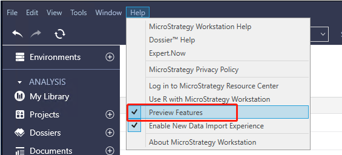   
2. Under the **Administration** section of the Workstation sidebar, click on the plus icon next to **Data Sources**.
3. Find and select "Palantir Foundry" from the list of supported data sources.   \
   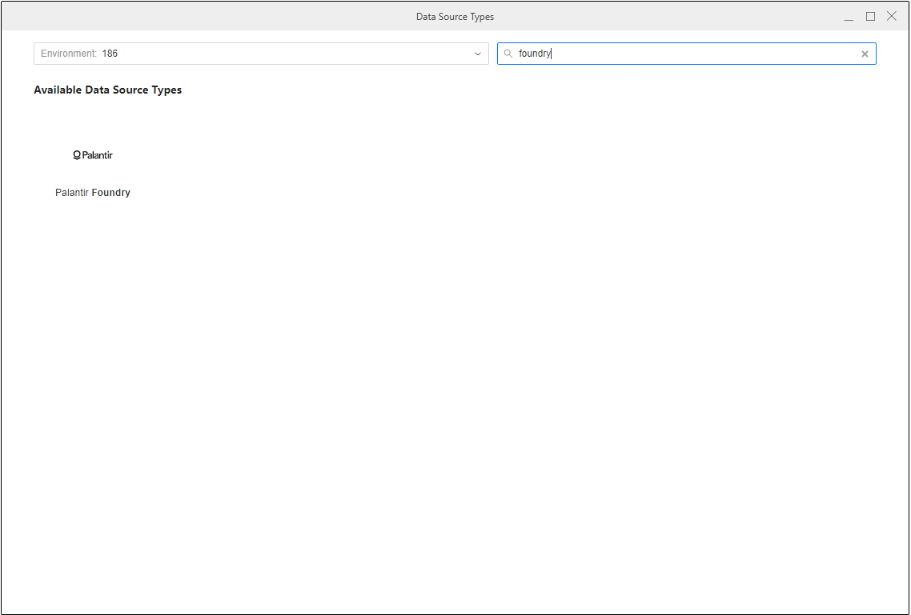   
4. Specify a name for the data source and keep the database version unchanged. Then, choose the MicroStrategy project where you will be using the connection. Select the **Default Database Connection** dropdown, then **Add New Database Connection**.   
   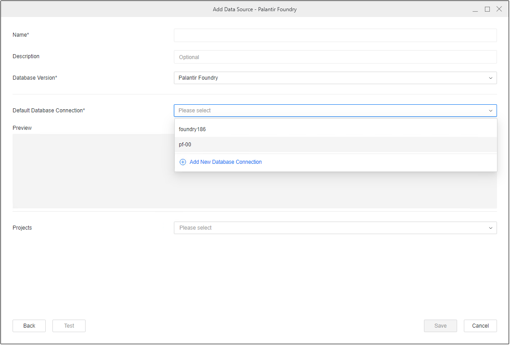   
5. Follow the prompts to add details about your Foundry connection, including [connection properties](#part-2-configure-foundry-connection-settings).   
   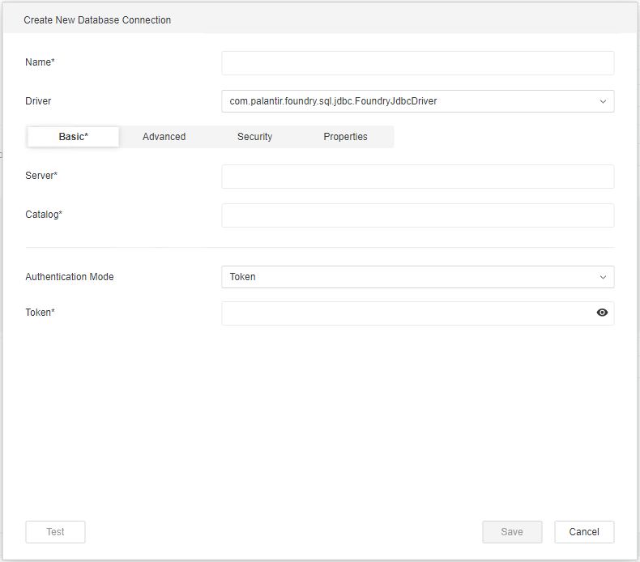   

#### Option 2: Create Foundry data source using MicroStrategy datasets

1. If you are on the **2021 Update 9 release or later**, you can create a Foundry data source using MicroStrategy datasets. Disable **Enable New Data Import Experience** in the **Help** menu of your Workstation.   
   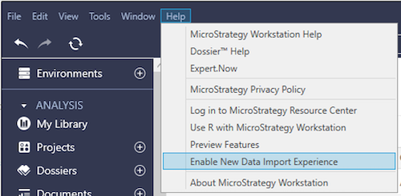   
2. Under the **Analysis** section, select the plus icon next to **Datasets**, then choose **Data Import Cube** in the **Create Dataset** dialog.   
   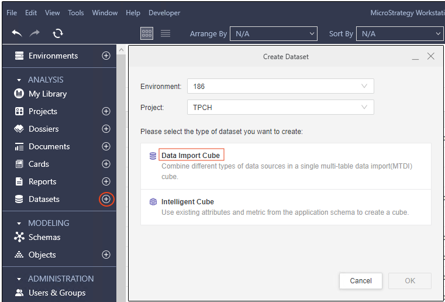   
3. Search for "Palantir Foundry" in the **Data Sources** window and select it from the list.   
   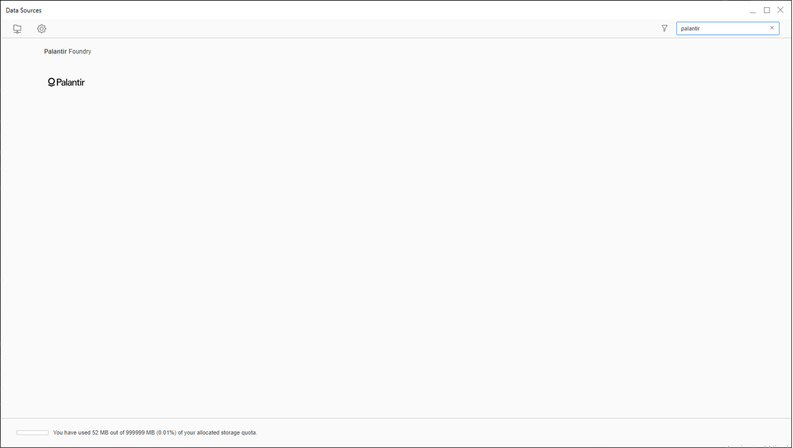   
4. Select any of the options in the **Select Import Options** window, then select **Next**. For this guide, we will choose the **Select Tables** option.   
   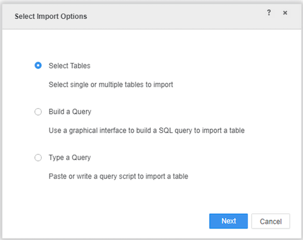   
5. Create a data source in the **Import from Table** window by selecting the plus icon next to **Data Sources**.   
   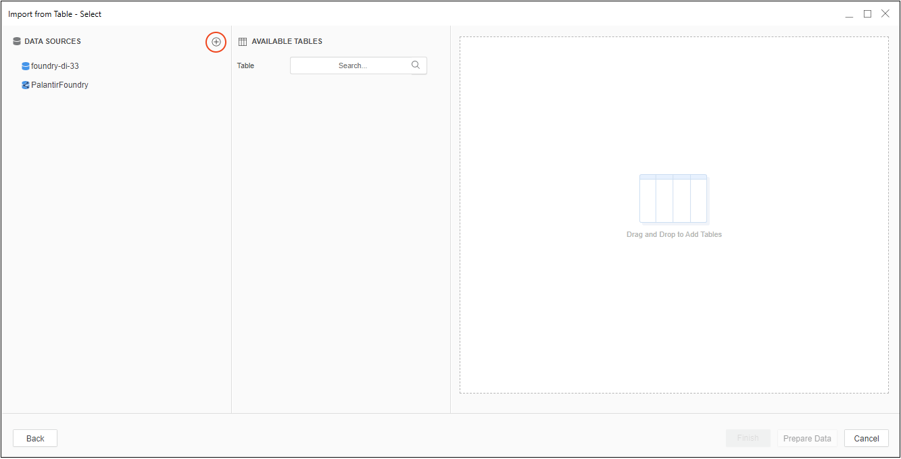   
6. Provide connection properties using the steps shown below in Part 2.   
   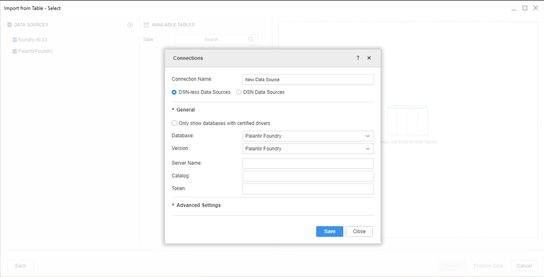   

### Part 2: Configure Foundry connection settings

To create a connection to Foundry, you must provide the following connection properties:

* **Server:** The URL you normally use to access Foundry, such as `<subdomain>.palantirfoundry.com`.
* **Catalog:** The path of a Foundry Project, such as `/MyOrg/MyProject`. This field is only required in the **2021 Update 9 release or later**. Setting this property can resolve table browsing issues in MicroStrategy. If you are on the **2021 Update 8 release**, switch to the **Advanced** tab and add the parameter in **Additional Connection String Parameters**.
* **Token:** A valid user token generated in Foundry. See the [User-generated tokens](/docs/foundry/platform-security-third-party/user-generated-tokens/) documentation for instructions on how to obtain a token.

:::callout{theme="neutral"}
The MicroStrategy connector supports only token-based authentication.
:::

* **Additional Connection String Parameters (Optional):** Switch to the **Advanced** tab and specify any other connection parameters. Parameters should be separated by the `&` symbol, such as `OptionalParam1=<VALUE>&OptionalParam2=<VALUE>`. Find the full list of connection parameters in the [Parameter reference](/docs/foundry/analytics-connectivity/odbc-jdbc-drivers/#parameter-reference) documentation for the JDBC driver for Foundry Datasets. If you are on the **2021 Update 9 release or later**, `Dialect` is set to the recommended value of `SPARK` for optimal integration of Foundry within MicroStrategy, and this cannot be changed.   
  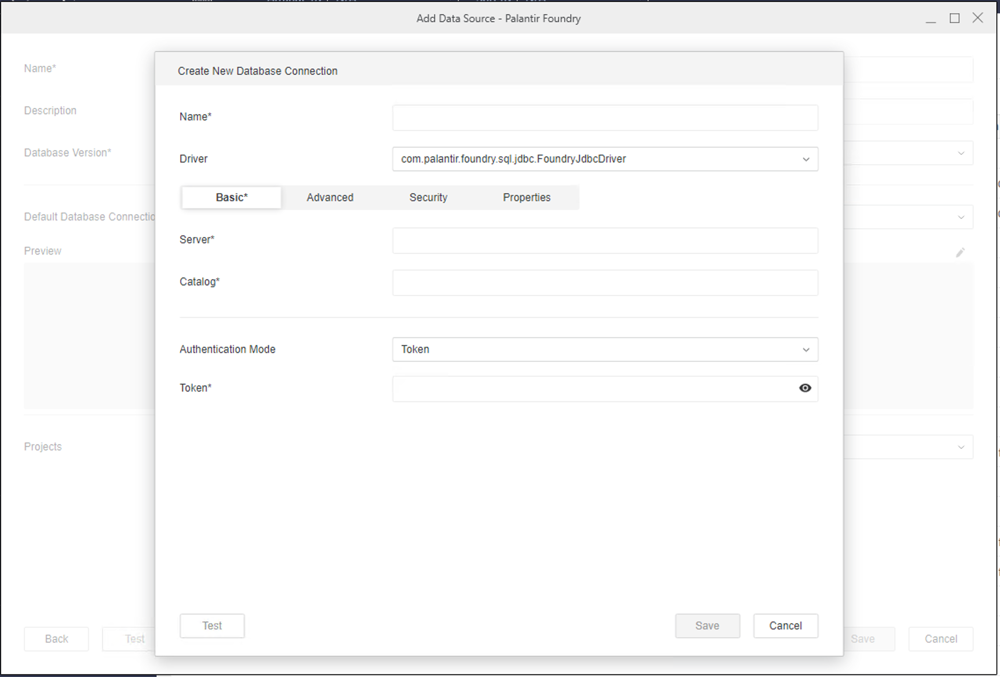   

### Part 3: Connect to Foundry and select dataset

1. Use the navigation sidebar to the left to select **Datasets**, then **Data Import Cube** or **Intelligent Cube**.
2. Connect to Foundry and select a dataset:
   * If you are on the **2021 Update 8 release**, choose to **Enable New Data Import Experience** under the **Help** menu. Select the Foundry data source you created in the previous steps, connect to it, then import your Foundry datasets.
   * If you are on the **2021 Update 9 release or later**, search for "Palantir Foundry" in the data sources list, select it, and then select any options in the **Select Import Options** window. In the **Import from Table** window, select the Foundry data source you created earlier, connect to it, and import your Foundry datasets.
3. Proceed with building your report within MicroStrategy.
